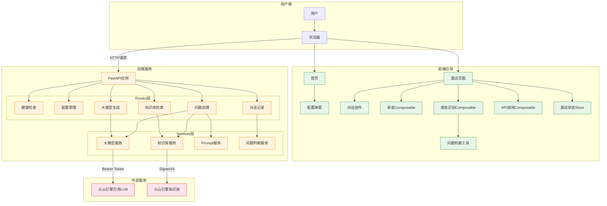
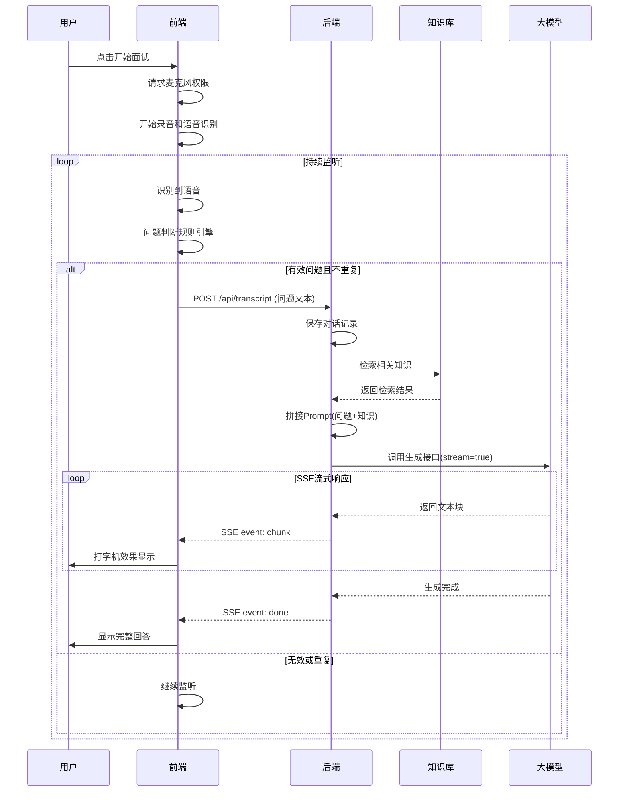

# 面试虎 - 增量架构总览

## 📋 项目信息

| 项目 | 内容 |
|------|------|
| 项目名称 | 面试虎 - AI智能面试助手 |
| 版本 | v1.0.0 |
| 架构类型 | 前后端分离 + 外部API调用 |
| 最后更新 | 2026-07-02 |

## 🏗️ 系统架构图

## 🔄 核心业务流程图

## 📁 模块清单

| 模块 | 类型 | 状态 | 负责人 |
|------|------|------|--------|
| 前端项目骨架 | 前端 | ✅ 已完成 | - |
| 后端项目骨架 | 后端 | ✅ 已完成 | - |
| 录音与语音识别 | 前端 | ✅ 已完成 | - |
| 大模型调用 | 后端 | ✅ 已完成 | - |
| 知识库检索 | 后端 | ✅ 已完成 | - |
| 面试对话展示 | 前端 | ✅ 已完成 | - |

## 🌐 API接口清单

| 方法 | 端点 | 说明 | 所属模块 |
|------|------|------|----------|
| GET | /api/health | 健康检查 | 后端骨架 |
| GET | /api/config | 获取配置 | 后端骨架 |
| POST | /api/config | 保存配置 | 后端骨架 |
| POST | /api/search | 知识库检索 | 知识库检索 |
| POST | /api/generate | 大模型调用（非流式） | 大模型调用 |
| POST | /api/generate/stream | 大模型调用（流式） | 大模型调用 |
| POST | /api/question | 问题处理（非流式） | 后端骨架 |
| POST | /api/question/stream | 问题处理（流式） | 后端骨架 |
| POST | /api/transcript | 提交对话记录 | 语音识别 |
| GET | /api/dialogues | 获取对话列表 | 语音识别 |

## 📝 迭代记录

| 迭代 | 时间 | 内容 |
|------|------|------|
| v1.0.0 | 2026-07-02 | 初始版本，完成所有核心模块 |

## 🔗 相关文档

- [文档导航索引](./DOCS-INDEX.md)
- [经验知识库](./LESSONS-LEARNED.md)