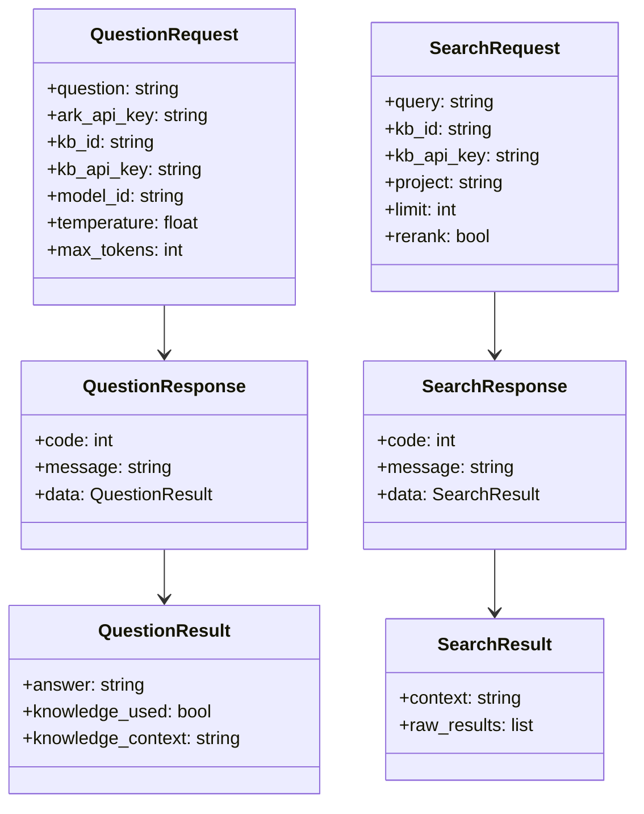
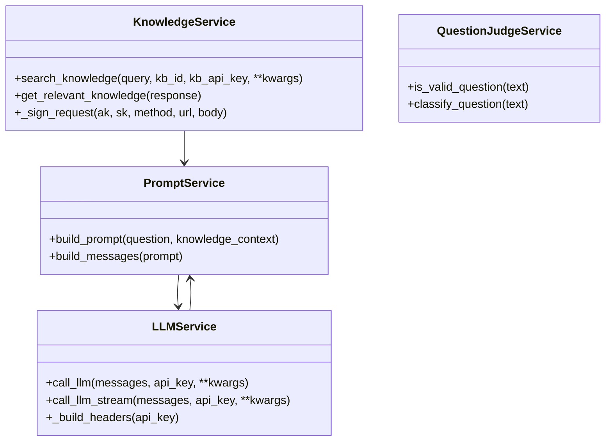

# 后端项目骨架模块 - 设计说明

## 架构决策

| 决策项 | 选择方案 | 备选方案 | 决策理由 | 相关ADR |
|--------|---------|---------|---------|---------|
| 后端框架 | FastAPI | Flask/Django | FastAPI性能高，原生支持异步，自动生成API文档，类型提示友好 | ADR-004 |
| ASGI服务器 | Uvicorn | Hypercorn | Uvicorn是FastAPI官方推荐，性能稳定，社区活跃 | - |
| 参数校验 | Pydantic | Marshmallow | Pydantic是FastAPI默认方案，与Python类型提示无缝集成 | - |
| 环境变量 | python-dotenv | 手动读取 | python-dotenv自动加载.env文件，开发体验好 | - |
| HTTP客户端 | httpx | requests | httpx支持异步，与FastAPI异步特性匹配 | - |

## 数据结构/状态管理设计

### 请求/响应模型

### 服务层类图

## 关键设计意图

### 1. 分层架构设计
为什么这样设计？解决了什么问题？

后端采用三层架构：Routes层负责接收请求和返回响应，Services层负责业务逻辑，外部API调用层负责与火山引擎交互。这样可以实现关注点分离，便于维护和测试。

### 2. 统一响应格式
为什么这样设计？有什么取舍？

所有API响应都采用统一格式 `{code, message, data}`，前端可以统一处理响应。牺牲了RESTful的标准响应格式，但提高了前端处理的一致性。

### 3. 全局异常处理
为什么这样设计？有什么取舍？

通过FastAPI的异常处理器统一捕获所有异常，返回友好的错误信息，避免泄露内部实现细节。

## 扩展性与未来改动点

| 可能的改动 | 影响范围 | 改动难度 | 建议时机 |
|-----------|---------|----------|---------|
| 添加数据库支持 | 所有服务层 | 高 | v2.0 |
| 引入Redis缓存 | 知识库检索、大模型调用 | 中 | v1.5 |
| 添加请求限流 | 所有路由 | 低 | v1.5 |
| 引入日志系统（ELK） | 全局 | 中 | v2.0 |