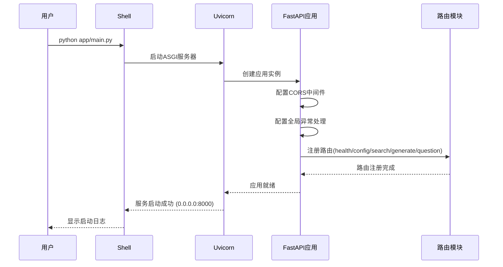
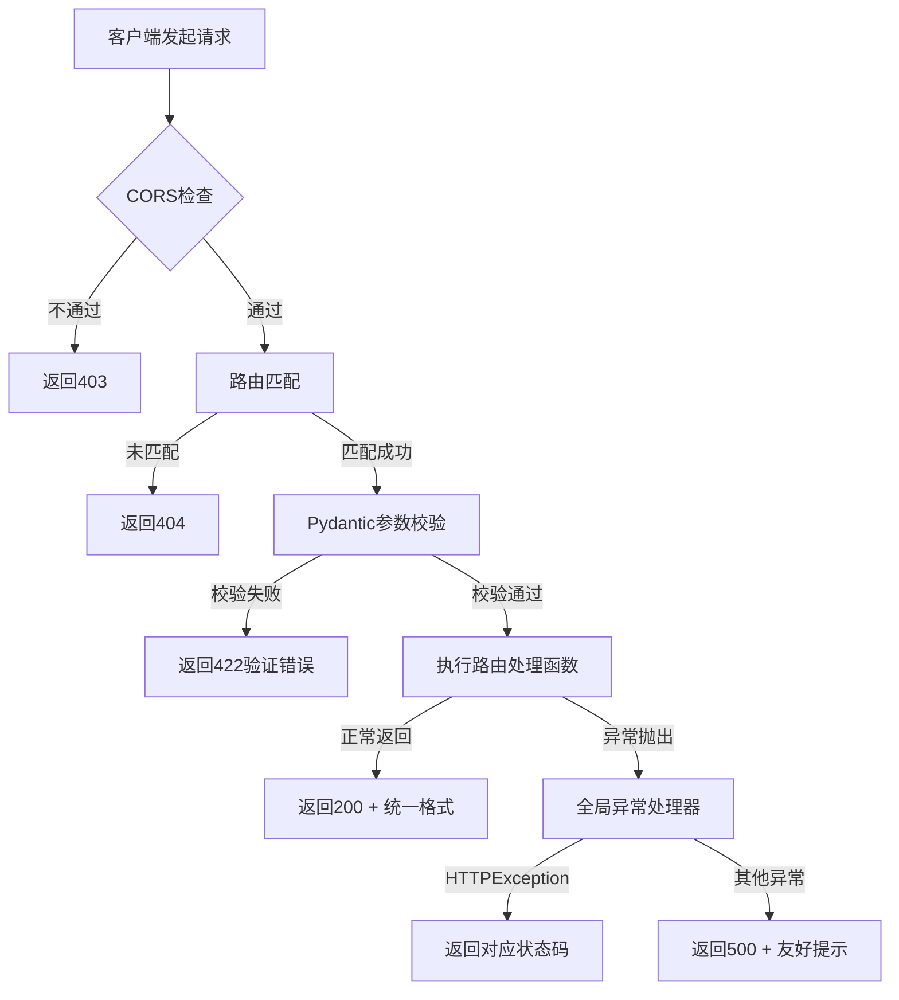

# 后端项目骨架模块 - 流程文档

## 模块概述
- **功能定位**: 项目的后端基础架构，提供FastAPI服务框架、路由注册、全局异常处理和配置管理
- **核心价值**: 快速搭建面试虎后端服务，支持API接口开发和外部服务调用

## 核心流程

### 服务启动流程



### 请求处理流程



## 涉及文件清单
| 文件 | 作用 | 层级 |
|-----|------|------|
| backend/requirements.txt | Python依赖列表 | 配置 |
| backend/config.py | 环境变量配置管理 | 配置 |
| backend/.env.dev | 开发环境变量模板 | 配置 |
| backend/app/main.py | FastAPI应用入口 | 入口 |
| backend/app/routes/health.py | 健康检查接口 | 路由 |
| backend/app/routes/config.py | 配置管理接口 | 路由 |
| backend/app/routes/search.py | 知识库检索接口 | 路由 |
| backend/app/routes/generate.py | 大模型生成接口 | 路由 |
| backend/app/routes/question.py | 问题处理接口 | 路由 |
| backend/app/services/knowledge.py | 知识库检索服务 | 服务 |
| backend/app/services/llm.py | 大模型调用服务 | 服务 |
| backend/app/services/prompt.py | Prompt拼接服务 | 服务 |

## 关键逻辑通俗解释

> 用大白话解释核心逻辑，让非技术人员也能理解。

后端项目骨架就像是面试虎应用的大脑。当用户在前端操作时，前端会发送请求给后端：

1. **启动服务**: 运行 python app/main.py 就像打开大脑开关，Uvicorn服务器开始工作
2. **注册功能**: 把健康检查、配置管理、知识库检索、大模型调用等功能注册到大脑中
3. **处理请求**: 当收到请求时，先检查来源是否合法（CORS），再找到对应的处理函数
4. **参数校验**: 检查请求参数是否正确，不正确就返回错误提示
5. **执行逻辑**: 调用相应的服务处理业务逻辑
6. **异常处理**: 如果处理过程中出错，统一捕获并返回友好的错误信息

## 接口/交互说明

### API端点清单
| 方法 | 端点 | 说明 |
|------|------|------|
| GET | /api/health | 健康检查，返回服务状态 |
| GET | /api/config | 获取当前配置（脱敏） |
| POST | /api/config | 保存配置（API Key等） |
| POST | /api/search | 知识库检索 |
| POST | /api/generate | 大模型调用（非流式） |
| POST | /api/generate/stream | 大模型调用（流式） |
| POST | /api/question | 问题处理（非流式） |
| POST | /api/question/stream | 问题处理（流式） |

### 统一响应格式
```json
{
  "code": 0,
  "message": "success",
  "data": {}
}
```

### 服务层调用关系
| 路由 | 调用服务 | 说明 |
|------|---------|------|
| question.py | knowledge.py + prompt.py + llm.py | 完整问答流程 |
| search.py | knowledge.py | 知识库检索 |
| generate.py | llm.py | 大模型生成 |