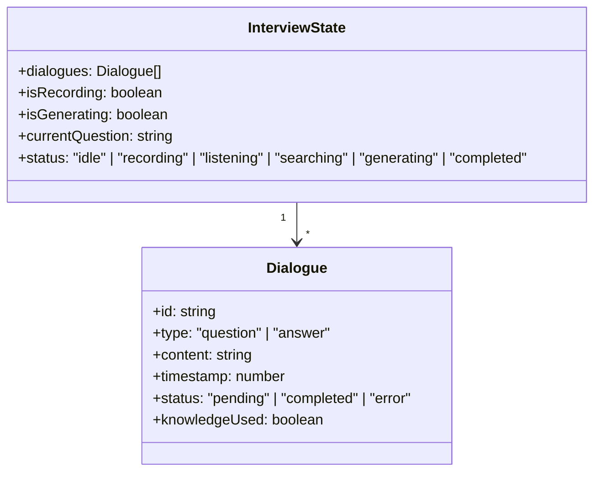
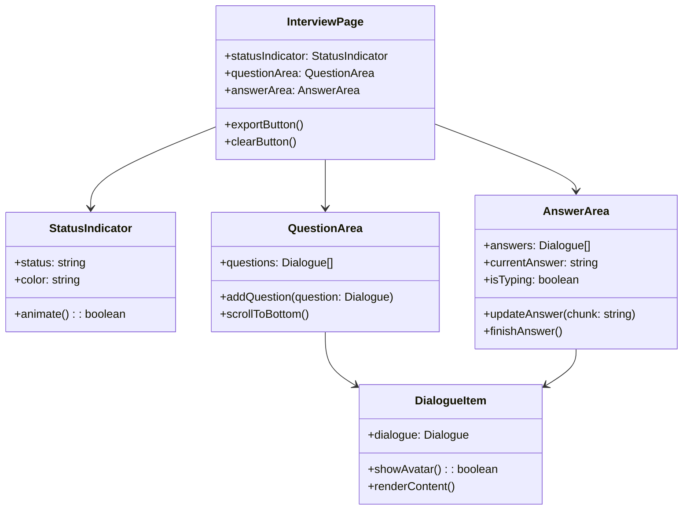

# 面试对话展示模块 - 设计说明

## 架构决策

| 决策项 | 选择方案 | 备选方案 | 决策理由 | 相关ADR |
|--------|---------|---------|---------|---------|
| 布局方案 | 左右分栏(PC) + 上下布局(移动端) | 单一布局 | 充分利用PC端屏幕空间，移动端保证可用性 | ADR-010 |
| 流式渲染 | SSE + 打字机效果 | 等待完整结果后渲染 | 用户体验更好，减少感知延迟 | - |
| 对话存储 | 内存存储(Pinia) | LocalStorage/IndexedDB | 面试会话是临时的，内存存储足够；刷新页面清空符合预期 | - |
| 导出格式 | JSON + TXT + Markdown | PDF/Word | 轻量级格式，用户可自行转换；避免引入复杂依赖 | - |

## 数据结构/状态管理设计

### 对话数据结构

### 组件关系图

## 关键设计意图

### 1. 响应式布局设计
为什么这样设计？解决了什么问题？

根据屏幕宽度自动切换布局：PC端使用左右分栏，充分利用宽屏空间；移动端使用上下布局，确保在小屏幕上的可用性。

### 2. 打字机效果渲染
为什么这样设计？有什么取舍？

SSE流式响应配合打字机效果可以让用户实时看到回答生成过程，减少等待焦虑。虽然增加了前端复杂度，但用户体验提升明显。

### 3. 状态指示器
为什么这样设计？有什么取舍？

实时显示系统状态（录音中、识别中、检索中、生成中），让用户了解系统当前在做什么，增强信任感。

## 扩展性与未来改动点

| 可能的改动 | 影响范围 | 改动难度 | 建议时机 |
|-----------|---------|----------|---------|
| 添加对话编辑功能 | DialogueItem + InterviewStore | 低 | v1.5 |
| 支持对话分类标签 | 对话数据结构 | 中 | v2.0 |
| 添加面试录音回放 | InterviewPage + useRecorder | 高 | v2.0 |
| 支持深色模式 | 全局样式 | 中 | v2.0 |