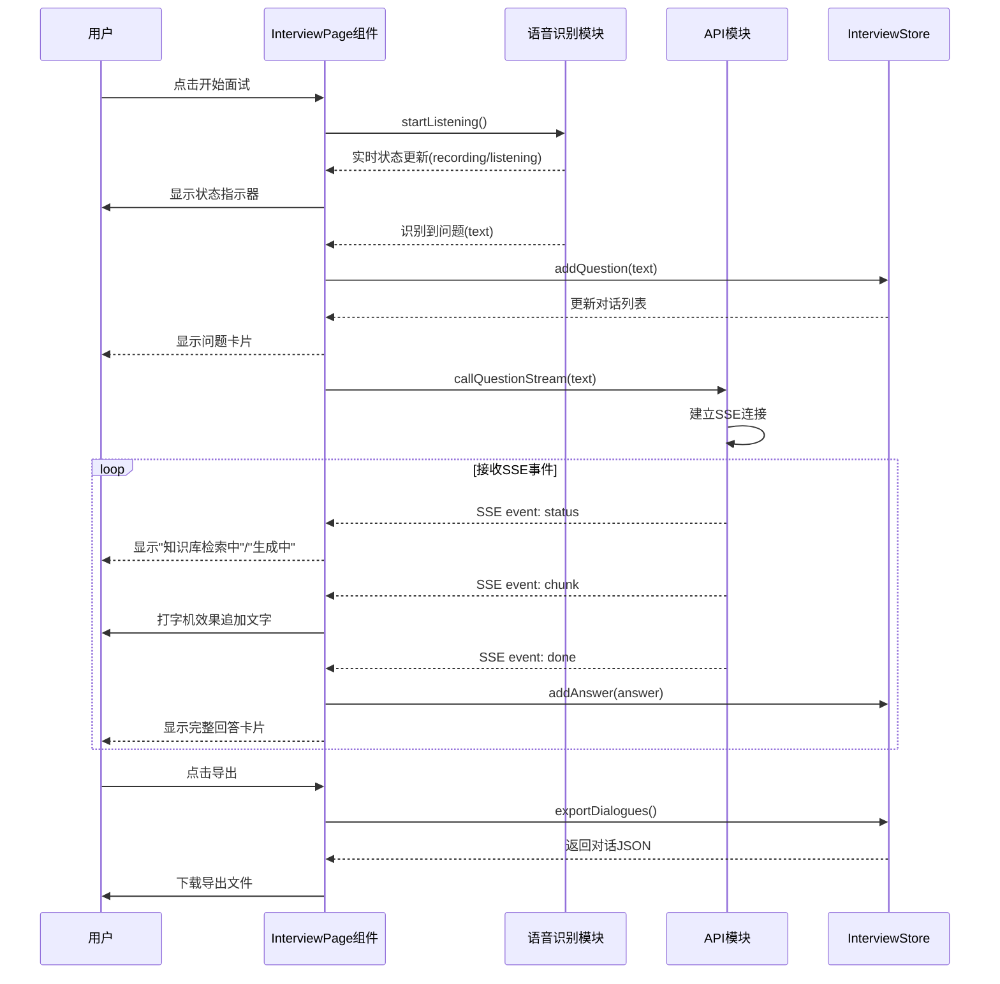

# 面试对话展示模块 - 流程文档

## 模块概述
- **功能定位**: 实现面试对话的展示和交互，支持左右分栏布局（PC端）、上下布局（移动端）、流式打字机效果、状态指示器和对话记录导出
- **核心价值**: 为用户提供清晰、实时的面试对话界面，展示面试官问题和AI生成的回答

## 核心流程

### 对话展示主流程



### 响应式布局逻辑

```mermaid
flowchart TD
    A[页面加载] --> B{屏幕宽度判断}
    B -->|>= 1024px (PC)| C[左右分栏布局]
    B -->|>= 768px (平板)| D[左右分栏布局]
    B -->|< 768px (手机)| E[上下布局]
    C --> F[左侧: 问题区域]
    C --> G[右侧: 回答区域]
    E --> H[上方: 问题区域]
    E --> I[下方: 回答区域]
    F --> J[语音状态指示器]
    G --> K[打字机效果渲染]
    H --> J
    I --> K
```

## 涉及文件清单
| 文件 | 作用 | 层级 |
|-----|------|------|
| frontend/src/components/InterviewPage.vue | 面试主页面组件 | 页面 |
| frontend/src/components/DialogueItem.vue | 单条对话展示组件 | 组件 |
| frontend/src/stores/interview.ts | 面试状态管理（对话记录） | 状态 |
| frontend/src/composables/useApi.ts | API调用封装（SSE处理） | Composable |
| frontend/src/router/index.ts | 路由配置 | 路由 |

## 关键逻辑通俗解释

> 用大白话解释核心逻辑，让非技术人员也能理解。

面试对话展示模块就像是面试虎的脸面。它的工作流程：

1. **准备界面**: 用户进入面试页面，看到一个左右分栏（PC端）或上下布局（手机端）的界面
2. **显示状态**: 录音和识别过程中，界面会显示"录音中"、"识别中"等状态提示，让用户知道系统在干什么
3. **展示问题**: 当识别到面试官的问题后，会在左侧（或上方）显示问题卡片
4. **打字机效果**: AI生成回答时，文字会像打字机一样逐字显示，而不是一次性全部出来，让用户有更好的体验
5. **保存对话**: 所有对话都会保存在内存中，方便用户后续查看
6. **导出功能**: 用户可以把对话记录导出成文件，方便回顾和分析

这个模块的设计考虑了不同设备的使用场景，在手机上会自动调整为上下布局，确保移动端也有良好的体验。

## 接口/交互说明

### 组件交互
| 组件 | 接收Props | 发出Events | 说明 |
|------|----------|-----------|------|
| InterviewPage | - | - | 面试主页面，管理整体状态 |
| DialogueItem | dialogue (对话对象) | - | 展示单条对话（问题或回答） |

### Store状态管理
| 状态 | 类型 | 说明 |
|------|------|------|
| dialogues | array | 对话列表 |
| isRecording | boolean | 是否正在录音 |
| isGenerating | boolean | 是否正在生成回答 |
| currentQuestion | string | 当前问题 |

### Store方法
| 方法 | 说明 |
|------|------|
| addQuestion(text) | 添加问题到对话列表 |
| addAnswer(answer) | 添加回答到对话列表 |
| exportDialogues(format) | 导出对话记录 |
| clearDialogues() | 清空对话记录 |

### 响应式断点
| 断点 | 宽度 | 布局 |
|------|------|------|
| lg | >= 1024px | 左右分栏 |
| md | >= 768px | 左右分栏 |
| sm | < 768px | 上下布局 |

### 状态指示器
| 状态 | 显示文本 | 颜色 |
|------|---------|------|
| idle | 准备就绪 | 绿色 |
| recording | 录音中 | 红色 |
| listening | 识别中 | 蓝色 |
| searching | 知识库检索中 | 黄色 |
| generating | 生成回答中 | 紫色 |