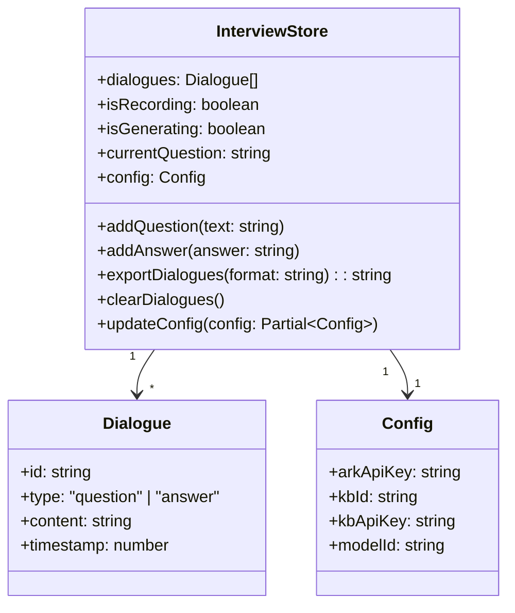
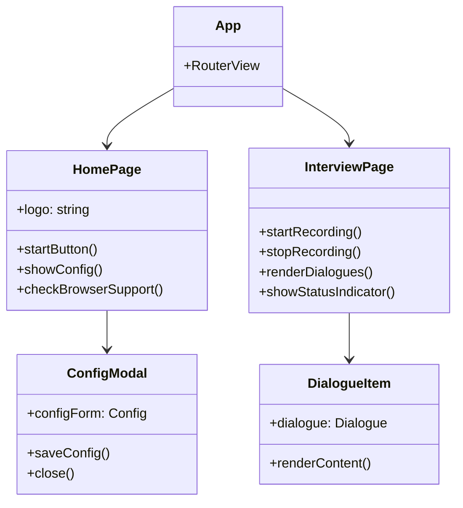

# 前端项目骨架模块 - 设计说明

## 架构决策

| 决策项 | 选择方案 | 备选方案 | 决策理由 | 相关ADR |
|--------|---------|---------|---------|---------|
| 前端框架 | Vue 3 + Composition API | React/Angular | Vue学习曲线平缓，Composition API适合中小型项目，生态成熟 | ADR-001 |
| 构建工具 | Vite 5 | Webpack/Rollup | Vite启动速度快，HMR热更新体验好，原生支持TypeScript | ADR-001 |
| 状态管理 | Pinia | Vuex | Pinia是Vue官方推荐，API简洁，支持TypeScript | ADR-002 |
| 样式方案 | Tailwind CSS 3 | SCSS/Element Plus | Tailwind开发效率高，响应式设计便捷，适合快速原型 | ADR-003 |
| 路由 | Vue Router 4 | 自定义路由 | Vue官方路由方案，支持懒加载和路由守卫 | - |

## 数据结构/状态管理设计

### 前端状态管理

### 组件关系图

## 关键设计意图

### 1. 路由懒加载设计
为什么这样设计？解决了什么问题？

路由采用懒加载模式（`() => import()`），当用户访问特定页面时才加载对应的组件代码。这样可以减小初始加载包的体积，加快首页加载速度。

### 2. Pinia状态集中管理
为什么这样设计？有什么取舍？

所有面试相关的状态（对话记录、录音状态、配置信息）都集中在 `interview` store中管理。这样可以避免组件间状态传递的复杂性，同时便于在任何组件中访问和修改状态。

### 3. Tailwind CSS原子化样式
为什么这样设计？有什么取舍？

使用Tailwind CSS的原子化类名（如`flex`, `p-4`, `text-center`）进行样式开发，开发效率高，无需编写额外的CSS文件。牺牲了一定的样式可维护性，但对于中小型项目来说是合理的取舍。

## 扩展性与未来改动点

| 可能的改动 | 影响范围 | 改动难度 | 建议时机 |
|-----------|---------|----------|---------|
| 添加多语言支持 | 所有组件 | 中 | v2.0 |
| 引入UI组件库（Element Plus） | 表单、弹窗组件 | 低 | v1.5 |
| 添加主题切换（深色模式） | 全局样式 | 中 | v2.0 |
| 增加用户登录模块 | 路由、状态管理、API | 高 | v2.0 |