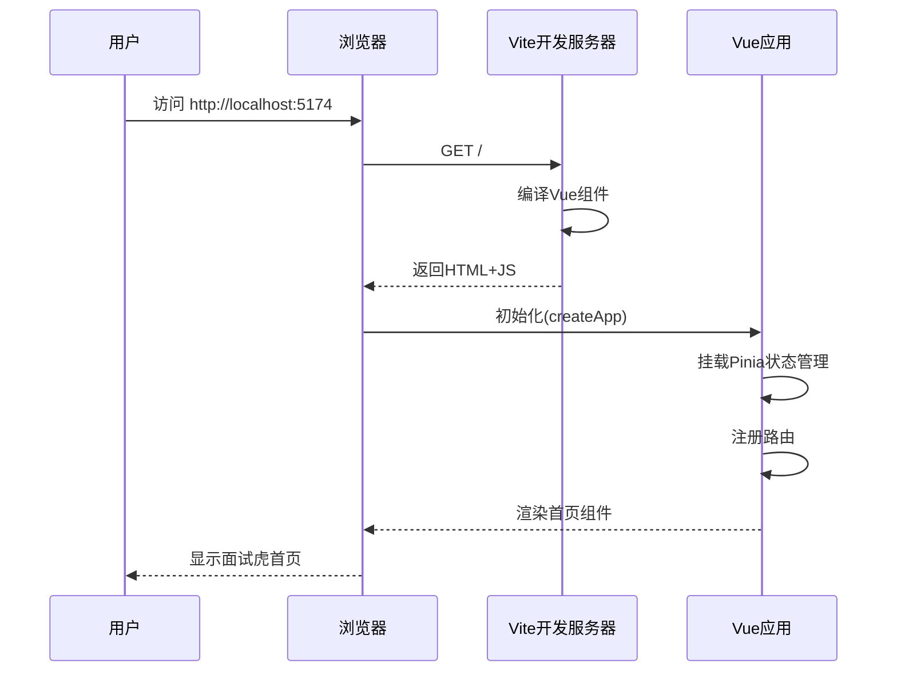

# 前端项目骨架模块 - 流程文档

## 模块概述
- **功能定位**: 项目的前端基础架构，提供Vue 3应用框架、路由管理、状态管理和UI基础组件
- **核心价值**: 快速搭建面试虎Web应用的前端开发环境，确保项目结构规范、可维护

## 核心流程

### 主流程



### 应用启动流程

```mermaid
flowchart TD
    A[用户启动 npm run dev] --> B[Vite启动开发服务器]
    B --> C[加载 vite.config.ts]
    C --> D[加载 tsconfig.json]
    C --> E[配置Tailwind CSS]
    B --> F[编译 src/main.ts]
    F --> G[createApp 创建Vue实例]
    G --> H[.use(Pinia) 状态管理]
    G --> I[.use(Router) 路由注册]
    H --> J[挂载到 #app]
    I --> J
    J --> K[渲染首页组件]
    K --> L[启动完成]
```

## 涉及文件清单
| 文件 | 作用 | 层级 |
|-----|------|------|
| frontend/package.json | 项目依赖和脚本配置 | 配置 |
| frontend/vite.config.ts | Vite构建工具配置 | 配置 |
| frontend/tsconfig.json | TypeScript编译配置 | 配置 |
| frontend/tailwind.config.js | Tailwind CSS主题配置 | 配置 |
| frontend/src/main.ts | Vue应用入口文件 | 入口 |
| frontend/src/App.vue | 根组件，包含RouterView | 组件 |
| frontend/src/router/index.ts | 路由配置和路由守卫 | 路由 |
| frontend/src/stores/interview.ts | Pinia面试状态管理 | 状态 |
| frontend/src/components/HomePage.vue | 首页组件 | 页面 |
| frontend/src/components/InterviewPage.vue | 面试主页面组件 | 页面 |
| frontend/src/components/ConfigModal.vue | 配置弹窗组件 | 组件 |

## 关键逻辑通俗解释

> 用大白话解释核心逻辑，让非技术人员也能理解。

前端项目骨架就像是一个房子的地基和框架。当用户打开浏览器访问应用时，系统会：

1. **启动服务**: 运行 npm run dev 就像打开电灯开关，Vite开发服务器开始工作
2. **加载配置**: 读取各种配置文件，就像查看房子的设计图纸
3. **创建应用**: Vue框架初始化，就像搭建房子的主体结构
4. **注册功能**: 添加状态管理（Pinia）和路由（Router），就像安装水电管线
5. **渲染页面**: 根据当前URL显示对应的页面组件，就像在框架内装修房间

## 接口/交互说明

### 路由配置
| 路径 | 组件 | 说明 |
|------|------|------|
| / | HomePage.vue | 首页，显示Logo和开始面试按钮 |
| /interview | InterviewPage.vue | 面试主页面 |

### 组件交互
| 组件 | 功能 | 说明 |
|------|------|------|
| HomePage | 首页入口 | 点击"开始面试"跳转面试页，点击设置图标打开配置弹窗 |
| InterviewPage | 面试主界面 | 包含录音区域和对话展示区域 |
| ConfigModal | 配置弹窗 | 输入API Key和知识库ID，保存到本地存储 |