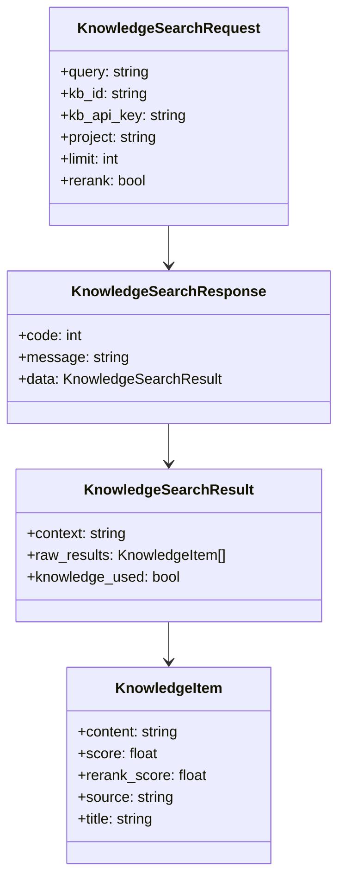
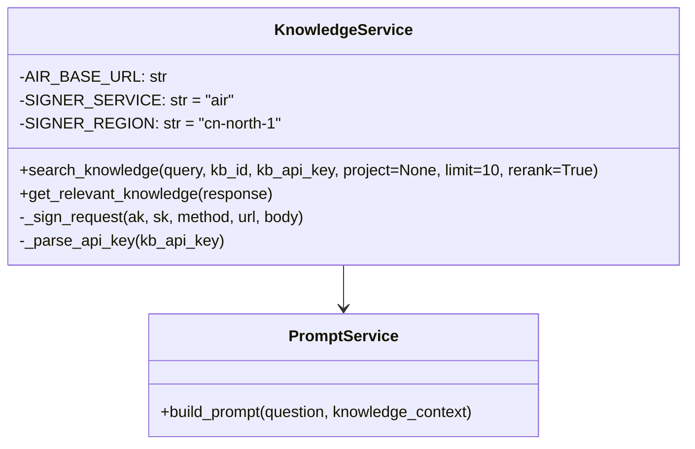

# 知识库检索模块 - 设计说明

## 架构决策

| 决策项 | 选择方案 | 备选方案 | 决策理由 | 相关ADR |
|--------|---------|---------|---------|---------|
| 知识库服务 | 火山引擎RAG | 自研向量数据库 | 用户已有火山引擎知识库，与LLM同平台，便于统一管理 | ADR-009 |
| 认证方式 | SignerV4签名 | API Key直接传递 | SignerV4是火山引擎标准认证方式，安全性更高 | - |
| 结果过滤 | 前端过滤(score>0.3) | 后端过滤 | 减少返回数据量，减轻网络传输压力 | - |
| 降级策略 | 无知识库时使用通用模式 | 报错提示 | 用户可能没有配置知识库，降级模式保证功能可用 | - |

## 数据结构/状态管理设计

### 检索结果结构

### 服务层类图

## 关键设计意图

### 1. SignerV4签名认证
为什么这样设计？解决了什么问题？

火山引擎知识库API要求使用SignerV4签名认证，这是一种基于时间戳和请求参数的动态签名机制，比固定API Key更安全。

### 2. 结果过滤和重排序
为什么这样设计？有什么取舍？

检索结果首先按rerank_score排序（如果启用重排序），然后过滤掉相关性低于0.3的结果，最多保留3条。这样可以确保只有最相关的内容被注入到Prompt中，避免信息过载。

### 3. 自动降级机制
为什么这样设计？有什么取舍？

当知识库检索失败或返回空结果时，系统自动降级为通用模式（不使用知识库上下文）。这样即使知识库不可用，用户仍然可以获得通用的面试回答建议。

## 扩展性与未来改动点

| 可能的改动 | 影响范围 | 改动难度 | 建议时机 |
|-----------|---------|----------|---------|
| 添加多知识库支持 | knowledge.py | 中 | v1.5 |
| 引入向量数据库（Milvus/PGVector） | 后端服务层 | 高 | v2.0 |
| 添加检索结果可视化 | 前端 | 中 | v2.0 |
| 支持自定义检索参数 | 前端配置 + 后端 | 低 | v1.5 |