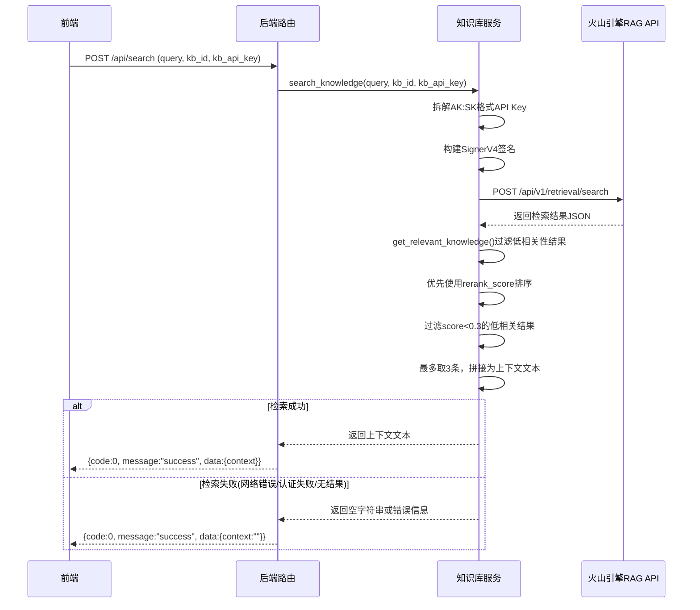
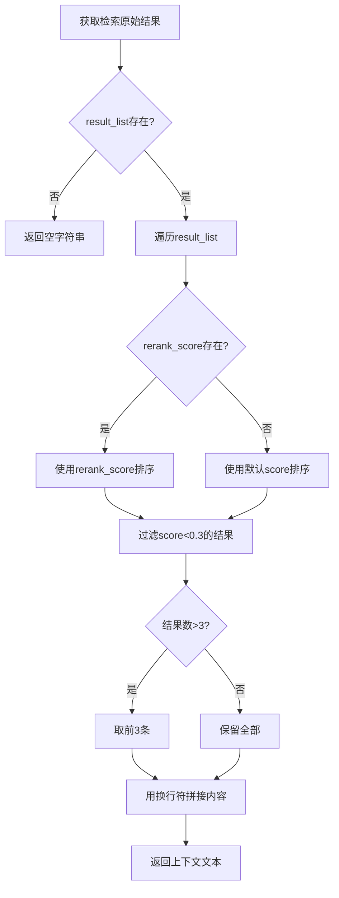

# 知识库检索模块 - 流程文档

## 模块概述
- **功能定位**: 实现火山引擎知识库的检索服务，支持SignerV4签名认证，从知识库中检索与面试问题相关的用户简历/项目经历信息
- **核心价值**: 为大模型提供个性化的上下文信息，让回答更贴合用户的真实经历

## 核心流程

### 知识库检索主流程

### 结果过滤逻辑

## 涉及文件清单
| 文件 | 作用 | 层级 |
|-----|------|------|
| backend/app/services/knowledge.py | 知识库检索核心服务 | 服务 |
| backend/app/routes/search.py | 知识库检索API路由 | 路由 |
| backend/app/routes/question.py | 问题处理路由（调用知识库） | 路由 |
| backend/app/services/prompt.py | Prompt拼接（使用知识库结果） | 服务 |
| backend/config.py | 环境变量配置（默认KB_API_KEY） | 配置 |

## 关键逻辑通俗解释

> 用大白话解释核心逻辑，让非技术人员也能理解。

知识库检索模块就像是面试虎的记忆库。它的工作流程：

1. **接收问题**: 后端收到面试问题后，需要从知识库中查找相关信息
2. **准备钥匙**: 把用户配置的API Key拆成Access Key和Secret Key，就像准备开锁的钥匙
3. **签名认证**: 生成SignerV4签名，就像在请求上盖个章证明身份
4. **检索记忆**: 向火山引擎知识库发送请求，查找与问题相关的用户简历、项目经历等信息
5. **筛选重要信息**: 
   - 只保留相关性高的内容（分数>0.3）
   - 最多取3条最相关的
   - 把它们拼接成一段上下文文本
6. **返回结果**: 如果找不到相关信息或检索失败，就返回空字符串，系统会自动降级为通用模式

这个模块的好处是，当用户回答面试问题时，大模型会参考用户自己的简历和项目经历，回答更具个性化。

## 接口/交互说明

### API端点
| 方法 | 端点 | 说明 |
|------|------|------|
| POST | /api/search | 知识库检索 |
| POST | /api/question | 完整问答流程（包含知识库检索） |

### 请求参数
| 参数 | 类型 | 说明 |
|------|------|------|
| query | string | 检索查询词（面试问题） |
| kb_id | string | 知识库ID |
| kb_api_key | string | 知识库API Key（AK:SK格式） |
| project | string | 项目ID（可选） |
| limit | number | 返回数量限制（可选） |
| rerank | boolean | 是否启用重排序（可选） |

### 服务层方法
| 方法 | 说明 |
|------|------|
| search_knowledge(query, kb_id, kb_api_key, **kwargs) | 原始检索调用 |
| get_relevant_knowledge(response) | 结果过滤和拼接 |

### 与其他模块的关系
| 模块 | 关系 |
|------|------|
| Prompt拼接模块 | 知识库结果作为上下文注入Prompt |
| 大模型调用模块 | 最终回答基于知识库上下文生成 |