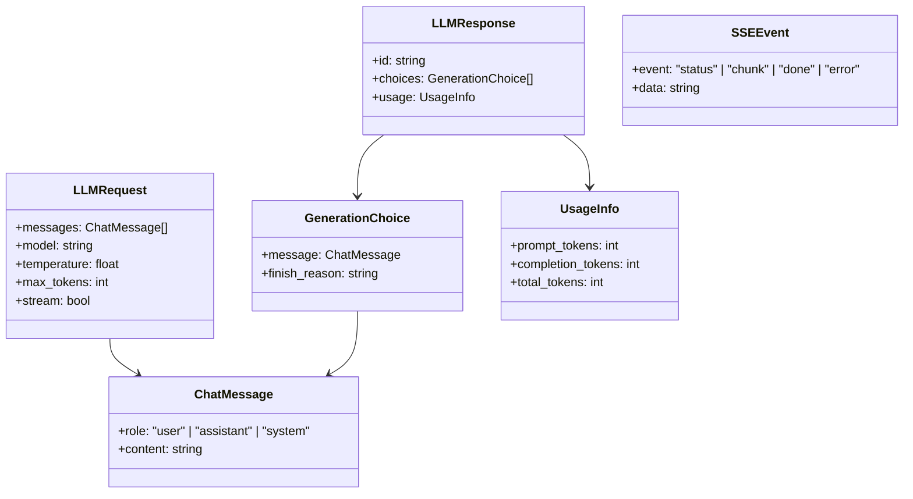
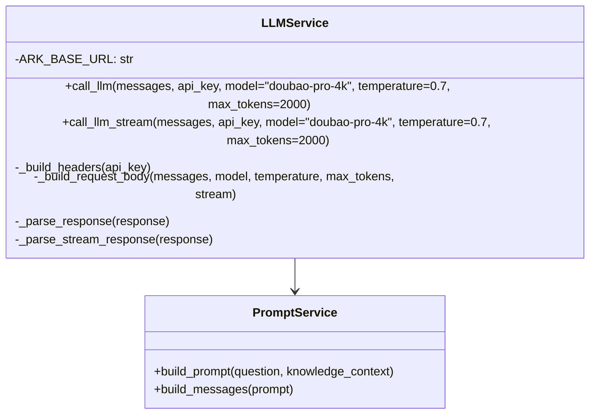

# 大模型调用模块 - 设计说明

## 架构决策

| 决策项 | 选择方案 | 备选方案 | 决策理由 | 相关ADR |
|--------|---------|---------|---------|---------|
| LLM服务 | 火山引擎方舟平台 | OpenAI/豆包 | 用户已有火山引擎账号，且知识库与LLM同平台 | ADR-007 |
| API格式 | OpenAI兼容Chat Completions | 火山引擎原生格式 | OpenAI格式是行业标准，便于切换其他LLM | - |
| 认证方式 | Bearer Token | API Key直接传递 | Bearer Token是标准HTTP认证方式，安全规范 | - |
| 流式响应 | SSE（Server-Sent Events） | WebSocket | SSE实现简单，适合单向数据流，浏览器原生支持 | ADR-008 |

## 数据结构/状态管理设计

### 请求消息结构

### 服务层类图

## 关键设计意图

### 1. 双模式调用设计
为什么这样设计？解决了什么问题？

同时支持非流式和流式两种调用模式。非流式适合需要完整结果的场景，流式适合实时展示的场景（打字机效果）。

### 2. OpenAI兼容格式
为什么这样设计？有什么取舍？

使用OpenAI Chat Completions格式封装火山引擎API，便于未来切换到其他支持OpenAI格式的LLM（如OpenAI、Azure OpenAI等）。

### 3. 流式错误处理
为什么这样设计？有什么取舍？

流式模式下的错误也通过SSE事件返回（event: error），前端可以统一处理正常流和错误流，避免连接中断。

## 扩展性与未来改动点

| 可能的改动 | 影响范围 | 改动难度 | 建议时机 |
|-----------|---------|----------|---------|
| 添加多LLM支持（OpenAI/豆包） | llm.py | 中 | v1.5 |
| 引入缓存机制 | llm.py | 低 | v1.5 |
| 添加模型参数调优界面 | 前端配置 | 中 | v2.0 |
| 支持函数调用（Function Calling） | llm.py + prompt.py | 高 | v2.0 |