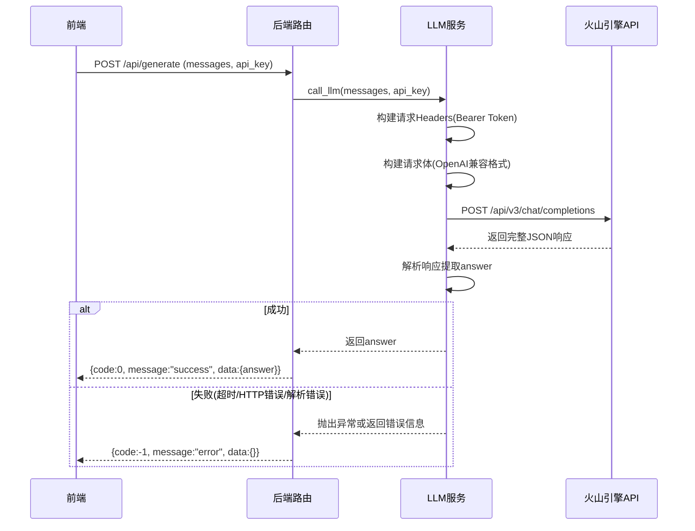

# 大模型调用模块 - 流程文档

## 模块概述
- **功能定位**: 实现火山引擎方舟大模型的调用服务，支持非流式和流式两种模式，处理API认证、请求构建、响应解析和错误处理
- **核心价值**: 根据面试问题和知识库内容生成个性化的回答建议

## 核心流程

### 非流式调用流程



### 流式调用流程（SSE）

```mermaid
sequenceDiagram
    participant 前端
    participant 后端路由
    participant LLM服务
    participant 火山引擎API

    前端->>后端路由: POST /api/generate/stream (messages, api_key)
    后端路由->>LLM服务: call_llm_stream(messages, api_key)
    LLM服务->>火山引擎API: POST /api/v3/chat/completions (stream=true)
    火山引擎API-->>LLM服务: SSE流式响应
    LLM服务->>LLM服务: iter_lines逐行解析
    loop 每收到一行
        alt data字段存在
            LLM服务->>后端路由: yield chunk(text)
            后端路由->>前端: SSE event: chunk
        else data:[DONE]
            LLM服务->>后端路由: yield done()
            后端路由->>前端: SSE event: done
            break
        else 错误
            LLM服务->>后端路由: yield error(message)
            后端路由->>前端: SSE event: error
        end
    end
```

## 涉及文件清单
| 文件 | 作用 | 层级 |
|-----|------|------|
| backend/app/services/llm.py | 大模型调用核心服务 | 服务 |
| backend/app/routes/generate.py | 大模型调用API路由 | 路由 |
| backend/app/routes/question.py | 问题处理路由（调用LLM） | 路由 |
| backend/config.py | 环境变量配置（默认API Key） | 配置 |
| frontend/src/composables/useApi.ts | 前端API调用封装 | Composable |
| frontend/src/stores/interview.ts | 面试状态管理（存储回答） | 状态 |

## 关键逻辑通俗解释

> 用大白话解释核心逻辑，让非技术人员也能理解。

大模型调用模块就像是面试虎的大脑思考能力。它的工作流程：

1. **接收问题**: 前端把面试问题和用户配置的API Key发送给后端
2. **认证**: 后端用API Key生成认证令牌（Bearer Token），就像出示身份证
3. **发送请求**: 把问题包装成大模型能理解的格式，发送给火山引擎
4. **等待回答**: 
   - **非流式**: 等待大模型完成全部思考后，一次性返回完整答案
   - **流式**: 大模型想到一点就返回一点，就像打字机一样逐字显示
5. **解析结果**: 从大模型的响应中提取答案文本
6. **返回结果**: 把答案返回给前端显示

这个模块支持两种模式，流式模式的好处是用户不用等待整个回答生成完毕，能看到实时的打字效果，体验更好。

## 接口/交互说明

### API端点
| 方法 | 端点 | 说明 |
|------|------|------|
| POST | /api/generate | 非流式大模型调用 |
| POST | /api/generate/stream | 流式大模型调用（SSE） |
| POST | /api/question | 完整问答流程（非流式） |
| POST | /api/question/stream | 完整问答流程（流式） |

### 请求参数
| 参数 | 类型 | 说明 |
|------|------|------|
| messages | array | 对话消息数组（OpenAI格式） |
| ark_api_key | string | 火山引擎API Key |
| model_id | string | 模型ID（可选） |
| temperature | number | 温度参数，控制回答随机性（可选） |
| max_tokens | number | 最大生成token数（可选） |

### SSE事件类型
| 事件 | 说明 |
|------|------|
| status | 状态更新（如"知识库检索中"） |
| chunk | 回答文本块 |
| done | 回答完成 |
| error | 错误信息 |

### 服务层方法
| 方法 | 说明 |
|------|------|
| call_llm(messages, api_key, **kwargs) | 非流式调用 |
| call_llm_stream(messages, api_key, **kwargs) | 流式调用（Generator） |