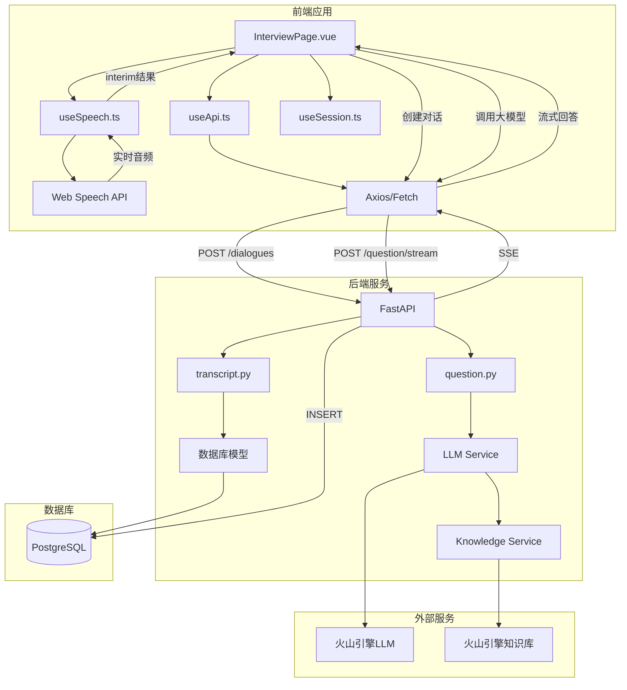
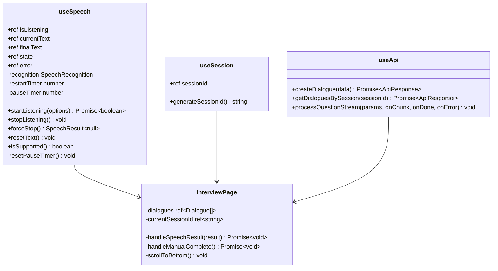

# 实时语音识别模块 - 设计文档

## 模块概述

实现语音文字实时显示、2秒停顿自动结束、左右两侧布局展示、PostgreSQL持久化存储。

## 架构设计

### 系统架构图



### 类图 - 前端



### 类图 - 后端

```mermaid
classDiagram
    class Dialogue {
        +id String
        +session_id String
        +question Text
        +answer Text
        +is_valid Boolean
        +rule String
        +knowledge_used Boolean
        +web_search_used Boolean
        +created_at DateTime
    }
    
    class Database {
        +engine Engine
        +SessionLocal Session
        +get_db() Generator
    }
    
    class TranscriptRouter {
        +POST /dialogues create_dialogue()
        +GET /dialogues/{session_id} get_dialogues()
        +PUT /dialogues/{id} update_dialogue()
        +DELETE /dialogues/{session_id} delete_dialogues()
    }
    
    class QuestionRouter {
        +POST /question/stream process_question_stream()
    }
    
    Database --> Dialogue
    TranscriptRouter --> Database
    QuestionRouter --> Database
```

## 数据结构

### 数据库表结构

```sql
CREATE TABLE dialogues (
    id VARCHAR PRIMARY KEY,
    session_id VARCHAR NOT NULL,
    question TEXT NOT NULL,
    answer TEXT,
    is_valid BOOLEAN DEFAULT TRUE,
    rule VARCHAR,
    knowledge_used BOOLEAN DEFAULT FALSE,
    web_search_used BOOLEAN DEFAULT FALSE,
    created_at TIMESTAMP DEFAULT NOW()
);

CREATE INDEX idx_dialogues_session ON dialogues(session_id);
CREATE INDEX idx_dialogues_created ON dialogues(created_at);
```

### API 请求/响应结构

#### POST /dialogues - 创建对话

请求体：
```json
{
  "session_id": "session_1234567890_abc",
  "question": "你好，介绍一下你自己",
  "is_valid": true,
  "rule": ""
}
```

响应：
```json
{
  "code": 0,
  "message": "success",
  "data": {
    "id": "dialogue_123",
    "session_id": "session_1234567890_abc",
    "question": "你好，介绍一下你自己",
    "answer": null,
    "is_valid": true,
    "rule": "",
    "knowledge_used": false,
    "web_search_used": false,
    "created_at": "2024-01-01T12:00:00Z"
  }
}
```

#### PUT /dialogues/{id} - 更新回答

请求体：
```json
{
  "answer": "我是面试虎，一个AI智能面试助手...",
  "knowledge_used": true,
  "web_search_used": false
}
```

响应：
```json
{
  "code": 0,
  "message": "success",
  "data": {
    "id": "dialogue_123",
    "answer": "我是面试虎，一个AI智能面试助手..."
  }
}
```

#### GET /dialogues/{session_id} - 获取会话对话

响应：
```json
{
  "code": 0,
  "message": "success",
  "data": {
    "dialogues": [
      {
        "id": "dialogue_123",
        "session_id": "session_1234567890_abc",
        "question": "...",
        "answer": "...",
        "created_at": "..."
      }
    ]
  }
}
```

## 接口清单

| 接口 | 方法 | 路径 | 描述 |
|------|------|------|------|
| 创建对话 | POST | /api/dialogues | 创建新对话记录 |
| 获取对话列表 | GET | /api/dialogues/{session_id} | 获取指定会话的所有对话 |
| 更新对话 | PUT | /api/dialogues/{id} | 更新对话（保存回答） |
| 删除会话 | DELETE | /api/dialogues/{session_id} | 删除指定会话的所有对话 |
| 处理问题（流式） | POST | /api/question/stream | 调用大模型获取回答 |

## 关键设计决策

### 1. 2秒停顿检测

- 在 `useSpeech.ts` 中添加 `pauseTimer`，每次收到新的 interim 结果时重置
- 2秒无新结果触发自动结束
- 自动结束后合并 `finalText` 和 `currentText` 作为完整消息

### 2. Session ID 管理

- 使用 `localStorage` 存储 session_id
- 每次页面加载时检查，不存在则生成新的
- session_id 格式：`session_{timestamp}_{random_str}`

### 3. 实时显示策略

- interim 结果直接显示在左侧气泡中（浅色/斜体表示未确认）
- isFinal 或自动结束后，文本变为深色/正常字体

### 4. 大模型调用时机

- 对话记录创建成功后立即调用
- 使用流式接口，实时显示回答
- 回答完成后更新数据库

## 错误处理

| 错误场景 | 处理策略 |
|---------|---------|
| 麦克风权限被拒绝 | 显示错误提示，引导用户开启权限 |
| 语音识别服务不可用 | 显示错误提示，建议更换浏览器 |
| 网络异常 | 自动重试3次，失败显示错误 |
| 大模型调用失败 | 显示错误提示，允许重试 |
| 数据库连接失败 | 返回500错误，记录日志 |