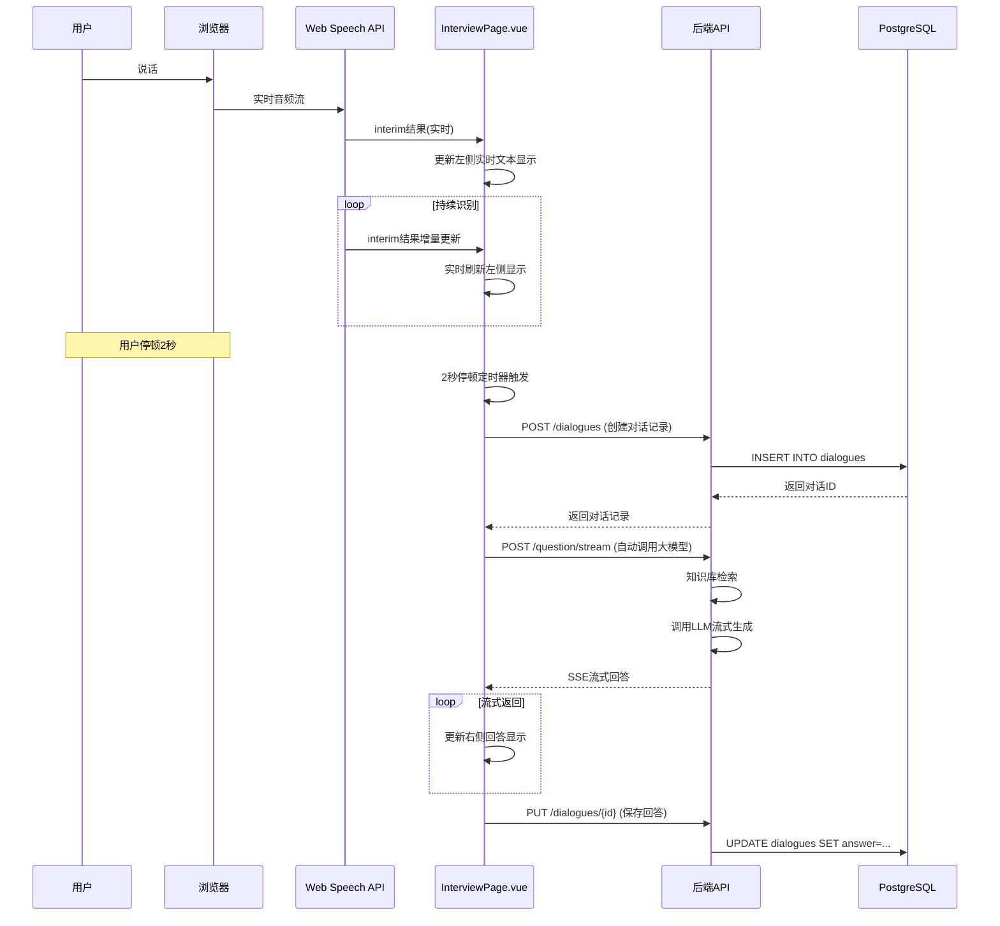
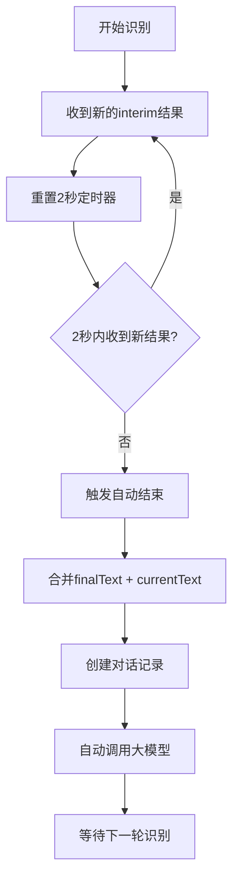
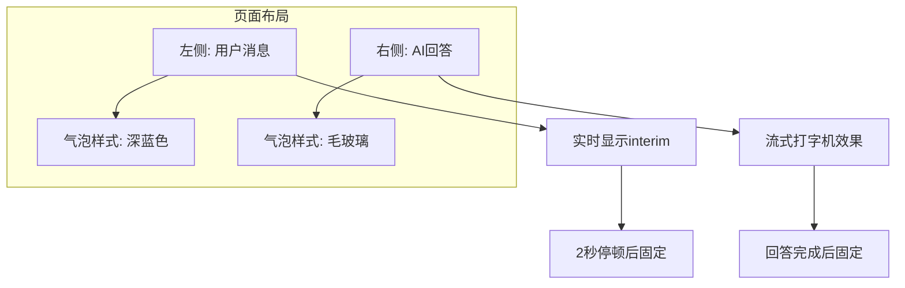
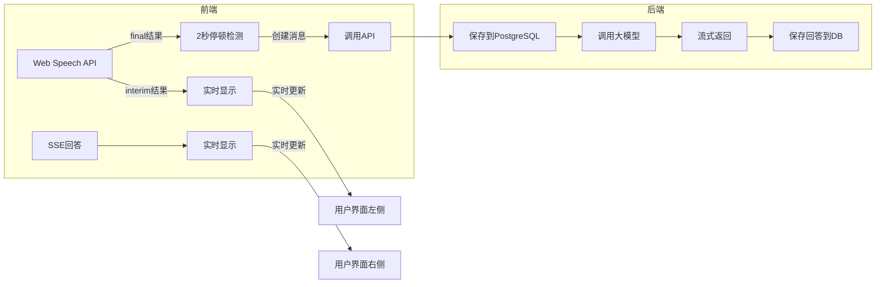

# 实时语音识别模块 - 流程文档

## 模块概述

实现语音文字实时显示、2秒停顿自动结束、左右两侧布局展示。

## 核心流程图

### 语音识别实时显示流程

```mermaid
sequenceDiagram
    participant User as 用户
    participant Browser as 浏览器
    participant SpeechAPI as Web Speech API
    participant Vue as InterviewPage.vue
    participant API as 后端API
    participant DB as PostgreSQL

    User->>Browser: 说话
    Browser->>SpeechAPI: 实时音频流
    SpeechAPI->>Vue: interim结果(实时)
    Vue->>Vue: 更新左侧实时文本显示
    
    loop 持续识别
        SpeechAPI->>Vue: interim结果增量更新
        Vue->>Vue: 实时刷新左侧显示
    end
    
    Note over User,Browser: 用户停顿2秒
    Vue->>Vue: 2秒停顿定时器触发
    Vue->>API: POST /dialogues (创建对话记录)
    API->>DB: INSERT INTO dialogues
    DB-->>API: 返回对话ID
    API-->>Vue: 返回对话记录
    
    Vue->>API: POST /question/stream (自动调用大模型)
    API->>API: 知识库检索
    API->>API: 调用LLM流式生成
    API-->>Vue: SSE流式回答
    
    loop 流式返回
        Vue->>Vue: 更新右侧回答显示
    end
    
    Vue->>API: PUT /dialogues/{id} (保存回答)
    API->>DB: UPDATE dialogues SET answer=...
```

### 2秒停顿检测逻辑

```mermaid
flowchart TD
    A[开始识别] --> B[收到新的interim结果]
    B --> C[重置2秒定时器]
    C --> D{2秒内收到新结果?}
    D -->|是| B
    D -->|否| E[触发自动结束]
    E --> F[合并finalText + currentText]
    F --> G[创建对话记录]
    G --> H[自动调用大模型]
    H --> I[等待下一轮识别]
```

### 左右两侧布局

```mermaid
flowchart TD
    subgraph 页面布局
        A[左侧: 用户消息] --> B[气泡样式: 深蓝色]
        C[右侧: AI回答] --> D[气泡样式: 毛玻璃]
    end
    
    A --> E[实时显示interim]
    E --> F[2秒停顿后固定]
    
    C --> G[流式打字机效果]
    G --> H[回答完成后固定]
```

## 数据流向

```mermaid
flowchart LR
    subgraph 前端
        A[Web Speech API] -->|interim结果| B[实时显示]
        A -->|final结果| C[2秒停顿检测]
        C -->|创建消息| D[调用API]
        E[SSE回答] --> F[实时显示]
    end
    
    subgraph 后端
        D --> G[保存到PostgreSQL]
        G --> H[调用大模型]
        H --> I[流式返回]
        I --> J[保存回答到DB]
    end
    
    B -->|实时更新| K[用户界面左侧]
    F -->|实时更新| L[用户界面右侧]
```