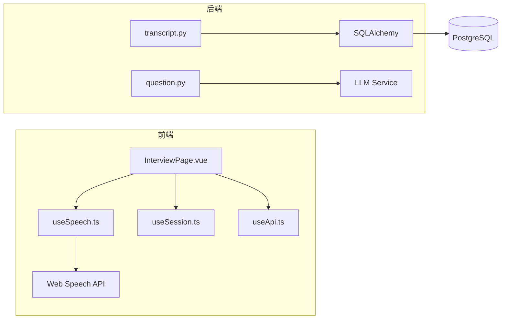

# 实时语音识别模块 - 双角色摘要

## 产品视角

### 功能概述

**实时语音识别模块**为面试虎应用提供核心的语音交互能力，让用户能够通过语音方式与AI面试助手进行对话。

### 用户故事

**作为**面试官，
**我希望**在面试过程中通过语音提问，
**以便**更自然地进行面试流程，无需手动输入文字。

**作为**面试官，
**我希望**我说的话能够实时显示在屏幕上，
**以便**确认识别结果是否正确。

**作为**面试官，
**我希望**说完话停顿后，系统能自动理解我已说完，
**以便**无需手动点击按钮确认。

**作为**面试官，
**我希望**系统能自动记录我和AI的对话，
**以便**面试结束后回顾整个对话内容。

### 核心功能

1. **实时显示**：语音识别结果实时显示在左侧面板
2. **自动结束**：2秒停顿后自动确认当前消息
3. **左右布局**：左侧显示用户消息，右侧显示AI回答
4. **自动响应**：消息确认后自动调用大模型生成回答
5. **数据持久化**：对话记录保存到数据库，支持跨会话查看

### 业务价值

- 提升用户体验：语音交互更自然
- 提高效率：自动检测结束，无需手动操作
- 数据留存：支持面试记录回顾和分析

---

## 技术视角

### 模块架构



### 核心技术点

#### 1. 语音识别实时处理

使用 Web Speech API 的 `interimResults` 特性实现实时显示：

```typescript
rec.interimResults = true
rec.continuous = true

rec.onresult = (event) => {
  for (let i = event.resultIndex; i < event.results.length; i++) {
    const result = event.results[i]
    if (result.isFinal) {
      finalText.value += result[0].transcript
    } else {
      currentText.value = result[0].transcript
    }
  }
}
```

#### 2. 2秒停顿检测

使用定时器实现自动结束逻辑：

```typescript
let pauseTimer = null

function resetPauseTimer() {
  if (pauseTimer) clearTimeout(pauseTimer)
  pauseTimer = setTimeout(() => {
    // 触发自动结束
  }, 2000)
}
```

#### 3. Session ID 管理

基于 localStorage 的无登录会话管理：

```typescript
const SESSION_KEY = 'interview_session_id'

function generateSessionId() {
  const id = 'session_' + Date.now() + '_' + Math.random().toString(36).substr(2, 9)
  localStorage.setItem(SESSION_KEY, id)
  return id
}
```

#### 4. PostgreSQL 数据存储

使用 SQLAlchemy ORM 进行数据库操作：

```python
class Dialogue(Base):
    __tablename__ = "dialogues"
    
    id = Column(String, primary_key=True)
    session_id = Column(String, index=True, nullable=False)
    question = Column(Text, nullable=False)
    answer = Column(Text)
    created_at = Column(DateTime, default=datetime.utcnow)
```

### 接口设计

| 接口 | 方法 | 用途 |
|------|------|------|
| `/api/dialogues` | POST | 创建对话记录 |
| `/api/dialogues/{session_id}` | GET | 获取会话对话列表 |
| `/api/dialogues/{id}` | PUT | 更新对话回答 |
| `/api/dialogues/{session_id}` | DELETE | 删除会话 |
| `/api/question/stream` | POST | 流式调用大模型 |

### 数据流

```
用户说话
    ↓
Web Speech API (interim实时)
    ↓
前端实时显示
    ↓
2秒停顿检测
    ↓
POST /dialogues (创建记录)
    ↓
POST /question/stream (调用LLM)
    ↓
SSE流式返回
    ↓
前端实时显示回答
    ↓
PUT /dialogues/{id} (保存回答)
```

### 技术栈

- **前端**：Vue 3 + TypeScript + Tailwind CSS
- **后端**：FastAPI + SQLAlchemy + PostgreSQL
- **语音识别**：Web Speech API
- **大模型**：火山引擎方舟 LLM
- **容器**：Docker + Docker Compose