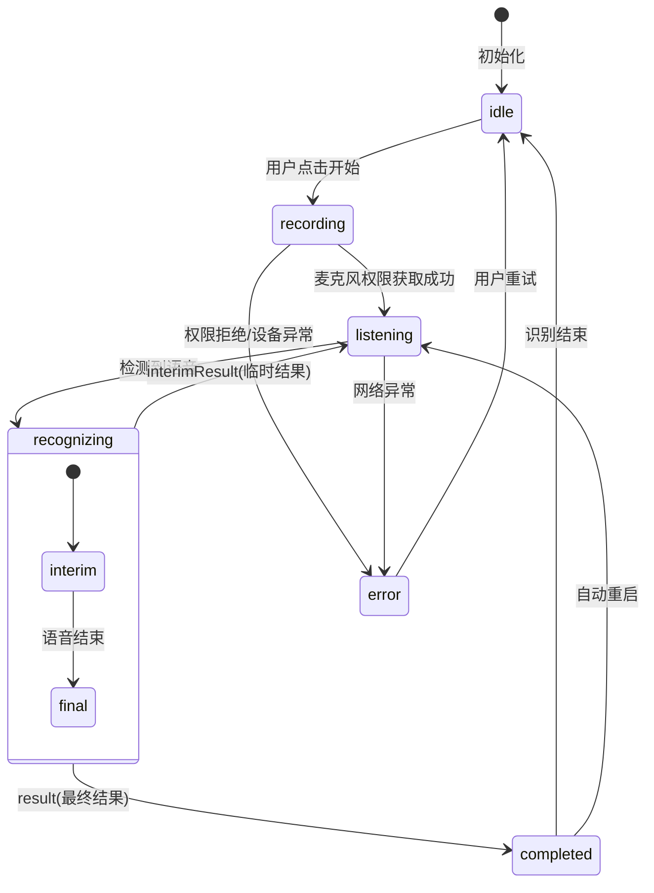
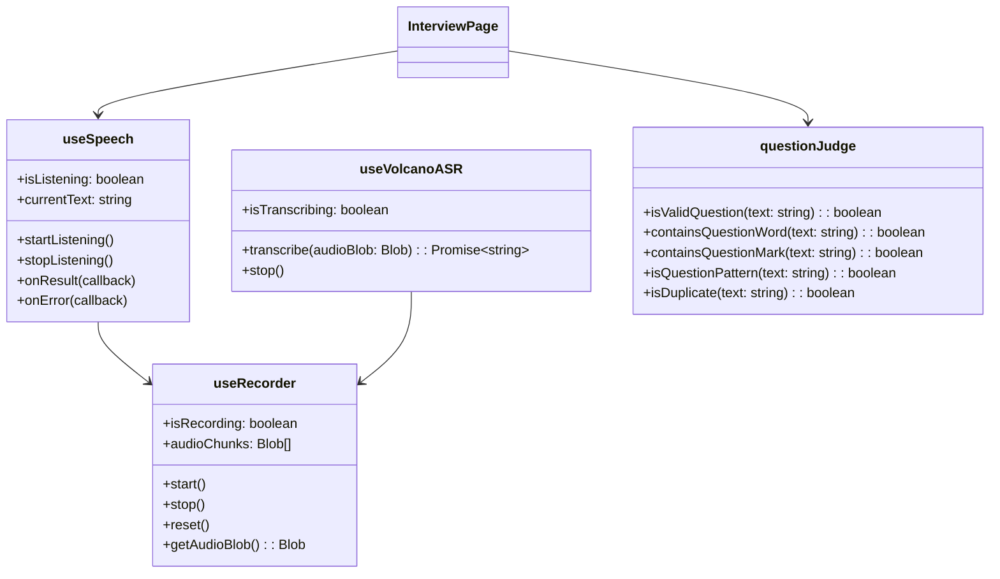

# 录音与语音识别模块 - 设计说明

## 架构决策

| 决策项 | 选择方案 | 备选方案 | 决策理由 | 相关ADR |
|--------|---------|---------|---------|---------|
| 语音识别 | Web Speech API | 火山引擎ASR | Web Speech API免费且无需后端，适合个人用户 | ADR-005 |
| 备用方案 | 火山引擎ASR | 百度ASR/阿里云ASR | 火山引擎与LLM同一生态，便于统一管理 | - |
| 问题判断 | 规则引擎（前端） | LLM二分类（后端） | 规则引擎响应快，无API成本，作为主方案；LLM作为兜底 | ADR-006 |
| 重复过滤 | 客户端30秒去重 | 服务端去重 | 减少不必要的API调用，降低成本 | - |

## 数据结构/状态管理设计

### 语音识别状态机

### Composable类图

## 关键设计意图

### 1. 自动重启机制
为什么这样设计？解决了什么问题？

Web Speech API的识别会话有时间限制（通常10秒左右），自动重启机制可以实现持续监听，用户无需手动重新开始。

### 2. 规则引擎优先设计
为什么这样设计？有什么取舍？

问题判断优先使用规则引擎（标点、疑问词、句式、长度四重规则），响应快且无API成本。当规则引擎无法确定时，才调用后端LLM进行二分类。

### 3. 双模式语音识别
为什么这样设计？有什么取舍？

主方案使用浏览器原生Web Speech API，零成本；备用方案使用火山引擎ASR，识别准确率更高但有成本。用户可根据需要切换。

## 扩展性与未来改动点

| 可能的改动 | 影响范围 | 改动难度 | 建议时机 |
|-----------|---------|----------|---------|
| 添加多语言识别支持 | useSpeech | 低 | v1.5 |
| 引入标点恢复功能 | questionJudge | 中 | v1.5 |
| 添加语音增强处理 | useRecorder | 中 | v2.0 |
| 支持离线语音识别 | useSpeech | 高 | v2.0 |