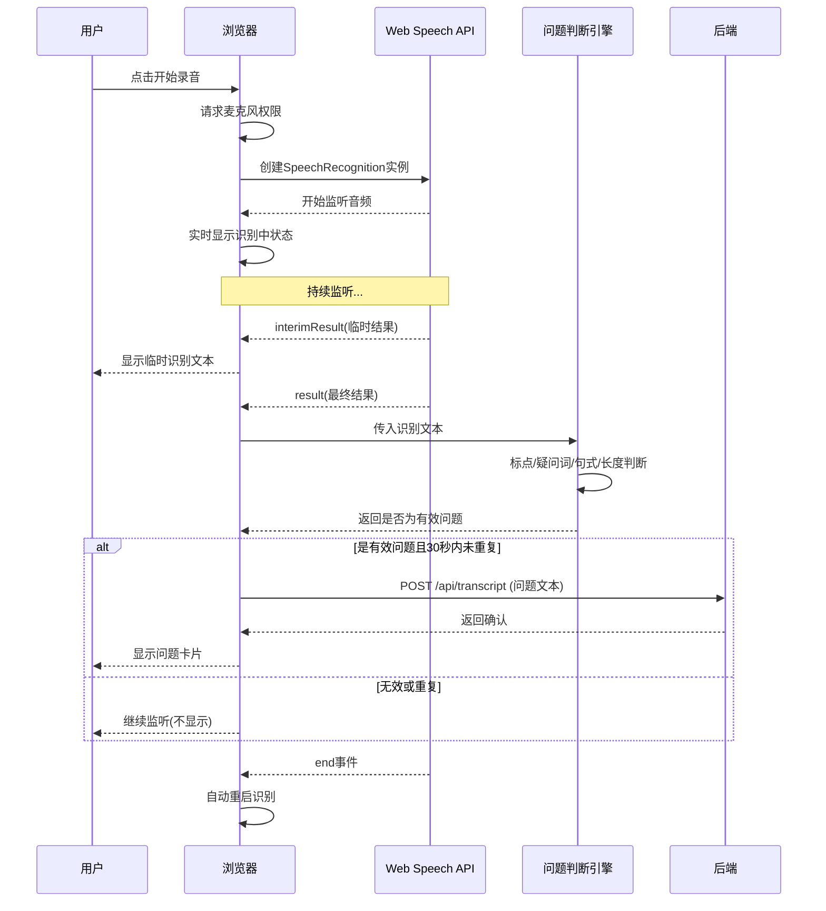
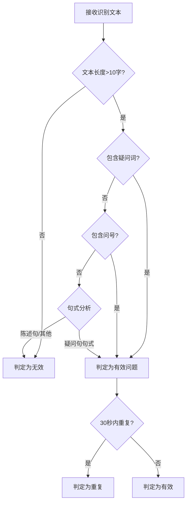

# 录音与语音识别模块 - 流程文档

## 模块概述
- **功能定位**: 实现浏览器端实时录音和语音转文字功能，支持麦克风权限请求、音频采集、Web Speech API识别、问题判断和重复过滤
- **核心价值**: 将面试官的语音问题转化为文字，为后续知识库检索和大模型回答提供输入

## 核心流程

### 录音识别主流程

### 问题判断逻辑

## 涉及文件清单
| 文件 | 作用 | 层级 |
|-----|------|------|
| frontend/src/composables/useRecorder.ts | 录音逻辑封装 | Composable |
| frontend/src/composables/useSpeech.ts | 语音识别逻辑封装 | Composable |
| frontend/src/composables/useVolcanoASR.ts | 火山引擎ASR备用方案 | Composable |
| frontend/src/utils/questionJudge.ts | 问题判断规则引擎 | 工具 |
| frontend/src/stores/interview.ts | 面试状态管理（对话记录） | 状态 |
| frontend/src/components/InterviewPage.vue | 面试页面（调用录音） | 页面 |
| backend/app/routes/transcript.py | 对话记录接口 | 路由 |
| backend/app/services/question_judge.py | 后端问题判断服务 | 服务 |

## 关键逻辑通俗解释

> 用大白话解释核心逻辑，让非技术人员也能理解。

录音与语音识别模块就像是面试虎的耳朵和嘴巴。它的工作流程：

1. **听**: 用户点击开始面试后，浏览器请求麦克风权限，就像递上一个麦克风
2. **转写**: 使用浏览器内置的语音识别功能，把面试官说的话转换成文字，就像一个实时翻译
3. **判断**: 系统会判断转换后的文字是不是一个问题——看有没有问号、有没有"什么""怎么""为什么"等疑问词
4. **去重**: 如果同样的问题30秒内又说了一遍，系统会忽略，避免重复处理
5. **展示**: 如果是有效问题，就发送给后端，然后在界面上显示问题卡片

这个模块最聪明的地方是能自动重启——识别结束后会自动开始新一轮监听，不用用户手动操作。

## 接口/交互说明

### 前端Composable方法
| 方法 | 说明 |
|------|------|
| useRecorder.start() | 开始录音 |
| useRecorder.stop() | 停止录音 |
| useSpeech.startListening() | 开始语音识别 |
| useSpeech.stopListening() | 停止语音识别 |
| questionJudge.isValidQuestion(text) | 判断是否为有效问题 |

### 后端接口
| 方法 | 端点 | 说明 |
|------|------|------|
| POST | /api/transcript | 提交对话记录 |
| GET | /api/dialogues | 获取对话列表 |

### 组件交互
| 组件 | 接收Props | 发出Events | 说明 |
|------|----------|-----------|------|
| InterviewPage | - | startRecording/stopRecording | 控制录音状态 |
| DialogueItem | dialogue | - | 展示单条对话 |