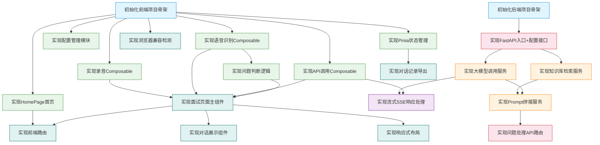

# 项目总控索引 — 面试虎

## 项目概述
- **项目名称**: 面试虎 - AI智能面试助手
- **项目描述**: 面向个人求职者的本地化AI面试辅助工具，实时录音→语音识别→知识库检索→大模型生成个性化回答
- **创建时间**: 2026-07-02 14:16
- **当前状态**: ✅ 全部完成 (21/21)
- **技术需求文档**: `.ai-workflow/prd/tech-requirements.md`

## 项目技术栈
- **前端**: Vue 3 + Vite + Tailwind CSS + Pinia + TypeScript
- **后端**: Python FastAPI
- **数据库**: 无（纯本地运行，localStorage存储配置）
- **外部服务**: 火山引擎方舟LLM + 火山引擎知识库
- **Docker**: 否
- **部署**: 本地启动（npm run dev + uvicorn）

## 任务清单

| 任务ID | 任务名称 | 类型 | 阶段 | 优先级 | 状态 | 依赖 | 日志文件 | 预期产出 |
|--------|---------|------|------|--------|------|------|---------|----------|
| TASK-001 | 初始化前端项目骨架 | 前端 | 项目初始化 | P0 | ✅已完成 | - | logs/TASK-001.md | frontend/完整骨架 |
| TASK-002 | 初始化后端项目骨架 | 后端 | 项目初始化 | P0 | ✅已完成 | - | logs/TASK-002.md | backend/完整骨架 |
| TASK-003 | 实现HomePage首页组件 | 前端 | View层 | P0 | ✅已完成 | TASK-001 | logs/TASK-003.md | HomePage.vue |
| TASK-004 | 实现录音Composable | 前端 | Composables | P0 | ✅已完成 | TASK-001 | logs/TASK-004.md | useRecorder.ts |
| TASK-005 | 实现语音识别Composable | 前端 | Composables | P0 | ✅已完成 | TASK-001 | logs/TASK-005.md | useSpeech.ts |
| TASK-006 | 实现配置管理模块 | 前端 | View层 | P1 | ✅已完成 | TASK-001 | logs/TASK-006.md | ConfigModal.vue + config store |
| TASK-007 | 实现后端FastAPI入口+配置接口 | 后端 | Routes层 | P0 | ✅已完成 | TASK-002 | logs/TASK-007.md | main.py, config路由 |
| TASK-008 | 实现知识库检索服务 | 后端 | Services层 | P0 | ✅已完成 | TASK-007 | logs/TASK-008.md | knowledge.py |
| TASK-009 | 实现大模型调用服务 | 后端 | Services层 | P0 | ✅已完成 | TASK-007 | logs/TASK-009.md | llm.py |
| TASK-010 | 实现Prompt拼接服务 | 后端 | Services层 | P0 | ✅已完成 | TASK-008,TASK-009 | logs/TASK-010.md | prompt.py |
| TASK-011 | 实现问题处理API路由 | 后端 | Routes层 | P0 | ✅已完成 | TASK-010 | logs/TASK-011.md | question.py |
| TASK-012 | 实现API调用Composable | 前端 | Composables | P1 | ✅已完成 | TASK-001,TASK-007 | logs/TASK-012.md | useApi.ts |
| TASK-013 | 实现问题判断逻辑 | 前端 | 业务逻辑 | P1 | ✅已完成 | TASK-005 | logs/TASK-013.md | questionJudge.ts |
| TASK-014 | 实现面试页面主组件 | 前端 | View层 | P0 | ✅已完成 | TASK-004,TASK-005,TASK-012 | logs/TASK-014.md | InterviewPage.vue |
| TASK-015 | 实现对话展示组件 | 前端 | 组件层 | P0 | ✅已完成 | TASK-014 | logs/TASK-015.md | DialogueItem.vue |
| TASK-016 | 实现Pinia面试状态管理 | 前端 | Store层 | P0 | ✅已完成 | TASK-001 | logs/TASK-016.md | interview.ts store |
| TASK-017 | 实现前端路由+页面切换 | 前端 | 路由层 | P1 | ✅已完成 | TASK-003,TASK-014 | logs/TASK-017.md | router/index.ts |
| TASK-018 | 实现流式SSE响应处理 | 后端+前端 | 全栈联调 | P1 | ✅已完成 | TASK-009,TASK-012 | logs/TASK-018.md | SSE流式联调 |
| TASK-019 | 实现响应式布局+移动端适配 | 前端 | UI层 | P1 | ✅已完成 | TASK-014 | logs/TASK-019.md | Tailwind响应式 |
| TASK-020 | 实现对话记录导出 | 前端+后端 | 功能特性 | P2 | ✅已完成 | TASK-016 | logs/TASK-020.md | 导出功能 |
| TASK-021 | 实现浏览器兼容检测 | 前端 | 工具层 | P1 | ✅已完成 | TASK-001 | logs/TASK-021.md | 兼容性检测 |

## 依赖关系说明

> ⚠️ 必须使用 Mermaid 有向无环图(DAG) 展示任务依赖关系

### 依赖阶段说明

| 阶段 | 任务范围 | 颜色 |
|------|---------|------|
| 🔵 项目初始化 | TASK-001 ~ TASK-002 | 蓝色 |
| 🟠 后端Services层 | TASK-008 ~ TASK-010 | 橙色 |
| 🔴 后端Routes层 | TASK-007, TASK-011 | 红色 |
| 🟢 前端业务层 | TASK-003 ~ TASK-006, TASK-012, TASK-013, TASK-016 | 绿色 |
| 🟣 全栈联调 | TASK-018 | 紫色 |
| 🟢 前端UI层 | TASK-014 ~ TASK-021 | 青色 |

## 模块闭环清单
- [x] 前端项目骨架模块 - ✅ 构建验证通过
- [x] 后端项目骨架模块 - ✅ 路由注册验证通过
- [x] 录音与语音识别模块 - ✅ 组件集成完成
- [x] 大模型调用模块 - ✅ 流式/非流式双模式
- [x] 知识库检索模块 - ✅ SignerV4签名集成
- [x] 面试对话展示模块 - ✅ 左右分栏+打字机效果

## Git 提交历史
| 提交时间 | Commit Hash | Message | 关联模块 |
|---------|------------|---------|----------|
| - | - | - | - |

## 续接指令
> 下一个AI实例请读取本文件，执行第一个"⏳待执行"任务，使用04-executor.md
