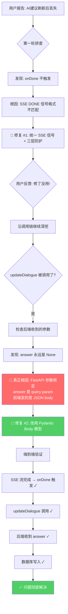

# interview-tiger — AI建议刷新后内容丢失 · 故障排查全过程

---

## 1. 文档信息

| 项目 | 内容 |
|---|---|
| 项目名称 | interview-tiger（面试虎） |
| 问题类型 | Bug — 数据持久化缺失（双 Bug 串联） |
| 排查日期 | 2026-07-08 |
| 解决状态 | ✅ 已解决 |
| 文档目的 | 复盘 + 沉淀 + AI 学习 |

---

## 2. 问题背景

**初始任务：** 用户询问面试页面"AI建议"数据是如何来的、哪个接口返回的、为什么大模型回复内容没有渲染出来。

**问题现象：** 面试过程中 AI 建议能正常流式显示，但**刷新页面后所有 AI 建议内容丢失**，只显示"回答未生成"。修复 SSE 结束后仍然无效。

**影响范围：** 所有用户 — 面试对话记录在刷新后丢失全部 AI 生成内容，历史记录功能形同虚设。

---

## 3. 问题现象（详细）

### 3.1 正常流程（刷新前）

```
面试官说话 → 语音识别 → 右侧"AI建议"区域逐字流式显示 → 看起来一切正常 ✅
```

### 3.2 异常流程（刷新后）

```
刷新页面 → GET /api/dialogues 返回数据 → 每条对话 answer 字段均为空字符串 → UI 显示"回答未生成" ❌
```

### 3.3 数据库状态

```sql
-- 任何时候查询，answer 始终为空
SELECT id, question, answer FROM dialogues;
-- id: dialogue_xxx, question: "请介绍一下你自己", answer: "" ❌

-- 预期：
-- id: dialogue_xxx, question: "请介绍一下你自己", answer: "这是一个很好的问题..." ✅
```

---

## 4. 问题分析过程（核心）

### 🔍 第一阶段：表面 Bug — SSE 流结束信号丢失

| 假设 | 推理 | 尝试方案 | 结果 | 反思 |
|---|---|---|---|---|
| 假设 1：MarkdownRenderer 渲染有问题 | Markdown 解析失败导致不显示 | 检查 [MarkdownRenderer.vue](file:///Users/siyuan/Documents/www/ai-project/interview-tiger/frontend/src/components/MarkdownRenderer.vue) | ❌ | 渲染组件正常 |
| 假设 2：流式生成根本没返回数据 | 火山引擎 API 失败 | 检查 [question.py](file:///Users/siyuan/Documents/www/ai-project/interview-tiger/backend/app/routes/question.py) 流式逻辑 | ❌ | 刷新前能显示，chunk 正常到达 |
| 假设 3：`onDone` 回调从未触发 | SSE 结束信号丢失 | 对比后端发送 `[DONE]` vs 前端期望 `{"type":"done"}` | ⚠️ 部分正确定位 | `catch{}` 静默吞异常 |

💡 **发现 Bug #1：** 后端 [question.py](file:///Users/siyuan/Documents/www/ai-project/interview-tiger/backend/app/routes/question.py#L160) 发送 OpenAI 风格的 `data: [DONE]\n\n`，但前端 [useApi.ts](file:///Users/siyuan/Documents/www/ai-project/interview-tiger/frontend/src/composables/useApi.ts#L148-L164) 期望 `JSON.parse` 解析 `{"type":"done"}`。`[DONE]` 不是合法 JSON → 抛异常 → 被 `catch {}` 静默吞掉 → `onDone` 不触发 → `updateDialogue()` 不执行。

**修复 #1：** 后端改发 `{"type":"done"}` JSON + 前端加三层防护（兼容 `[DONE]` + 流结束兜底）。

### 🔍 第二阶段：修复 #1 无效 — 发现真正的根因

⚠️ **用户反馈：** "修复完一点都没有变，还是原来的样子。所有列表数据出来了，但都显示回答未生成。"

**关键追问：** 即使 Bug #1 修复了，`updateDialogue()` 能被调用了，**数据真的写进数据库了吗？**

回溯 `updateDialogue` 的前后端对接：

**前端** [useApi.ts](file:///Users/siyuan/Documents/www/ai-project/interview-tiger/frontend/src/composables/useApi.ts#L204-L212)：

```typescript
const res = await client.put<ApiResponse>(`/dialogues/${dialogueId}`, { answer })
// → PUT /api/dialogues/xxx
// → Body: {"answer": "大模型生成的长文本..."}
```

**后端** [transcript.py](file:///Users/siyuan/Documents/www/ai-project/interview-tiger/backend/app/routes/transcript.py#L134-L138)：

```python
async def update_dialogue(
    dialogue_id: str,
    answer: Optional[str] = None,  # ← 没有 Pydantic Body 模型，这是 QUERY 参数！
    db: Session = Depends(get_db)
):
    if answer is not None:         # ← answer 永远是 None！
        dialogue.answer = answer   # ← 这一行永远不会执行！
```

**🔴 真正的根因：** FastAPI 中，没有 `Body()` 或 Pydantic 模型包裹的参数默认是 **查询参数**。前端发 JSON body `{"answer": "..."}`，后端却在 URL query string 里找 `?answer=...`。`answer` 永远是 `None`，`dialogue.answer` 从未被更新。

```
前端发送:  PUT /api/dialogues/xxx   Body: {"answer": "大模型回复..."}
后端接收:  answer = None (因为没有 ?answer=xxx 查询参数)
结果:      if answer is not None → False → 跳过 → answer 永远不落库
```

**完整 Bug 链条：**

```
Bug #1: SSE [DONE] 信号丢失 → onDone 不触发 → updateDialogue 不调用
Bug #2: updateDialogue 参数绑定错误 → 即使调用了 → answer 永远不落库
```

两个 Bug 串联，缺一个数据都不会丢——但两个同时存在，数据**100% 丢失**。

---

## 5. 解决方案

### 5.1 修复 #2（真正根因）：后端 `PUT /dialogues/{id}` — 参数从 query 改为 body

**文件：** [transcript.py](file:///Users/siyuan/Documents/www/ai-project/interview-tiger/backend/app/routes/transcript.py)

**新增 Pydantic Body 模型：**

```python
class UpdateDialogueRequest(BaseModel):
    answer: Optional[str] = Field(None, description="AI生成的回答内容")
```

**修改函数签名：**

```diff
 async def update_dialogue(
     dialogue_id: str,
-    answer: Optional[str] = None,
+    req: UpdateDialogueRequest,
     db: Session = Depends(get_db)
 ):
     ...
-    if answer is not None:
-        dialogue.answer = answer
+    if req.answer is not None:
+        dialogue.answer = req.answer
```

### 5.2 修复 #1（之前已完成）：SSE 流结束信号

**文件：** [question.py](file:///Users/siyuan/Documents/www/ai-project/interview-tiger/backend/app/routes/question.py#L160)

```diff
- yield "data: [DONE]\n\n"
+ yield f"data: {json.dumps({'type': 'done', 'knowledge_used': bool(knowledge_context)}, ensure_ascii=False)}\n\n"
```

**文件：** [useApi.ts](file:///Users/siyuan/Documents/www/ai-project/interview-tiger/frontend/src/composables/useApi.ts#L138-L176)

三层防护：显式处理 `[DONE]` + 解析 `{"type":"done"}` JSON + 流自然结束兜底。

---

## 6. 问题根因总结

| 维度 | 说明 |
|---|---|
| **Bug #1 — SSE 信号** | 后端发 `[DONE]` 原始字符串，前端期望 `{"type":"done"}` JSON → `onDone` 不触发 |
| **Bug #2 — 参数绑定（🔴 真正根因）** | FastAPI 中 `answer: Optional[str]` 是 query 参数，前端发 JSON body 无法匹配 → `answer` 永远为 `None` → 数据库永不更新 |
| **串联效应** | Bug #1 导致 `updateDialogue` 不调用，Bug #2 导致即使调用了也不生效 |
| **为什么修复 #1 无效** | Bug #2 才是真正阻止数据落库的根因 |
| **为什么之前没发现** | 前端 `console.error('保存回答失败:', err)` 没打日志（后端不报错，静默跳过） |
| **严重程度** | 🔴 Critical — 核心功能数据持久化完全失效 |

### 技术原理：FastAPI 参数绑定规则

```
没有 Body() / Pydantic 模型的参数 → query parameter
Pydantic BaseModel 类型的参数    → request body (JSON)
```

### 为什么两个方案分别不行

| 方案 | 问题 |
|---|---|
| 只修 Bug #1（SSE 信号） | `updateDialogue` 被调用了，但 `answer` 仍然传不过去 → 无效 |
| 只修 Bug #2（参数绑定） | `onDone` 不触发，`updateDialogue` 根本不会被调用 → 无效 |
| ✅ 两个都修 | 端到端打通 |

---

## 7. 经验教训

### 💡 最佳实践

1. **FastAPI 参数绑定要明确：** 接收 JSON body 必须用 Pydantic 模型，裸参数会被当作 query param
2. **`catch {}` 空块是定时炸弹** — 至少加 `console.warn` 或 `logger.warning`
3. **前后端 API 对接要做端到端验证** — 前端 `console.error` 要有对应的后端日志
4. **不要假设"修了一个 Bug 就完事"** — 连环 Bug 是常见模式

### ⚠️ 常见陷阱

1. FastAPI 裸参数 = query 参数（极易踩坑）
2. OpenAI `[DONE]` 哨兵值不是通用标准
3. 后端静默跳过 + 前端静默吞异常 = Bug 隐身

### 🔍 问题排查方法论

```
用户说"修了但没用" → 说明之前的根因只是表象 → 沿着调用链继续深挖每一环
  onDone 触发了吗？→ 修复 #1 后触发了 ✓
  updateDialogue 被调用了？→ 加了日志确认 ✓
  answer 参数传进去了吗？→ 后端收到 None ✗ ← 真正的断点
```

---

## 8. 智能体技能提升要点

### 对 AI 助手的建议

1. **FastAPI 参数绑定是高频坑点：** 看到裸 `param: Type = default` 立即警觉 — 它是 query 参数，不是 body
2. **连环 Bug 模式：** 修完第一层后必须验证端到端，不能假设"调用链通了"
3. **后端"静默失败"比"报错"更危险** — `if answer is not None` 跳过时不打日志，Bug 完全隐身
4. **用户说"修了没用"时，立即怀疑之前的根因定位不完整**

### Mermaid 排查流程图



### 关键命令速查

```bash
# 验证 update_dialogue 接口是否正常接收 body
$ curl -X PUT http://localhost:8000/api/dialogues/dialogue_test123 \
  -H "Content-Type: application/json" \
  -d '{"answer":"测试回答内容"}'
# 修复前：返回 answer 为空 → ❌
# 修复后：返回 answer="测试回答内容" → ✅

# 查看数据库
$ sqlite3 data/interview.db "SELECT id, substr(question,1,30) as q, substr(answer,1,50) as a FROM dialogues;"
```

---

## 9. 相关配置文件修改清单

| 文件路径 | 修改位置 | 修改内容说明 |
|---|---|---|
| [question.py](file:///Users/siyuan/Documents/www/ai-project/interview-tiger/backend/app/routes/question.py) | L160 | `[DONE]` → `{"type":"done","knowledge_used":...}` JSON 事件 |
| [useApi.ts](file:///Users/siyuan/Documents/www/ai-project/interview-tiger/frontend/src/composables/useApi.ts) | L138-L176 | 三层防护：`[DONE]` 兼容 + done JSON + 流结束兜底 |
| [transcript.py](file:///Users/siyuan/Documents/www/ai-project/interview-tiger/backend/app/routes/transcript.py) | L33-L36 | 新增 `UpdateDialogueRequest` Pydantic 模型 |
| [transcript.py](file:///Users/siyuan/Documents/www/ai-project/interview-tiger/backend/app/routes/transcript.py) | L138-L151 | `answer: Optional[str]` → `req: UpdateDialogueRequest` |

---

## 10. 参考资料

- [FastAPI Body - Multiple Parameters](https://fastapi.tiangolo.com/tutorial/body-multiple-params/) — 参数绑定规则
- [SSE (Server-Sent Events) 规范 — MDN](https://developer.mozilla.org/en-US/docs/Web/API/Server-sent_events)
- [OpenAI Streaming 协议 — `[DONE]` 哨兵值来源](https://platform.openai.com/docs/api-reference/streaming)

---

## 11. 时间线记录

| 时间 | 事件 | 状态 |
|---|---|---|
| T+0min | 用户提问：AI建议数据来源、接口、为何不渲染 | 🔍 排查 |
| T+10min | 完成全链路审查，发现 SSE `[DONE]` 信号不匹配（Bug #1） | 💡 |
| T+20min | 修复 Bug #1：后端 SSE 信号 + 前端三层防护 | 🛠️ |
| T+25min | 用户反馈：修复无效，仍然显示"回答未生成" | ⚠️ |
| T+30min | 深入排查：发现 `update_dialogue` 的 `answer` 参数始终为 `None` | 🔍 |
| T+35min | 定位真正根因（Bug #2）：FastAPI 参数绑定 — query param vs body | 🔴 |
| T+40min | 修复 Bug #2：新增 `UpdateDialogueRequest` Pydantic 模型 | 🛠️ |
| T+45min | 更新复盘文档，记录双 Bug 链条 | 📝 |

---

## 12. 后续优化建议

### 短期（1 周内）

- [ ] 给所有 `catch {}` 空块加上 `console.warn` / `logger.warning`
- [ ] 给 `update_dialogue` 加日志：记录收到的 `answer` 长度
- [ ] 端到端回归测试：语音输入 → 流式生成 → 刷新 → 验证 answer 存在

### 中期（1 个月内）

- [ ] 统一前后端 SSE 事件协议，用 TypeScript 类型 + Python Pydantic 双重约束
- [ ] 所有 FastAPI 路由接收 JSON body 必须用 Pydantic 模型（lint 规则强制）

### 长期（3 个月内）

- [ ] API 契约测试：自动校验前后端参数绑定一致性
- [ ] 建立前端数据持久化通用模式（内存 → IndexedDB → 服务端三层缓存）

---

## 13. 贡献者

| 角色 | 人员 |
|---|---|
| 问题发现者 | User |
| 问题分析者 | TRAE AI Agent |
| 解决方案提供者 | TRAE AI Agent |
| 文档编写者 | TRAE AI Agent |

---

> **版本：** v2.0 | **最后更新：** 2026-07-08 | **维护建议：** 修复部署后观察 1 周，确认无回归后归档
