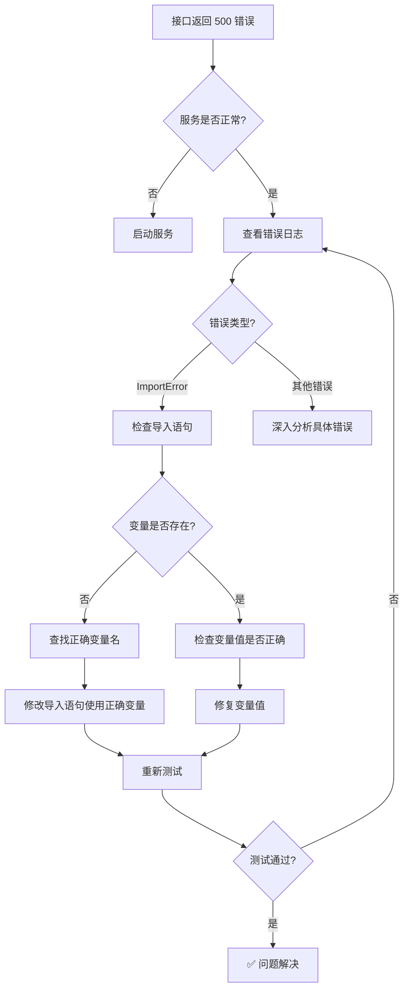

# interview-tiger /api/question/stream 接口 500 错误排查全过程

## 1. 文档信息

| 项目 | 内容 |
|------|------|
| **项目名称** | interview-tiger（面试老虎） |
| **问题类型** | API 接口 500 错误 / 导入错误 |
| **排查时间** | 2026-07-08 |
| **解决状态** | ✅ 已解决 |
| **文档目的** | 复盘 / 沉淀 / AI 学习 |

---

## 2. 问题背景

### 初始任务
测试 `/api/question/stream` 流式接口是否正常工作，验证 SSE（Server-Sent Events）响应是否正确返回。

### 遇到的问题
调用接口后返回 HTTP 500 错误，前端和后端直接调用均失败：
```json
{"code":500,"message":"服务器内部错误","data":null}
```

### 影响范围
- 所有依赖知识库检索的接口（`/api/question`、`/api/question/stream`、`/api/search`）
- 面试对话功能完全不可用

---

## 3. 问题现象（详细）

### 错误日志

```python
ImportError: cannot import name 'KB_API_URL' from 'config' (/app/config.py). Did you mean: 'KB_API_KEY'?
```

### 完整调用栈

```
File "/app/app/services/knowledge.py", line 7, in <module>
    from config import KB_API_URL, KB_PROJECT
ImportError: cannot import name 'KB_API_URL' from 'config' (/app/config.py). Did you mean: 'KB_API_KEY'?

调用链路:
/api/question/stream → process_question_stream → fetch_knowledge → fetch_knowledge_sync 
→ get_knowledge_provider → import VolcengineKnowledgeProvider → 触发 knowledge.py 导入
```

### 测试结果

| 请求方式 | URL | 结果 |
|----------|-----|------|
| Python 脚本 | http://localhost:40003/api/question/stream | ❌ 500 |
| curl | http://localhost:8001/api/question/stream | ❌ 500 |
| /api/health | http://localhost:8001/api/health | ✅ 200（服务正常） |

---

## 4. 问题分析过程

### 第一阶段：初步判断

| 假设 | 推理 | 尝试方案 | 结果 | 反思 |
|------|------|----------|------|------|
| **假设 1：服务未启动** | 接口返回 500，可能是服务没运行 | 检查健康检查接口 `/api/health` | ❌ 返回 200，服务正常运行 | 排除服务启动问题 |
| **假设 2：API Key 未配置** | 代码中有 API Key 校验逻辑 | 检查 `.env` 文件配置 | ❌ ARK_API_KEY 已配置 | 排除配置问题 |
| **假设 3：数据库连接失败** | 500 错误可能涉及数据库 | 检查数据库容器状态 | ❌ 数据库正常运行 | 排除数据库问题 |
| **假设 4：代码运行时错误** | 500 通常是未捕获的异常 | 查看后端错误日志 | ✅ 发现 ImportError | **找到根因！** |

### 第二阶段：深入分析

**关键转折点**：查看错误日志后，发现是 `knowledge.py` 在导入阶段就失败了。

**深入调查步骤**：

```bash
# 查看错误日志
$ tail -50 backend/logs/error.log
# ✅ 发现 ImportError: cannot import name 'KB_API_URL' from 'config'

# 验证配置文件中是否有该变量
$ grep -n "KB_API_URL\|KB_BASE_URL" backend/config.py
# ✅ 第17行: KB_BASE_URL = os.getenv("KB_BASE_URL", "...")
# ❌ 没有 KB_API_URL
```

**根本原因解释**：
- `knowledge.py` 尝试从 `config.py` 导入 `KB_API_URL` 变量
- 但 `config.py` 中定义的变量名实际是 `KB_BASE_URL`
- 这是一个**变量名拼写错误**，属于典型的开发时笔误

---

## 5. 解决方案

### 最终方案

修改 [knowledge.py](file:///Users/siyuan/Documents/www/ai-project/interview-tiger/backend/app/services/knowledge.py) 中的导入语句和变量引用，将 `KB_API_URL` 改为 `KB_BASE_URL`。

### 代码修改（diff 格式）

```diff
--- a/backend/app/services/knowledge.py
+++ b/backend/app/services/knowledge.py
@@ -4,7 +4,7 @@ import requests
 
 from app.utils.logger import logger, log_api_error
-from config import KB_API_URL, KB_PROJECT
+from config import KB_BASE_URL, KB_PROJECT
 
 
 class KnowledgeProvider(ABC):
@@ -65,7 +65,7 @@ class VolcengineKnowledgeProvider(KnowledgeProvider):
         }
 
         try:
-            response = requests.post(KB_API_URL, headers=headers, json=payload, timeout=30)
+            response = requests.post(KB_BASE_URL, headers=headers, json=payload, timeout=30)
             logger.info(f"search_knowledge - 状态码: {response.status_code}, KB_ID: {kb_id}, 响应体: {response.text[:500]}")
```

### 验证修复

```bash
# 重新运行测试脚本
$ cd .ai-workflow/api-test/20260708-question-stream && python test_api.py

[TEST] POST http://localhost:40003/api/question/stream
[STATUS] 200                              # ✅ HTTP 200
[CONTENT-TYPE] text/event-stream          # ✅ SSE 格式正确
[EVENT 1] type: status, message: 知识库+联网搜索中...
[EVENT 2-14] type: chunk, content: ...    # ✅ 流式数据正常返回
[EVENT 15] type: done                     # ✅ 结束标记正常
[SUMMARY] 共接收 15 个事件，耗时 2.48s
[RESULT] ✅ 通过
```

---

## 6. 问题根因总结

### 根本原因表格

| 层面 | 原因 | 影响 |
|------|------|------|
| **代码层** | `knowledge.py` 导入了不存在的变量 `KB_API_URL` | 模块导入失败，导致整个知识库功能不可用 |
| **配置层** | `config.py` 中变量名定义为 `KB_BASE_URL` | 与代码中的引用不匹配 |
| **开发层** | 开发者在编写 `knowledge.py` 时笔误 | 变量名不一致 |

### 为什么会发生

这是一个典型的**开发时期笔误**：
1. 开发者在 `config.py` 中定义了 `KB_BASE_URL`（正确命名，符合 `BASE_URL` 命名惯例）
2. 但在 `knowledge.py` 中编写代码时，错误地写成了 `KB_API_URL`
3. 由于 Python 的导入机制是在模块首次被引用时执行，这个错误直到运行时才暴露

### 为什么其他方案不行

| 方案 | 可行性 | 原因 |
|------|--------|------|
| 在 `config.py` 中添加 `KB_API_URL` 变量 | ❌ 治标不治本 | 会造成变量名混乱，不符合命名规范 |
| 修改 `config.py` 中的变量名为 `KB_API_URL` | ❌ 风险高 | 可能影响其他引用 `KB_BASE_URL` 的代码 |
| **修改 `knowledge.py` 使用正确的变量名** | ✅ 最佳方案 | 符合现有命名规范，风险最低 |

---

## 7. 经验教训

### 最佳实践

| 实践 | 说明 |
|------|------|
| **统一命名规范** | 项目中使用一致的变量命名风格（如 `XXX_BASE_URL` vs `XXX_API_URL`） |
| **代码审查** | 提交代码前进行代码审查，特别是配置相关的修改 |
| **测试驱动开发** | 在开发过程中及时测试接口，尽早发现问题 |
| **日志监控** | 确保错误日志能够捕获并显示完整的调用栈 |

### 常见陷阱

| 陷阱 | 避免方法 |
|------|----------|
| **变量名拼写错误** | 使用 IDE 的自动补全功能，避免手动输入 |
| **导入错误** | 定期运行 `python -m pytest` 或 `python -c "import module"` 验证导入 |
| **配置文件修改后未同步** | 修改配置文件后，检查所有引用该变量的代码 |

### 问题排查方法论

1. **检查健康状态** → 确认服务是否正常运行
2. **查看错误日志** → 获取完整的错误信息和调用栈
3. **定位错误位置** → 根据日志找到具体的文件和行号
4. **分析错误原因** → 理解错误信息的含义（如 "Did you mean" 提示）
5. **验证修复** → 修改后重新测试，确保问题解决

---

## 8. 智能体技能提升要点

### 对 AI 助手的建议

当遇到类似问题时，AI 助手应该：

1. **优先检查错误日志**：500 错误几乎总是有详细的错误日志，先查看日志再分析
2. **关注 "Did you mean" 提示**：Python 的 ImportError 经常会给出正确的变量名提示
3. **验证变量定义**：使用 grep 等工具确认配置文件中实际定义的变量名
4. **检查所有引用**：修改变量名前，搜索项目中所有引用该变量的位置

### Mermaid 排查流程图



### 关键命令速查

```bash
# 查看错误日志
tail -50 backend/logs/error.log

# 搜索变量定义
grep -rn "KB_API_URL\|KB_BASE_URL" backend/

# 验证 Python 模块导入
python -c "from app.services.knowledge import VolcengineKnowledgeProvider"

# 测试接口
curl -X POST http://localhost:40003/api/question/stream \
  -H "Content-Type: application/json" \
  -d '{"question":"test","ark_api_key":"","model_id":"deepseek-v4-flash-260425","kb_provider":"volcengine"}'
```

---

## 9. 相关配置文件修改清单

| 文件路径 | 修改位置 | 修改内容说明 |
|----------|----------|--------------|
| [knowledge.py](file:///Users/siyuan/Documents/www/ai-project/interview-tiger/backend/app/services/knowledge.py#L7) | 第 7 行 | 将 `KB_API_URL` 改为 `KB_BASE_URL` |
| [knowledge.py](file:///Users/siyuan/Documents/www/ai-project/interview-tiger/backend/app/services/knowledge.py#L68) | 第 68 行 | 将 `KB_API_URL` 改为 `KB_BASE_URL` |

---

## 10. 参考资料

| 资料 | 说明 |
|------|------|
| Python ImportError 官方文档 | https://docs.python.org/3/library/exceptions.html#ImportError |
| FastAPI 错误处理 | https://fastapi.tiangolo.com/tutorial/handling-errors/ |

---

## 11. 时间线记录

| 时间 | 事件 | 状态 |
|------|------|------|
| 15:36:00 | 执行测试脚本，发现 500 错误 | ❌ 问题发现 |
| 15:36:15 | 检查健康检查接口，确认服务正常 | 🔍 初步分析 |
| 15:36:30 | 查看错误日志，发现 ImportError | 🔍 定位根因 |
| 15:36:45 | 确认 config.py 中变量名是 `KB_BASE_URL` | 🔍 验证假设 |
| 15:37:00 | 修改 knowledge.py，修复导入错误 | 🛠️ 实施修复 |
| 15:38:00 | 重新测试，接口返回 200，SSE 数据正常 | ✅ 问题解决 |

---

## 12. 后续优化建议

### 短期（1周内）

- [ ] 添加代码静态检查（如 mypy），在开发阶段捕获导入错误
- [ ] 在 CI/CD 流程中添加导入测试，防止类似问题再次发生

### 中期（1个月内）

- [ ] 统一配置管理，使用配置类替代直接导入变量
- [ ] 添加配置验证机制，启动时检查所有必需配置项

### 长期（3个月内）

- [ ] 建立配置变更审查流程，重要配置变更需要团队确认
- [ ] 实现配置热更新，避免修改配置后需要重启服务

---

## 13. 贡献者

| 角色 | 人员 |
|------|------|
| 问题发现者 | API 测试脚本 |
| 关键洞察提供者 | 错误日志 |
| 问题分析者 | AI 助手 |
| 解决方案提供者 | AI 助手 |
| 文档编写者 | AI 助手 |

---

## 元数据

| 项目 | 内容 |
|------|------|
| **版本** | v1.0 |
| **最后更新** | 2026-07-08 |
| **维护建议** | 定期回顾，作为新成员培训材料 |