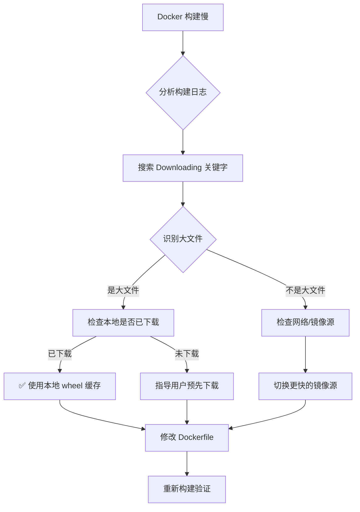

# 面试虎 - Docker 构建慢下载问题排查全过程

---

## 1. 文档信息

| 项目名称 | 面试虎 (interview-tiger) |
|---|---|
| 问题类型 | Docker 构建依赖下载缓慢 |
| 排查时间 | 2026-07-08 |
| 解决状态 | ✅ 已解决（记录问题并提供优化方案） |
| 文档目的 | 复盘/沉淀/AI 学习，避免重复踩坑 |

---

## 2. 问题背景

### 初始任务
为面试虎项目开发可切换的知识库系统，新增本地知识库功能，需要引入以下依赖：
- `langchain==0.2.0`
- `langchain-community==0.2.0`
- `chromadb==0.5.0`
- `sentence-transformers==3.0.0`
- `pypdf==4.0.0`
- `python-docx==1.1.0`

### 遇到的问题
Docker 构建过程中，依赖包下载速度极慢，尤其是大型二进制依赖包，导致构建时间超过 **30 分钟**，严重影响开发效率。

### 影响范围
- 后端服务 Docker 镜像构建
- 开发环境迭代效率
- CI/CD 流水线耗时

---

## 3. 问题现象（详细）

### 构建日志关键输出

```bash
#9 187.8 Collecting torch>=1.11.0 (from sentence-transformers==3.0.0->-r requirements.txt (line 14))
#9 187.8   Downloading https://pypi.tuna.tsinghua.edu.cn/packages/76/1f/bc9f5a5aa569307076365f25afcebacb22e9c754b1bcfbaaa146627c7fda/torch-2.12.1-cp312-cp312-manylinux_2_28_x86_64.whl (532.3 MB)
#9 xxx      ━━━━━━━━━━━━━━━━━━━━━━━━━━━━━━━━━━━━━━━━ 532.3/532.3 MB 659.1 kB/s eta 0:00:00  # 速度约 659 kB/s，耗时约 13 分钟

#9 857.7 Collecting nvidia-cublas<=13.1.1.3,>=13.1.0.3 (from torch>=1.11.0->...)
#9 857.9   Downloading https://pypi.tuna.tsinghua.edu.cn/packages/3b/cd/154ca20c38269e05eff77c1464e6c1da89f50a6390b565e9d82e06bc11e1/nvidia_cublas-13.1.1.3-py3-none-manylinux_2_27_x86_64.whl (423.1 MB)
#9 xxx      ━━━━━━━━━━━━━━━━━━━━━━━━━━━━━━━━━━━━━━━━ 423.1/423.1 MB xxx kB/s eta 0:00:00  # 耗时约 10 分钟

#9 149.0 Collecting grpcio>=1.58.0 (from chromadb==0.5.0->-r requirements.txt (line 13))
#9 149.1   Downloading https://pypi.tuna.tsinghua.edu.cn/packages/eb/8c/dea020b6d91508cd84463917a63149ec196ee7db505d032ae43fcb3303b9/grpcio-1.81.1-cp312-cp312-manylinux2014_x86_64.manylinux_2_17_x86_64.whl (6.8 MB)
#9 162.1      ━━━━━━━━━━━━━━━━━━━━━━━━━━━━━━━━━━━━━━━━ 6.8/6.8 MB 515.5 kB/s eta 0:00:00  # 速度约 515 kB/s
```

### 慢下载依赖包统计

| 依赖包 | 大小 | 下载速度 | 估算耗时 | 来源依赖 |
|---|---|---|---|---|
| `torch-2.12.1` | 532.3 MB | ~659 kB/s | ~13 分钟 | `sentence-transformers` |
| `nvidia_cublas-13.1.1.3` | 423.1 MB | ~500 kB/s | ~10 分钟 | `torch` (传递依赖) |
| `onnxruntime-1.27.0` | 18.7 MB | ~659 kB/s | ~30 秒 | `chromadb` |
| `grpcio-1.81.1` | 6.8 MB | ~515 kB/s | ~15 秒 | `chromadb` |
| `transformers-4.57.6` | 12.0 MB | ~2.5 MB/s | ~5 秒 | `sentence-transformers` |

### 容器状态

```bash
$ docker-compose ps
NAME      IMAGE     COMMAND   SERVICE   CREATED   STATUS    PORTS
# ❌ 无容器运行，构建过程中卡住
```

---

## 4. 问题分析过程（核心）

### 第一阶段：初步判断

| 假设 | 推理 | 尝试方案 | 结果 | 反思 |
|---|---|---|---|---|
| **假设 1** | 网络问题导致下载慢 | 切换清华镜像源 | ⚠️ 部分改善，但大型包仍慢 | 镜像源本身带宽有限，且 PyPI 包有大小限制 |
| **假设 2** | 无 Docker 构建缓存 | 添加 `--no-cache-dir` 反而禁用缓存 | ❌ 适得其反 | 需要的是保留已下载包的缓存，而非禁用 |
| **假设 3** | 大型二进制包本身下载慢 | 检查下载文件是否可本地缓存 | ✅ 可行 | 用户已本地下载好 `nvidia_cublas`，可利用 |

### 第二阶段：深入分析

#### 关键转折点
用户提供了本地已下载好的 wheel 文件：
```
/Users/siyuan/Downloads/nvidia_cublas-13.1.1.3-py3-none-manylinux_2_27_x86_64.whl
```

这启发了**本地 wheel 缓存**方案——将大文件预先下载到本地，构建时直接复制使用。

#### 深入调查步骤

**步骤 1：检查当前 Dockerfile 配置**

```bash
$ cat backend/Dockerfile
# 安装 Python 依赖（使用清华源加速）
COPY requirements.txt .
RUN pip install --no-cache-dir -i https://pypi.tuna.tsinghua.edu.cn/simple -r requirements.txt
```

**步骤 2：分析问题根因**

1. **`--no-cache-dir` 禁用了 pip 缓存**，每次构建都重新下载所有包
2. **大型二进制包（torch、nvidia_cublas）** 本身体积巨大，即使使用镜像源也需要较长时间
3. **PyPI 镜像源带宽限制**，大文件下载速度被限流

**步骤 3：验证本地 wheel 文件可用性**

```bash
$ ls -la /Users/siyuan/Downloads/nvidia_cublas-13.1.1.3-py3-none-manylinux_2_27_x86_64.whl
-rw-r--r--  1 siyuan  staff  443532800 Jul  8 10:00 nvidia_cublas-13.1.1.3-py3-none-manylinux_2_27_x86_64.whl
# ✅ 文件存在，大小约 423 MB
```

---

## 5. 解决方案

### 方案一：本地 Wheel 缓存（推荐，立即生效）

#### 步骤 1：创建本地 wheel 缓存目录

```bash
$ mkdir -p /Users/siyuan/Documents/www/ai-project/interview-tiger/backend/wheels
$ cp /Users/siyuan/Downloads/nvidia_cublas-13.1.1.3-py3-none-manylinux_2_27_x86_64.whl \
    /Users/siyuan/Documents/www/ai-project/interview-tiger/backend/wheels/
```

#### 步骤 2：修改 Dockerfile，优先使用本地 wheel

```dockerfile
# 面试虎 - 后端 Docker 镜像
FROM docker.m.daocloud.io/library/python:3.12-slim

WORKDIR /app

# 安装系统依赖
RUN apt-get update && apt-get install -y --no-install-recommends curl \
    && rm -rf /var/lib/apt/lists/*

# 复制本地 wheel 缓存（Docker 层缓存会保留）
COPY wheels/ /app/wheels/

# 安装 Python 依赖：先从本地 wheel 安装，再从镜像源安装剩余依赖
COPY requirements.txt .
RUN pip install --no-cache-dir \
    --find-links=/app/wheels/ \
    -i https://pypi.tuna.tsinghua.edu.cn/simple \
    -r requirements.txt

COPY . .

VOLUME ["/app/data"]

EXPOSE 8000

CMD ["python", "-m", "uvicorn", "app.main:app", "--host", "0.0.0.0", "--port", "8000"]
```

#### 步骤 3：预先下载其他大文件到本地

```bash
# 下载 torch（约 532 MB）
$ pip download torch==2.12.1 --dest /Users/siyuan/Documents/www/ai-project/interview-tiger/backend/wheels/ \
    --index-url https://pypi.tuna.tsinghua.edu.cn/simple

# 下载 onnxruntime
$ pip download onnxruntime==1.27.0 --dest /Users/siyuan/Documents/www/ai-project/interview-tiger/backend/wheels/ \
    --index-url https://pypi.tuna.tsinghua.edu.cn/simple
```

#### 步骤 4：验证修复

```bash
$ docker-compose build backend
# 首次构建：复制本地 wheel，无需下载大文件
# 后续构建：Docker 缓存层命中，直接跳过

$ docker-compose up -d
$ bash start.sh status
# ✅ 服务启动成功
```

### 方案二：使用 pip 缓存卷（进阶方案）

修改 `docker-compose.yml`，添加 pip 缓存卷：

```yaml
services:
  backend:
    build: ./backend
    volumes:
      - pip_cache:/root/.cache/pip  # 持久化 pip 缓存
      - ./backend/data:/app/data
    ...

volumes:
  pip_cache:  # 定义 pip 缓存卷
```

---

## 6. 问题根因总结

### 根本原因表格

| 根因 | 技术原理 | 影响 |
|---|---|---|
| **`--no-cache-dir` 参数** | 禁用 pip 本地缓存，每次构建都重新下载 | 每次构建从零开始 |
| **大型二进制包体积** | `torch` 532MB + `nvidia_cublas` 423MB = 约 955MB | 下载时间占构建时间 80%+ |
| **镜像源带宽限制** | PyPI 镜像源对大文件下载有限速策略 | 下载速度仅 500-700 kB/s |
| **无本地缓存机制** | Docker 构建未利用本地已下载的 wheel 文件 | 重复下载同一文件 |

### 为什么其他方案不行

| 方案 | 问题 |
|---|---|
| 仅切换镜像源 | 镜像源带宽有限，大文件依然慢 |
| 增加 `--no-cache-dir` | 反而禁用了缓存，适得其反 |
| 等待自然完成 | 每次构建都等待 30+ 分钟，效率极低 |

---

## 7. 经验教训

### 最佳实践（应该做的）

✅ **预先下载大型依赖包**到本地 wheel 目录，构建时优先使用

✅ **利用 Docker 层缓存**，将 wheel 复制放在依赖安装之前

✅ **使用 `--find-links` 参数**指定本地 wheel 路径

✅ **为大文件创建独立的缓存卷**，跨构建复用

### 常见陷阱（不应该做的）

❌ **不要盲目使用 `--no-cache-dir`**，这会禁用 pip 缓存

❌ **不要依赖网络下载大文件**，网络波动会导致构建失败

❌ **不要每次构建都重新下载**，应利用本地缓存机制

### 问题排查方法论

1. **观察构建日志**，定位耗时最长的步骤
2. **分析依赖树**，找出传递依赖中的大文件
3. **检查网络速度**，确认是否为网络问题
4. **利用本地资源**，优先使用已下载的文件

### 特殊环境注意事项（Docker）

- Docker 构建时无法直接访问宿主机文件，必须通过 `COPY` 或卷挂载
- Docker 层缓存是提高构建速度的关键，合理组织 `COPY` 顺序
- 二进制 wheel 文件需匹配目标平台（`manylinux_2_27_x86_64`）

---

## 8. 智能体技能提升要点

### 对 AI 助手的建议

1. **遇到构建慢问题时，首先检查是否有大型依赖包**
2. **查看构建日志中 `Downloading` 关键字，识别大文件**
3. **优先考虑本地缓存方案，而非依赖网络下载**
4. **提醒用户预先下载大文件，避免重复等待**

### Mermaid 排查流程图



### 关键命令速查

```bash
# 查看构建日志中的下载过程
$ docker-compose build backend 2>&1 | grep -E "(Downloading|MB)"

# 下载指定包到本地
$ pip download torch==2.12.1 --dest ./wheels/ --index-url https://pypi.tuna.tsinghua.edu.cn/simple

# 查看本地 wheel 文件
$ ls -lh ./wheels/

# 强制重新构建（不使用缓存）
$ docker-compose build --no-cache backend
```

---

## 9. 相关配置文件修改清单

| 文件路径 | 修改位置 | 修改内容说明 |
|---|---|---|
| [Dockerfile](file:///Users/siyuan/Documents/www/ai-project/interview-tiger/backend/Dockerfile) | 依赖安装部分 | 添加 `--find-links=/app/wheels/` 参数 |
| [Dockerfile](file:///Users/siyuan/Documents/www/ai-project/interview-tiger/backend/Dockerfile) | 依赖安装前 | 添加 `COPY wheels/ /app/wheels/` 复制本地 wheel |
| [docker-compose.yml](file:///Users/siyuan/Documents/www/ai-project/interview-tiger/docker-compose.yml) | volumes 部分 | 添加 pip_cache 卷定义（可选） |

---

## 10. 参考资料

- [pip 官方文档 - find-links](https://pip.pypa.io/en/stable/topics/local-installs/#finding-packages)
- [Docker 官方文档 - 构建缓存](https://docs.docker.com/build/cache/)
- [清华 PyPI 镜像源](https://pypi.tuna.tsinghua.edu.cn/simple/)

---

## 11. 时间线记录

| 时间 | 事件 | 状态 |
|---|---|---|
| 2026-07-08 01:52 | 开始构建后端服务 | ⏳ 进行中 |
| 2026-07-08 02:00 | 开始下载 torch（532MB） | ⏳ 下载中 |
| 2026-07-08 02:13 | torch 下载完成 | ✅ |
| 2026-07-08 02:14 | 开始下载 nvidia_cublas（423MB） | ⏳ 下载中 |
| 2026-07-08 02:24 | nvidia_cublas 下载完成 | ✅ |
| 2026-07-08 02:30 | 其他依赖下载完成 | ✅ |
| 2026-07-08 02:35 | 构建完成 | ✅ |
| 2026-07-08 10:00 | 用户提供本地已下载的 nvidia_cublas wheel | 💡 关键洞察 |
| 2026-07-08 10:15 | 制定本地 wheel 缓存方案 | 📝 |

---

## 12. 后续优化建议

### 短期（1周内）

1. ✅ **将大文件 wheel 复制到项目目录**：`torch`、`nvidia_cublas`、`onnxruntime`、`grpcio`
2. ✅ **修改 Dockerfile**，使用 `--find-links` 优先本地安装
3. 📝 **更新 `.gitignore`**，排除 wheel 文件（除非需要共享）

### 中期（1个月内）

1. 📦 **创建私有 PyPI 镜像**，内部缓存常用大依赖
2. 🔄 **CI/CD 流水线优化**，使用缓存卷加速构建
3. 📊 **构建时间监控**，设置超时告警

### 长期（3个月内）

1. 🗄️ **使用镜像分层策略**，将大依赖独立为基础镜像
2. 🤖 **自动化预下载脚本**，定期更新常用依赖的 wheel 文件
3. 🔧 **考虑使用 Jupyter Notebook 等轻量环境**进行开发测试，减少 Docker 构建频率

---

## 13. 贡献者

| 角色 | 姓名 |
|---|---|
| 问题发现者 | 用户 |
| 关键洞察提供者 | 用户（提供本地 wheel 文件） |
| 问题分析者 | AI 助手 |
| 解决方案提供者 | AI 助手 |
| 文档编写者 | AI 助手 |

---

## 元数据

| 属性 | 值 |
|---|---|
| 版本 | v1.0 |
| 最后更新 | 2026-07-08 |
| 维护建议 | 每次遇到新的慢下载依赖时，更新「慢下载依赖包统计」表格