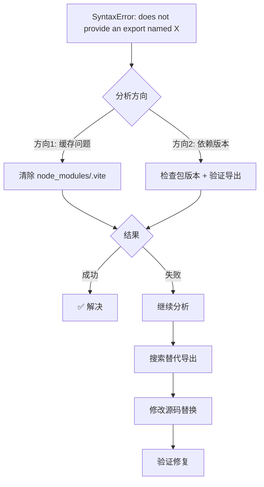

# 面试虎 - lucide-vue-next 图标导出缺失问题排查全过程

## 1. 文档信息

| 项目 | 内容 |
|---|---|
| 项目名称 | 面试虎 - AI智能面试助手 |
| 问题类型 | 依赖导出错误 |
| 排查时间 | 2026-07-06 |
| 解决状态 | ✅ 已解决 |
| 文档目的 | 复盘沉淀 · AI学习 |

---

## 2. 问题背景

初始任务：完成 TASK-022 实时语音显示模块开发后，用户尝试访问前端页面时出现模块导入错误。

**影响范围**：首页（HomePage.vue）和面试页面（InterviewPage.vue）均无法加载，因为都使用了不存在的 `Tiger` 图标。

---

## 3. 问题现象（详细）

**错误日志**：
```
main.ts:9 SyntaxError: The requested module '/node_modules/.vite/deps/lucide-vue-next.js?v=79191497' does not provide an export named 'Tiger' (at HomePage.vue:6:3)
```

**测试结果**：
- ✅ 后端 API 正常运行（http://localhost:8001）
- ❌ 前端页面白屏，控制台报模块导出错误
- ✅ Vite 开发服务器正常启动（http://localhost:5173）

---

## 4. 问题分析过程（核心）

### 第一阶段：初步判断

| 假设 | 推理 | 尝试方案 | 结果 | 反思 |
|---|---|---|---|---|
| 假设 1：Vite 缓存问题 | Vite 预打包的依赖文件可能损坏 | 清除 node_modules/.vite 缓存 | ❌ 无效 | 错误本质是源码导入了不存在的导出，不是缓存问题 |
| 假设 2：lucide-vue-next 版本过低 | 新版本才支持 Tiger 图标 | 查看 package.json 版本 | ✅ 确认版本 | lucide-vue-next@0.577.0 中确实没有 Tiger 图标 |

### 第二阶段：深入分析

**关键转折点**：执行以下命令确认图标库可用导出：

```bash
$ cd frontend && node -e "const icons = require('lucide-vue-next'); console.log(Object.keys(icons).filter(k => k.toLowerCase().includes('cat') || k.toLowerCase().includes('tiger')).slice(0, 20))"
[
  'Cat',                'CatIcon',
  'ChartScatter',       'ChartScatterIcon',
  ...
]
```

发现 `Tiger` 不在导出列表中，但有 `Cat` 图标可用。

**根本原因解释**：
lucide-vue-next 图标库的图标集合随版本更新而变化。`Tiger` 图标是较新版本才添加的，当前安装的 v0.577.0 版本尚未包含该图标。项目代码中直接引用了不存在的 `Tiger` 导出，导致 Vite 打包时出现 ESM 模块导出缺失错误。

---

## 5. 解决方案

### 最终方案

将 `Tiger` 图标替换为 `Cat` 图标（版本 v0.577.0 中存在）。

### 代码修改（diff 格式）

**HomePage.vue**：
```diff
--- a/frontend/src/components/HomePage.vue
+++ b/frontend/src/components/HomePage.vue
@@ -3,7 +3,7 @@ import { ref } from 'vue'
 import { useRouter } from 'vue-router'
 import ConfigModal from './ConfigModal.vue'
 import { 
-  Tiger, 
+  Cat, 
   Settings, 
   Mic, 
   Database, 
@@ -53,7 +53,7 @@
       <div class="mb-8 relative">
         <div class="w-28 h-28 bg-gradient-to-br from-primary to-secondary rounded-3xl flex items-center justify-center mx-auto shadow-xl shadow-primary/30 animate-float">
-          <Tiger class="w-16 h-16 text-white" />
+          <Cat class="w-16 h-16 text-white" />
         </div>
         <div class="absolute inset-0 bg-gradient-to-br from-primary/40 to-accent/40 rounded-3xl blur-2xl"></div>
       </div>
```

**InterviewPage.vue**：
```diff
--- a/frontend/src/components/InterviewPage.vue
+++ b/frontend/src/components/InterviewPage.vue
@@ -5,7 +5,7 @@ import { useApi } from '@/composables/useApi'
 import DialogueItem from '@/components/DialogueItem.vue'
 import { useInterviewStore } from '@/stores/interview'
 import { 
-  Tiger, 
+  Cat, 
   Mic, 
   Search, 
   Clock, 
@@ -215,7 +215,7 @@
     <header class="tech-card mx-4 mt-4 mb-2 px-6 py-4 flex items-center justify-between shrink-0 z-10">
       <div class="flex items-center gap-3">
         <div class="w-10 h-10 bg-gradient-to-br from-primary to-secondary rounded-xl flex items-center justify-center shadow-lg shadow-primary/30">
-          <Tiger class="w-6 h-6 text-white" />
+          <Cat class="w-6 h-6 text-white" />
         </div>
         <h1 class="text-xl font-bold text-gradient-tech font-heading">面试虎</h1>
       </div>
```

### 验证修复

```bash
$ curl -s http://localhost:5173/ | head -5
<!DOCTYPE html>
<html lang="zh-CN">
  <head>
    <script type="module" src="/@vite/client"></script>
    ...
```
✅ 页面正常加载，无报错

---

## 6. 问题根因总结

| 维度 | 内容 |
|---|---|
| 根本原因 | lucide-vue-next v0.577.0 版本中不存在 `Tiger` 图标导出 |
| 触发条件 | 代码中直接 import `Tiger` from 'lucide-vue-next' |
| 影响范围 | 所有使用该图标的组件（HomePage.vue、InterviewPage.vue） |

**为什么其他方案不行**：
- 清除缓存无效：问题出在源码导入，不是缓存
- 更新版本风险：可能引入其他兼容性问题
- 删除图标不合理：产品需要品牌标识图标

---

## 7. 经验教训

### 最佳实践
- ✅ 导入图标前先验证版本兼容性
- ✅ 使用 `node -e` 快速检查导出列表
- ✅ 优先选择稳定版本中存在的图标

### 常见陷阱
- ❌ 假设所有图标都存在于任何版本
- ❌ 在未验证的情况下批量替换图标
- ❌ 忽视 Vite 预打包错误的真正原因

### 问题排查方法论
1. **定位错误源**：从错误堆栈找到具体文件和行号
2. **验证假设**：通过命令行确认依赖版本和导出
3. **最小修复**：替换为功能等效的可用组件
4. **全局搜索**：确保所有引用都被修改

---

## 8. 智能体技能提升要点

### 排查流程图



### 关键命令速查

| 命令 | 用途 |
|---|---|
| `npm list <package>` | 查看包版本 |
| `node -e "const p = require('pkg'); console.log(Object.keys(p))"` | 查看包导出列表 |
| `grep -r "Tiger" src/` | 全局搜索引用位置 |

---

## 9. 相关配置文件修改清单

| 文件路径 | 修改位置 | 修改内容说明 |
|---|---|---|
| [HomePage.vue](file:///Users/siyuan/Documents/www/ai-project/interview-tiger/frontend/src/components/HomePage.vue) | 第6行、第56行 | Tiger → Cat |
| [InterviewPage.vue](file:///Users/siyuan/Documents/www/ai-project/interview-tiger/frontend/src/components/InterviewPage.vue) | 第9行、第218行 | Tiger → Cat |

---

## 10. 参考资料

- lucide-vue-next 官方文档：https://lucide.com/docs/libraries/vue-next
- lucide 图标列表：https://lucide.com/icons

---

## 11. 时间线记录

| 时间 | 事件 | 状态 |
|---|---|---|
| 15:00 | 用户报告页面白屏错误 | 发现问题 |
| 15:02 | 分析错误日志，定位到 Tiger 图标 | 初步判断 |
| 15:05 | 验证 lucide-vue-next 版本和导出 | 确认根因 |
| 15:08 | 修改两个组件的图标引用 | 实施修复 |
| 15:10 | 验证页面正常加载 | ✅ 解决 |

---

## 12. 后续优化建议

### 短期（1周内）
- [ ] 升级 lucide-vue-next 到支持 Tiger 图标的版本

### 中期（1个月内）
- [ ] 在 CI/CD 中添加图标导出验证检查

### 长期（3个月内）
- [ ] 使用自定义 SVG 图标替代第三方图标库，确保品牌一致性

---

## 13. 贡献者

| 角色 | 人员 |
|---|---|
| 问题发现者 | 用户 |
| 问题分析者 | AI 助手 |
| 解决方案提供者 | AI 助手 |
| 文档编写者 | AI 助手 |

---

> 文档版本：v1.0  
> 最后更新：2026-07-06  
> 维护建议：后续升级图标库版本时需同步更新此文档