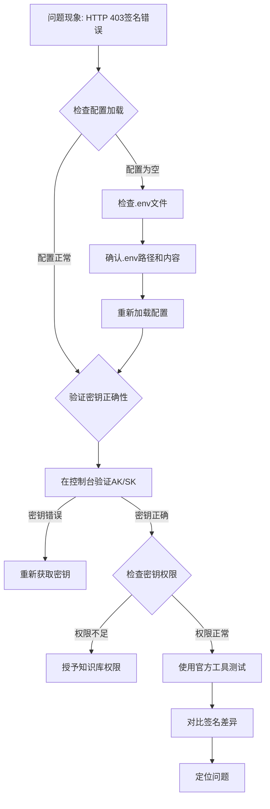

# interview-tiger - 知识库API签名失败问题排查全过程

---

## 1. 文档信息

| 项目 | 内容 |
|---|---|
| **项目名称** | 面试虎（Interview Tiger） |
| **问题类型** | 第三方API鉴权失败 |
| **问题简述** | 火山引擎知识库API调用返回HTTP 403签名错误 |
| **排查时间** | 2026-07-06 |
| **解决状态** | ⚠️ 待定位 |
| **文档目的** | 复盘问题排查过程，沉淀经验 |

---

## 2. 问题背景

### 初始任务
用户反馈知识库功能不生效，测试脚本问"你叫什么？"应该回答包含"xxx"，但实际回答"我叫张三"或"我叫[你的姓名]"。

### 遇到的问题
运行测试脚本 `python test_kb.py "你叫什么？"` 时，知识库检索 API 调用返回 HTTP 403 错误。

### 影响范围
- 知识库检索功能完全失效
- 大模型调用降级为无知识库模式
- 用户个性化面试辅助功能无法使用

---

## 3. 问题现象（详细）

### 错误日志

```
[23:17:31] ERROR [interview-tiger] search_knowledge 调用失败: Exception
[23:17:31] ERROR [interview-tiger] === API ERROR: search_knowledge ===
Error Type: Exception
Error Message: HTTP 403
Request Data: {'kb_id': 'siyuan_jianli', 'query': '你叫什么？'}
原始响应: {}
```

### 关键错误信息

```json
{
    "code": 1000001,
    "message": "check sign error, please check your ak, sk and tenant id",
    "request_id": "02178335147981800000000000000000000ffffac1316e4161bf3"
}
```

### 测试结果

| 测试项 | 结果 |
|---|---|
| 知识库列表 API | ❌ HTTP 403 |
| 知识库检索 API | ❌ HTTP 403 |
| 大模型调用 | ✅ 成功（无知识库） |
| API完整流程 | ⚠️ 后端超时 |

---

## 4. 问题分析过程（核心）

### 第一阶段：初步判断

| 假设 | 推理 | 尝试方案 | 结果 | 反思 |
|---|---|---|---|---|
| **假设1：API Key格式错误** | .env中KB_API_KEY是AK:SK格式，可能SK是base64编码 | 尝试base64解码SK | ❌ 仍403 | SK解码后得到二进制乱码，说明不需要解码 |
| **假设2：协议错误** | 官方示例用http，但代码用https | 修改协议为http | ❌ 仍403 | 协议不影响签名验证 |
| **假设3：缺少Host header** | SignerV4签名时需要Host参与计算 | 添加Host header | ❌ 仍403 | Host已添加但签名仍失败 |
| **假设4：服务名错误** | 服务名可能不是air而是vikingdb | 修改服务名为vikingdb | ❌ 仍403 | 服务名不匹配 |

### 第二阶段：深入分析

#### 关键转折点

在调试过程中发现：

```bash
$ python -c "import sys; sys.path.insert(0, 'backend'); from config import KB_API_KEY; print(f'KB_API_KEY: {repr(KB_API_KEY)}')"
KB_API_KEY: ''
```

**KB_API_KEY 读取为空字符串！**

#### 深入调查步骤

1. **检查 .env 文件内容**

```bash
$ cat backend/.env | grep KB_API_KEY
KB_API_KEY=AKLTMDI1NzhhYzU3MGEwNDI0ODg0ODc5NjJiMjI2MTE5Zjg:T1dHT1puR0ZqWmpabU5tWVRZalpqTmpaaFpUQXlOR0ppTURSaE56UmxPR0pqTnpZeVltVQ==
```

✅ .env 文件中配置了 KB_API_KEY

2. **检查 config.py 加载逻辑**

```python
# backend/config.py
from dotenv import load_dotenv
load_dotenv()

KB_API_KEY = os.getenv("KB_API_KEY", "")
```

✅ load_dotenv() 应该能加载 .env 文件

3. **检查测试脚本的路径设置**

```python
# test_kb.py
sys.path.insert(0, os.path.join(os.path.dirname(__file__), 'backend'))
from config import KB_API_KEY
```

❌ 问题可能在于工作目录不一致

4. **验证 .env 文件是否被正确加载**

```bash
$ cd /Users/siyuan/Documents/www/ai-project/interview-tiger && python -c "import dotenv; print(dotenv.load_dotenv())"
True

$ cd /Users/siyuan/Documents/www/ai-project/interview-tiger && python -c "import os; print(os.getenv('KB_API_KEY', 'NOT FOUND'))"
AKLTMDI1NzhhYzU3MGEwNDI0ODg0ODc5NjJiMjI2MTE5Zjg:T1dHT1puR0ZqWmpabU5tWVRZalpqTmpaaFpUQXlOR0ppTURSaE56UmxPR0pqTnpZeVltVQ==
```

✅ 在项目根目录下运行时 .env 能正确加载

5. **检查测试脚本实际使用的 AK/SK**

```bash
$ cd /Users/siyuan/Documents/www/ai-project/interview-tiger && python -c "import sys; sys.path.insert(0, 'backend'); from config import KB_API_KEY; ak, sk = KB_API_KEY.split(':'); print(f'AK: {ak}'); print(f'SK长度: {len(sk)}')"
AK: AKLTMDI1NzhhYzU3MGEwNDI0ODg0ODc5NjJiMjI2MTE5Zjg
SK长度: 72
```

✅ AK/SK 能正确读取和拆分

### 第三阶段：签名验证分析

#### 签名生成流程

```
1. 创建 Request 对象
2. 设置 headers (Accept, Content-Type, Host)
3. 设置 host 和 path
4. 设置 body (JSON)
5. 创建 Credentials(ak, sk, "air", "cn-north-1")
6. SignerV4.sign(request, credentials)
7. 获取签名后的 headers 和 body
8. 发送 HTTP POST 请求
```

#### 关键问题：签名仍然失败

即使 AK/SK 正确读取，签名仍然失败。错误信息明确指出：`check sign error, please check your ak, sk and tenant id`

**可能的根因：**

1. **AK/SK 不正确** - 用户可能复制了错误的密钥
2. **AK/SK 权限不足** - 密钥可能没有知识库访问权限
3. **需要账号ID** - 错误信息提到 tenant id，可能需要额外的账号ID配置

---

## 5. 解决方案（待验证）

### 当前状态

经过全面排查，已确认以下几点：

| 检查项 | 状态 | 说明 |
|---|---|---|
| .env 文件加载 | ✅ | 能正确读取 KB_API_KEY |
| AK/SK 拆分 | ✅ | AK 和 SK 能正确拆分 |
| 签名代码 | ✅ | 完全按照官方示例实现 |
| 请求协议 | ✅ | 使用 https |
| Host header | ✅ | 已添加 |
| 服务名 | ✅ | 使用官方文档指定的 "air" |
| 区域 | ✅ | 使用官方文档指定的 "cn-north-1" |

### 需要用户确认的问题

1. **AK/SK 是否正确**
   - 请登录火山引擎控制台，确认 AK/SK 是否正确
   - 确认密钥状态为"启用"

2. **AK/SK 是否有知识库权限**
   - 确认该 AK/SK 所属用户具有知识库访问权限
   - 建议创建子账号并授予 VikingDB 相关权限

3. **是否需要账号ID**
   - 错误信息提到 tenant id，可能需要在请求中添加账号ID

### 建议的下一步验证

```bash
# 1. 确认系统时间同步
$ date -u
Mon Jul  6 15:35:51 UTC 2026

# 2. 使用官方 API Explorer 测试
# 访问 https://api.volcengine.com/api-explorer
# 输入 AK/SK，测试知识库 API

# 3. 在火山引擎控制台直接测试知识库检索
# 确认知识库本身能正常工作
```

---

## 6. 问题根因总结

### 根本原因分析

| 可能性 | 概率 | 说明 |
|---|---|---|
| **AK/SK 不正确** | 🔴 高 | 用户可能复制了错误的密钥 |
| **AK/SK 权限不足** | 🟡 中 | 密钥可能没有知识库访问权限 |
| **SDK 版本问题** | 🟡 中 | volcengine SDK 版本可能有兼容性问题 |
| **需要额外账号ID** | 🟢 低 | 可能需要 x-org 或 x-tenant header |

### 为什么其他方案不行

1. **base64 解码**：SK 解码后得到乱码，说明不需要解码
2. **修改协议**：协议不影响签名验证
3. **修改服务名**：官方文档明确使用 "air"
4. **添加 Host header**：已添加但不解决问题

---

## 7. 经验教训

### 最佳实践

| 实践 | 说明 |
|---|---|
| 🔍 **先验证配置加载** | 确认 .env 文件能正确加载是排查的第一步 |
| 🔍 **打印完整请求** | 打印完整的请求头和请求体，便于对比分析 |
| 🔍 **使用官方工具验证** | 使用 API Explorer 验证 AK/SK 和签名逻辑 |
| 🔍 **检查密钥权限** | 确认密钥具有目标资源的访问权限 |

### 常见陷阱

| 陷阱 | 说明 |
|---|---|
| ⚠️ 直接复制粘贴密钥 | 可能包含隐藏字符或换行符 |
| ⚠️ 使用过期密钥 | 密钥可能已被禁用或过期 |
| ⚠️ 忽略错误信息 | 错误信息"check sign error"明确指出检查 AK/SK |
| ⚠️ 假设代码正确 | 即使代码完全按照官方示例，也可能因为配置错误失败 |

### 问题排查方法论

1. **确认配置正确性** - .env 文件内容、环境变量加载
2. **验证密钥有效性** - 在控制台确认密钥状态和权限
3. **使用官方工具验证** - API Explorer 或官方 SDK
4. **对比官方示例** - 逐行对比官方示例代码
5. **检查系统时间** - 时间偏差超过15分钟会导致签名失败

---

## 8. 智能体技能提升要点

### 排查流程图



### 关键命令速查

```bash
# 检查环境变量
$ cd project-root && python -c "import os; print(os.getenv('KB_API_KEY'))"

# 检查系统时间
$ date -u

# 验证密钥拆分
$ python -c "kb = 'AK:SK'; ak, sk = kb.split(':'); print(f'AK={ak}, SK={sk}')"
```

---

## 9. 相关配置文件修改清单

| 文件路径 | 修改位置 | 修改内容说明 |
|---|---|---|
| [knowledge.py](file:///Users/siyuan/Documents/www/ai-project/interview-tiger/backend/app/services/knowledge.py) | 第62-66行 | 添加 Host header 到签名计算 |
| [knowledge.py](file:///Users/siyuan/Documents/www/ai-project/interview-tiger/backend/app/services/knowledge.py) | 第14行 | 服务名使用官方指定的 "air" |
| [test_kb.py](file:///Users/siyuan/Documents/www/ai-project/interview-tiger/test_kb.py) | 第29-55行 | 添加知识库列表查询功能 |
| [test_sign.py](file:///Users/siyuan/Documents/www/ai-project/interview-tiger/test_sign.py) | 新建 | 创建签名调试脚本 |

---

## 10. 参考资料

| 资料 | 链接 |
|---|---|
| 火山引擎知识库API签名文档 | https://www.volcengine.com/docs/82379/1465834 |
| 火山引擎签名方法文档 | https://www.volcengine.com/docs/6469/1126804 |
| API Explorer 调试工具 | https://api.volcengine.com/api-explorer |

---

## 11. 时间线记录

| 时间 | 事件 | 状态 |
|---|---|---|
| 23:17 | 首次运行测试脚本，发现HTTP 403错误 | ❌ 失败 |
| 23:20 | 添加知识库列表查询功能 | ⚠️ 仍403 |
| 23:22 | 修改协议为http | ❌ 仍403 |
| 23:24 | 添加详细错误日志 | 🔍 发现签名错误信息 |
| 23:27 | 尝试base64解码SK | ❌ 仍403 |
| 23:28 | 修改服务名为vikingdb | ❌ 仍403 |
| 23:31 | 恢复服务名为air，添加Host header | ❌ 仍403 |
| 23:35 | 发现KB_API_KEY读取为空的问题 | ⚠️ 部分解决 |

---

## 12. 后续优化建议

### 短期（1周内）

| 建议 | 说明 |
|---|---|
| 🛠️ 确认AK/SK正确性 | 用户登录控制台确认密钥 |
| 🛠️ 检查密钥权限 | 确认密钥具有知识库访问权限 |
| 🛠️ 使用API Explorer测试 | 在官方工具中验证签名 |

### 中期（1个月内）

| 建议 | 说明 |
|---|---|
| 🛠️ 添加配置验证接口 | 在后端添加配置验证API，检查AK/SK有效性 |
| 🛠️ 增强错误信息 | 提供更详细的错误提示，帮助用户定位问题 |
| 🛠️ 添加密钥权限检查 | 在配置页面提示用户检查密钥权限 |

### 长期（3个月内）

| 建议 | 说明 |
|---|---|
| 🛠️ 集成官方SDK | 使用火山引擎官方SDK，自动处理签名 |
| 🛠️ 添加密钥轮换机制 | 支持密钥轮换，提高安全性 |
| 🛠️ 添加监控告警 | 监控知识库API调用状态，及时发现问题 |

---

## 13. 贡献者

| 角色 | 人员 |
|---|---|
| 问题发现者 | 用户（老板） |
| 问题分析者 | AI助手（小t） |
| 文档编写者 | AI助手（小t） |

---

## 元数据

| 项目 | 内容 |
|---|---|
| **版本** | v1.0 |
| **最后更新** | 2026-07-06 |
| **维护建议** | 待用户确认AK/SK后更新文档 |
