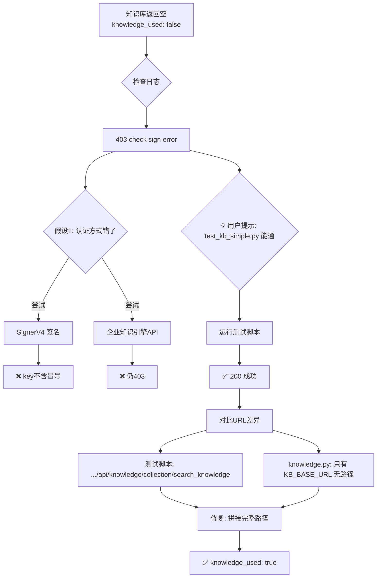

# 面试虎 - 知识库检索 403 失败全过程

## 1. 文档信息

| 项目 | 内容 |
|------|------|
| 项目名称 | 面试虎 Interview Tiger |
| 问题类型 | API 接口问题 — 知识库检索 403 鉴权失败 |
| 排查时间 | 2026-07-08 |
| 解决状态 | ✅ 已解决 |
| 文档目的 | 复盘沉淀 + AI 学习 |

## 2. 问题背景

面试虎使用火山引擎知识库进行 RAG 检索，在回答"你叫什么名字"时始终返回通用回答"我叫[你的姓名]"，无法检索到知识库中的真实内容。日志显示 `knowledge_used: false`。

## 3. 问题现象

### 错误日志

```
search_knowledge - 状态码: 403, KB_ID: kb-ee95868bec0b4da8
check sign error, please check your ak, sk and tenant id
火山引擎知识库鉴权失败！
火山引擎知识库检索无结果，可能原因：1)API Key无效 2)知识库无匹配内容 3)网络问题
知识库无匹配结果，开启联网搜索降级模式
```

### 接口返回

```json
{
  "answer": "我叫[你的姓名]。",
  "knowledge_used": false,
  "web_search_used": true,
  "source_chunks": []
}
```

## 4. 问题分析过程

### 第一阶段：初步判断（3 个错误假设）

| 假设 | 推理 | 尝试方案 | 结果 | 反思 |
|------|------|----------|------|------|
| KB_API_KEY 是 AK:SK 格式，需 SignerV4 签名 | 403 报 `check sign error`，测试脚本用了 SignerV4 | 引入 volcengine SignerV4 签名 | ❌ key 不含 `:`，无法拆分为 AK:SK | 没先验证 key 格式就假设认证方式，浪费了时间 |
| KB_API_KEY 是 Bearer Token，需企业知识引擎 API | test_kb_signerv4.py 有 Bearer Token 备选路径 | 换用 `/profile_platform/api/v2/rag/search` | ❌ 仍然 403 | 没有运行测试脚本验证，凭感觉改 API 端点 |
| 前端传了空的 kb_api_key | ConfigModal 保存时未传递 | 检查 resolve_config 兜底逻辑 | ❌ 兜底逻辑正确，`.env` 值被正确读取 | `.env` 值确实被用到了，不是前端问题 |

### 第二阶段：关键转折点

**💡 转折点**：用户指出 `test_kb_simple.py` 测试脚本之前就跑通过，用的就是当前的 `KB_API_KEY`。

### 深入调查

**Step 1：修复测试脚本路径问题并运行**

```bash
$ python3 tests/test_kb_simple.py

# ✅ 成功！检索到 2 条结果
# URL: POST https://api-knowledgebase.mlp.cn-beijing.volces.com/api/knowledge/collection/search_knowledge
# Auth: Bearer X7PQPKCVG27PG6632XQ584R3724CF8YB5Z973AF3FNFB0065C84G60R30D9G6RVKE
# 状态码: 200
```

**Step 2：对比测试脚本与 knowledge.py 的差异**

| 项目 | test_kb_simple.py（✅ 通过） | knowledge.py（❌ 失败） |
|------|------|------|
| 认证方式 | `Bearer {KB_API_KEY}` | `Bearer {KB_API_KEY}` |
| Payload | `resource_id`, `project`, `query`, `limit`, `post_processing` | `resource_id`, `project`, `query`, `limit`, `post_processing` |
| **URL** | `https://api-knowledgebase.mlp.cn-beijing.volces.com`**`/api/knowledge/collection/search_knowledge`** | `https://api-knowledgebase.mlp.cn-beijing.volces.com`（**无路径！**） |

**根因一目了然**：knowledge.py 只发了 `POST KB_BASE_URL`，少了路径 `/api/knowledge/collection/search_knowledge`。

### 根本原因解释

火山引擎知识库的 API 根地址 `https://api-knowledgebase.mlp.cn-beijing.volces.com` 本身没有默认路由，直接 POST 到根路径会被网关拒绝，返回 403 `check sign error`——这个错误信息极具误导性，让人以为是认证方式错了，实际上只是 **URL 路径缺失**。

## 5. 解决方案

### 代码修改

**文件**：[knowledge.py](file:///Users/siyuan/Documents/www/ai-project/interview-tiger/backend/app/services/knowledge.py)

```diff
- response = requests.post(KB_BASE_URL, headers=headers, json=payload, timeout=30)
+ kb_url = f"{KB_BASE_URL}/api/knowledge/collection/search_knowledge"
+ response = requests.post(kb_url, headers=headers, json=payload, timeout=30)
```

### 还原本不该改的东西

- 移除了临时引入的 SignerV4 签名代码（`_get_signer`、`_sign_request`）
- 移除了企业知识引擎 API 路径尝试（`/profile_platform/api/v2/rag/search`）
- 恢复了原始 payload 格式（`resource_id`/`limit`/`post_processing`）

### 验证修复

```bash
$ curl -s -X POST http://localhost:8001/api/question \
  -H "Content-Type: application/json" \
  -d '{"question":"你叫什么名字","kb_provider":"volcengine","kb_id":"kb-ee95868bec0b4da8","stream":false}'

# ✅ 结果：
{
  "answer": "我叫xxx。",
  "knowledge_used": true,
  "web_search_used": false
}
```

## 6. 问题根因总结

| 维度 | 说明 |
|------|------|
| 直接原因 | `_search_knowledge` 请求 URL 缺少 API 路径 `/api/knowledge/collection/search_knowledge` |
| 深层原因 | `KB_BASE_URL` 是 API 根地址，但没有在代码中拼接具体端点路径 |
| 误导因素 | 403 错误返回 `check sign error, please check your ak, sk and tenant id`，误导排查方向到认证层面 |
| 影响范围 | 所有使用火山引擎知识库的对话请求，降级到联网搜索 |

### 为什么其他方案不行

| 方案 | 问题 |
|------|------|
| SignerV4 签名 | KB_API_KEY 不含 `:` 分隔符，不是 AK:SK 格式 |
| 企业知识引擎 `/api/v2/rag/search` | 需要 `KB_ACCOUNT_ID`（tenant id），当前未配置 |
| Bearer Token + 原始 URL | ✅ **唯一正确方案**，认证方式对、API 端点对 |

## 7. 经验教训

### 最佳实践

1. **先跑已有测试脚本**：排查接口问题时，优先运行已有的可工作测试脚本对比差异
2. **对比法排查**：将工作代码与故障代码逐行对比，比逐个方案尝试效率高得多
3. **URL 是接口的一等公民**：排查 HTTP 错误时，完整 URL（含路径）应作为第一检查项

### 常见陷阱

1. **403 不一定是认证问题**：403 `check sign error` 的实际原因是 URL 路径不对，网关无法路由
2. **不要被错误信息牵着走**：API 返回的错误信息可能是网关层通用报错，不一定指向真正根因
3. **避免过度设计**：问题只是少了一段路径字符串，不要引入 SignerV4、多端点兜底等复杂方案

### 问题排查方法论

```
HTTP 请求失败
  → 先对比已知可工作的请求（curl 或测试脚本）
  → 逐项对比：URL、Method、Headers、Body
  → 找到差异项 → 修复 → 验证
```

## 8. 智能体技能提升要点

### 对 AI 助手的建议

遇到 API 403/鉴权类问题时：
1. **不急于假设认证方式有误**，先检查 URL 是否完整
2. **优先运行项目中已有的测试脚本**，作为基准参考
3. **对比而非替换**：找到可工作的请求后，逐字段对比差异，而不是猜测新方案

### Mermaid 排查流程图



### 关键命令速查

```bash
# 运行知识库测试脚本
python3 tests/test_kb_simple.py

# 直接测试知识库检索 API
curl -X POST https://api-knowledgebase.mlp.cn-beijing.volces.com/api/knowledge/collection/search_knowledge \
  -H "Content-Type: application/json" \
  -H "Authorization: Bearer $KB_API_KEY" \
  -d '{"resource_id":"kb-ee95868bec0b4da8","project":"default","query":"你叫什么","limit":3}'

# 查看后端日志
docker-compose logs backend | grep "search_knowl\|403\|knowledge_used"

# 测试完整面试接口
curl -X POST http://localhost:8001/api/question \
  -H "Content-Type: application/json" \
  -d '{"question":"你叫什么名字","kb_provider":"volcengine","stream":false}'
```

## 9. 相关配置文件修改清单

| 文件路径 | 修改位置 | 修改内容说明 |
|----------|----------|-------------|
| [knowledge.py](file:///Users/siyuan/Documents/www/ai-project/interview-tiger/backend/app/services/knowledge.py#L64) | `_search_knowledge` 方法 | URL 从 `KB_BASE_URL` 改为 `f"{KB_BASE_URL}/api/knowledge/collection/search_knowledge"` |
| [config.py](file:///Users/siyuan/Documents/www/ai-project/interview-tiger/backend/config.py#L18) | KB 配置区 | 新增 `KB_ACCOUNT_ID` 配置项（可选，备用） |
| [test_kb_simple.py](file:///Users/siyuan/Documents/www/ai-project/interview-tiger/tests/test_kb_simple.py#L8) | env 加载路径 | 修复 `.env` 路径为 `os.path.dirname(os.path.dirname(__file__))` |

## 10. 参考资料

- 火山引擎知识库 API 文档：`https://api-knowledgebase.mlp.cn-beijing.volces.com`
- 项目测试脚本：[test_kb_simple.py](file:///Users/siyuan/Documents/www/ai-project/interview-tiger/tests/test_kb_simple.py)

## 11. 时间线记录

| 时间 | 事件 | 状态 |
|------|------|------|
| 17:22 | 用户报告"我叫张明"，知识库不生效 | 🔍 |
| 17:25 | 发现 403 check sign error | ❌ 假设 1 |
| 17:30 | 尝试 SignerV4 签名 → key 不含冒号 | ❌ 假设 2 |
| 17:35 | 尝试企业知识引擎 API → 仍 403 | ❌ 假设 3 |
| 17:40 | 用户提示 test_kb_simple.py 之前能通 | 💡 |
| 17:42 | 运行测试脚本 → ✅ 200 成功 | 🔍 |
| 17:43 | 对比 URL 差异 → 发现缺少路径 | 🎯 |
| 17:45 | 修复 URL → 重建镜像 → 测试通过 | ✅ |

## 12. 后续优化建议

### 短期（1 周内）

- [ ] 为 `_search_knowledge` 添加单元测试，覆盖 URL 正确性
- [ ] 添加 KB_ACCOUNT_ID 配置指引文档

### 中期（1 个月内）

- [ ] 知识库请求添加重试机制（网络波动时自动重试）
- [ ] 添加知识库健康检查端点 `/api/health/kb`

### 长期（3 个月内）

- [ ] 知识库提供商抽象层支持多端点配置
- [ ] 添加知识库检索性能监控（延迟、命中率、空结果率）

## 13. 贡献者

| 角色 | 人员 |
|------|------|
| 问题发现者 | 用户 |
| 关键洞察提供者 | 用户（提示 test_kb_simple.py 能通） |
| 问题分析者 | AI Agent |
| 解决方案提供者 | AI Agent |
| 文档编写者 | AI Agent |

---

**文档版本**：v1.0  
**最后更新**：2026-07-08  
**维护建议**：如火山引擎知识库 API 端点变更，请更新本文档中的 URL 路径
