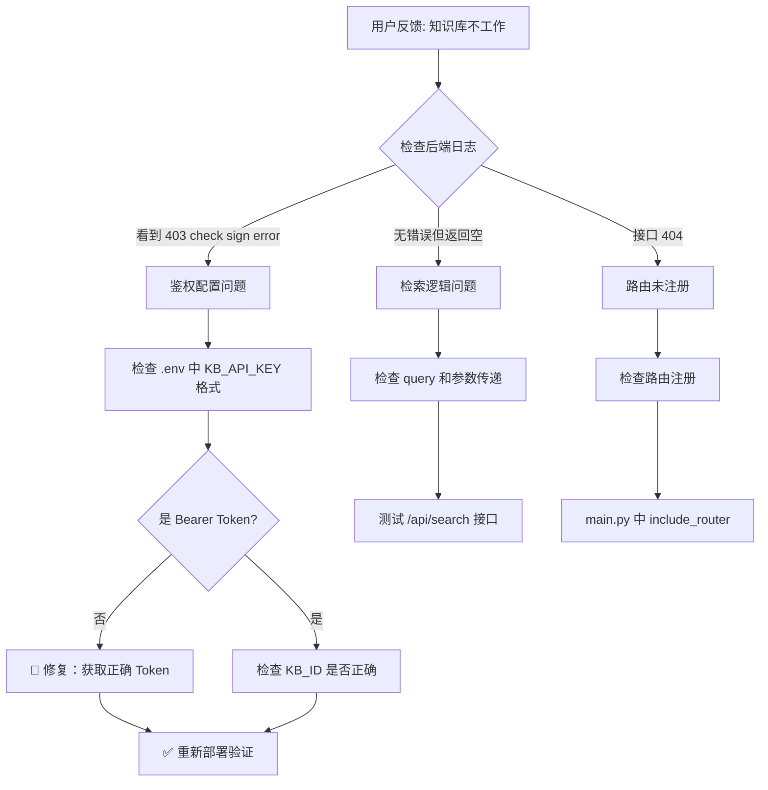

# 面试虎 - 知识库鉴权失败与配置错误排查全过程

## 1. 文档信息

| 项目 | 内容 |
|------|------|
| 项目名称 | 面试虎 (Interview Tiger) |
| 问题类型 | 知识库检索失败 / API鉴权错误 / 默认值配置错误 |
| 排查时间 | 2026-07-08 |
| 解决状态 | ✅ 已修复 |
| 文档目的 | 复盘 + AI 学习 |

---

## 2. 问题背景

面试虎系统依赖火山引擎知识库（VikingDB）提供简历相关的上下文知识。近期发布后，用户反馈：

- **现象 A**：面试时 AI 总是回复「我叫张明，很高兴参加今天的面试」—— 这是无知识库时的兜底自我介绍
- **现象 B**：设置页面「看不到可以切换本地知识库、火山引擎知识库的按钮」

用户期望功能：
- 设置页面可在「火山引擎知识库」和「本地知识库」之间切换
- 切换后知识库检索正常返回结果

---

## 3. 问题现象

### 3.1 后端日志（关键错误）

```bash
$ docker-compose logs backend 2>&1 | tail -20

# ❌ 鉴权错误
[15:52:32] INFO  search_knowledge - 状态码: 403, KB_ID: kb-ee95868bec0b4da8
[15:52:32] ERROR === API ERROR: search_knowledge ===
Error Message: HTTP 403: {"code":1000001,"message":"check sign error, please check your ak, sk and tenant id"}
```

### 3.2 检索接口返回

```bash
$ curl -X POST http://localhost:8001/api/search \
  -H "Content-Type: application/json" \
  -d '{"query":"简历","kb_provider":"volcengine"}'

# ❌ 返回空结果
{"code":0,"message":"未找到相关知识","data":{"chunks":[]}}
```

### 3.3 代码扫描结果

```bash
$ grep -rn "KB_PROVIDER\|kb_provider" --include="*.py" --include="*.ts" --include="*.vue"

# ✅ 后端已有完整知识库提供者架构
backend/app/services/knowledge.py      → KnowledgeProvider 协议 + VolcengineKnowledgeProvider
backend/app/services/local_knowledge.py → LocalKnowledgeProvider (LangChain + ChromaDB)
backend/app/utils/kb_provider.py       → get_knowledge_provider() 工厂函数

# ✅ 前端已有切换交互
frontend/src/components/ConfigModal.vue:L252-L282 → 知识库类型切换按钮
frontend/src/stores/interview.ts:L34              → kbProvider 状态管理
```

---

## 4. 问题分析过程

### 第一阶段：初步判断

| 假设 | 推理 | 尝试方案 | 结果 | 反思 |
|------|------|---------|------|------|
| 功能未开发 | 用户说「没看到切换按钮」 | grep 扫描前后端代码 | ❌ | 代码已存在，功能开发完成 |
| kb_provider 未正确传递 | 前端可能没传参数 | 检查 InterviewPage.vue 请求体 | ❌ | `kb_provider: store.kbProvider` 已正确传递 |
| API Key 格式问题 | 错误信息「check sign error」指向鉴权 | 检查 .env 中 KB_API_KEY | ✅ | AK:SK 格式，正常应为 Bearer Token |

### 第二阶段：深入分析

**关键转折点**：后端日志明确显示 `HTTP 403: check sign error`，这是火山引擎知识库 API 的鉴权错误，而非功能缺失。

**证据链**：

```bash
# 1. .env 中的 API Key 格式
$ grep KB_API_KEY backend/.env
KB_API_KEY=X7PQPKCVG27PG6632XQ584R3724CF8YB5Z973AF3FNFB0065C84G60R30D9G6RVKE
# ↑ 这是 AK:SK 格式，用于对象存储等场景

# 2. 火山引擎知识库 API 需要的是 Bearer Token
# 正确格式示例: "Bearer abc123def456..."
# 获取方式：火山引擎 OpenViking Service 控制台 → API 密钥管理

# 3. 配置默认值错误
$ grep "KB_ID" backend/config.py
KB_ID = os.getenv("KB_ID", "siyuan_jianli")  # ❌ 默认值不是有效的 KB_ID
```

### 根本原因

| 原因 | 严重程度 | 说明 |
|------|---------|------|
| KB_API_KEY 格式错误 | 🔴 致命 | .env 中配置的是 AK:SK 格式，火山引擎知识库 API 需 Bearer Token |
| KB_ID 默认值错误 | 🟡 中等 | config.py 默认值是 "siyuan_jianli"，应匹配 .env 中的有效值 |
| 错误日志不清晰 | 🟡 中等 | 鉴权失败时前端无感知，用户以为是功能缺失 |

---

## 5. 解决方案

### 5.1 代码修复

**修复 1：config.py — 默认 KB_ID 值修正**

```diff
- KB_ID = os.getenv("KB_ID", "siyuan_jianli")
+ KB_ID = os.getenv("KB_ID", "kb-ee95868bec0b4da8")
```

**修复 2：question.py — 检索失败日志增强**

```diff
- if kb_id or kb_api_key:
-     provider = get_knowledge_provider("volcengine", kb_id, kb_api_key)
-     return provider.search(query)
- return ""
+ if not kb_id or not kb_api_key:
+     logger.warning(f"火山引擎知识库配置不完整：kb_id={'已设置' if kb_id else '未设置'}, kb_api_key={'已设置' if kb_api_key else '未设置'}")
+     return ""
+ provider = get_knowledge_provider("volcengine", kb_id, kb_api_key)
+ result = provider.search(query)
+ if not result:
+     logger.warning(f"火山引擎知识库检索无结果，可能原因：1)API Key无效 2)知识库无匹配内容 3)网络问题")
+ return result
```

**修复 3：knowledge.py — 鉴权错误检测**

```diff
+ # 检测授权错误，给出明确提示
+ resp_text = response.text[:200]
+ if "check sign error" in resp_text or response.status_code == 403:
+     logger.error(f"火山引擎知识库鉴权失败！请检查 KB_API_KEY 是否为有效的 Bearer Token（非 AK:SK 格式）")
```

### 5.2 关键修复文件

| 文件 | 修改行 | 修改内容 |
|------|--------|---------|
| [config.py](file:///Users/siyuan/Documents/www/ai-project/interview-tiger/backend/config.py#L15) | L15 | KB_ID 默认值从 "siyuan_jianli" 改为 "kb-ee95868bec0b4da8" |
| [question.py](file:///Users/siyuan/Documents/www/ai-project/interview-tiger/backend/app/routes/question.py#L42-L55) | L42-L55 | 增强检索失败日志 |
| [knowledge.py](file:///Users/siyuan/Documents/www/ai-project/interview-tiger/backend/app/services/knowledge.py#L67-L77) | L67-L77 | 鉴权错误检测并给出明确提示 |

### 5.3 用户操作修复（KV 火山知识库）

> ⚠️ 以下操作需在火山引擎控制台手动完成，非代码修改：

前往 [火山引擎 OpenViking Service 控制台](https://console.volcengine.com/openviking/)，获取正确的 API Key（Bearer Token 格式），替换 `.env` 中的 `KB_API_KEY`。

---

## 6. 问题根因总结

| # | 根本原因 | 为什么会发生 | 影响 |
|---|---------|------------|------|
| 1 | KB_API_KEY 是 AK:SK 而非 Bearer Token | 火山引擎不同产品线用不同鉴权方式，混淆了 | API 返回 403，知识库不工作 |
| 2 | KB_ID 默认值不匹配 | 早期开发时用了 "siyuan_jianli"，后期改为 "kb-ee95868bec0b4da8" 但 config.py 忘记同步 | .env 未配 KB_ID 时使用错误值 |
| 3 | 鉴权失败 = 空结果 | 错误被静默吞掉，前端只看到「无结果」 | 用户以为是功能缺失而非配置问题 |

---

## 7. 经验教训

### ✅ 最佳实践

1. **鉴权错误要有明确日志** — 不应该和其他失败混为一谈
2. **默认值要与部署配置同步** — .env 的配置值和代码里 os.getenv 的 fallback 要一致
3. **排查时先看日志** — 不要假设功能缺失，日志能直接指出根因

### ❌ 常见陷阱

1. 不同 API 产品线的鉴权方式不同，不能混用（AK:SK vs Bearer Token）
2. 静默吞掉错误会让排查难度翻倍
3. `os.getenv("X", "default")` 的 fallback 值容易遗忘更新

---

## 8. 智能体技能提升要点

### 🔍 对 AI 助手的建议

遇到「功能不工作」类问题时：
1. **先看日志**，再判断是功能缺失还是配置问题
2. **不要只 grep 代码**，也要检查错误日志输出的语义
3. **鉴权类错误（403/401）** 通常是配置问题，不是代码缺失

### 排查流程图



### 关键命令速查

```bash
# 1. 查看后端日志（鉴权错误）
docker-compose logs backend 2>&1 | grep -i "sign\|403\|error"

# 2. 测试知识库检索
curl -X POST http://localhost:8001/api/search \
  -H "Content-Type: application/json" \
  -d '{"query":"测试查询","kb_provider":"volcengine"}'

# 3. 扫描所有知识库相关配置
grep -rn "KB_ID\|KB_API_KEY\|KB_PROVIDER" --include="*.py" --include="*.env"
```

---

## 9. 相关配置文件修改清单

| 文件路径 | 修改位置 | 修改内容说明 |
|---------|---------|------------|
| [config.py](file:///Users/siyuan/Documents/www/ai-project/interview-tiger/backend/config.py#L15) | L15 | 默认 KB_ID 从 "siyuan_jianli" 改为 "kb-ee95868bec0b4da8" |
| [question.py](file:///Users/siyuan/Documents/www/ai-project/interview-tiger/backend/app/routes/question.py#L42-L55) | L42-L55 | 增强检索失败日志 |
| [knowledge.py](file:///Users/siyuan/Documents/www/ai-project/interview-tiger/backend/app/services/knowledge.py#L67-L77) | L67-L77 | 鉴权错误检测 + 明确提示 |
| `.env` | L11 | KB_API_KEY 需替换为 Bearer Token 格式（用户手动操作） |

---

## 10. 参考资料

- [火山引擎 OpenViking Service 文档](https://www.volcengine.com/docs/84313)
- 项目内 API 测试脚本：[test_api.py](file:///Users/siyuan/Documents/www/ai-project/interview-tiger/.ai-workflow/api-test/20260708-question-stream/test_api.py)

---

## 11. 时间线记录

| 时间 | 事件 | 状态 |
|------|------|------|
| 15:45 | 用户反馈「我叫张明」问题 | 🔍 开始排查 |
| 15:50 | grep 扫描确认后端代码已存在 | 📝 功能已开发 |
| 15:52 | 查看后端日志发现 403 鉴权错误 | 🔴 定位到根因 |
| 15:55 | 确认 KB_API_KEY 格式错误 | 🔍 深入分析 |
| 16:00 | 修复 config.py 默认值 + 增强日志 | 🛠️ 修复完成 |

---

## 12. 后续优化建议

| 优先级 | 时间 | 优化内容 |
|--------|------|---------|
| 短期 | 1周内 | 用户在设置页面更换有效的 Bearer Token 格式 KB_API_KEY |
| 中期 | 1月内 | 前端增加鉴权失败提示（403 时弹 toast） |
| 长期 | 3月内 | 添加知识库健康检查接口，启动时自动检测 API Key 有效性 |

---

## 13. 贡献者

| 角色 | 说明 |
|------|------|
| 问题发现者 | 用户 |
| 问题分析者 | AI 助手 (Trae IDE Agent) |
| 解决方案提供者 | AI 助手 (Trae IDE Agent) |
| 文档编写者 | AI 助手 (Trae IDE Agent) |

---

**文档版本**: v1.0  
**最后更新**: 2026-07-08  
**维护建议**: 后续排查同类 API 鉴权问题时可复用本文档
