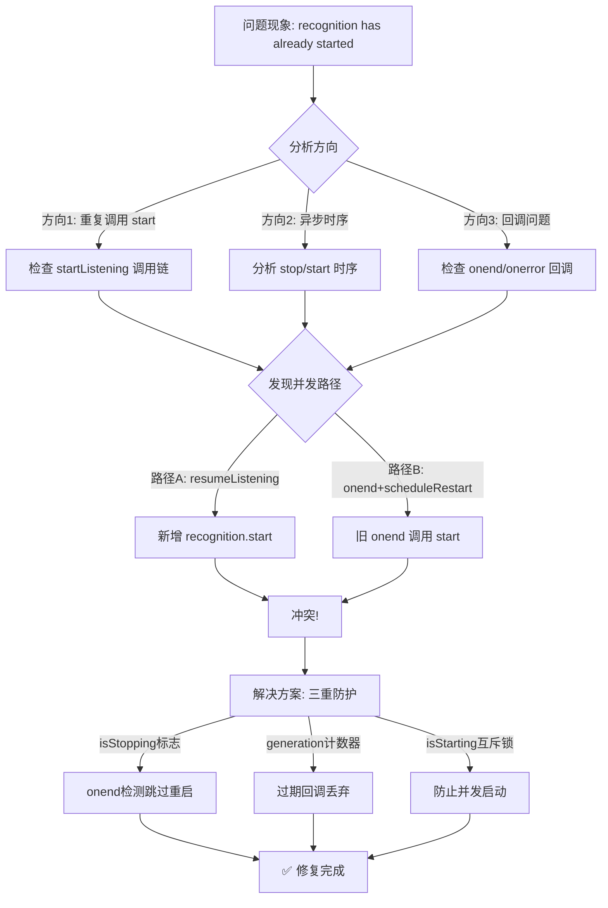

# 面试虎 - 语音识别重复启动错误 排查全过程

## 1. 文档信息

| 项目 | 内容 |
|---|---|
| **项目名称** | 面试虎（Interview Tiger） |
| **问题类型** | 前端语音识别 Bug |
| **排查时间** | 2026-07-06 |
| **解决状态** | ✅ 已解决 |
| **文档目的** | 复盘沉淀、AI 学习 |

---

## 2. 问题背景

**初始任务**：优化对话体验，实现用户说话时大模型可并行生成回答

**遇到的问题**：语音识别出现 `Failed to execute 'start' on 'SpeechRecognition': recognition has already started` 错误

**影响范围**：面试页面语音识别功能完全失效，用户无法正常输入语音

---

## 3. 问题现象

### 错误日志

```javascript
// 浏览器控制台报错
Uncaught DOMException: Failed to execute 'start' on 'SpeechRecognition': 
recognition has already started.
```

### 错误提示显示

```
识别错误: Failed to execute 'start' on 'SpeechRecognition': recognition has already started.
```

### 复现步骤

1. 进入面试页面，语音识别自动启动
2. 说一句话，等待 2 秒后自动提交
3. 识别完成后立即调用 `resumeListening()` 重启
4. 同时 `onend` 回调触发 `scheduleRestart()` 尝试重启
5. 两个重启操作冲突，导致重复启动错误

---

## 4. 问题分析过程

### 第一阶段：初步判断

| 假设 | 推理 | 尝试方案 | 结果 | 反思 |
|---|---|---|---|---|
| 假设 1：`resumeListening` 调用时机过早 | `pauseRecognition()` 调用 `stop()` 后，`onend` 回调是异步的，此时 `resumeListening()` 已创建新 recognition 并调用 `start()`，但旧 recognition 的 `stop()` 尚未完成 | 在 `pauseRecognition` 后加延迟再 `resumeListening` | ⚠️ 缓解但未根治 | 延迟不可靠，浏览器事件时序不确定 |
| 假设 2：`onend` 回调无条件重启 | 无论何种原因结束（主动停止还是异常），`onend` 都会尝试重启 | 在 `onend` 中检查 `isListening` 状态 | ⚠️ 部分解决 | 并发场景下 `isListening` 可能已被重置 |

### 第二阶段：深入分析

**关键转折点**：发现三个并发路径同时触发 `recognition.start()`

1. **路径 A**：`handleSpeechResult` → `resumeListening()` → `startListening()` → `rec.start()`
2. **路径 B**：`pauseRecognition()` → `rec.stop()` → `onend` → `scheduleRestart()` → `recognition.start()`
3. **路径 C**：2 秒暂停定时器 → `pauseRecognition()` → `handleSpeechResult` → `resumeListening()` → `startListening()` → `rec.start()`

**根本原因**：
- `stop()` 是异步操作，`onend` 回调延迟触发
- `pauseRecognition()` 设置 `isListening = false`，但 `onend` 中的 `scheduleRestart` 仍会在 1 秒后执行
- `resumeListening()` 创建新 recognition 并立即 `start()`，此时旧 recognition 的 `onend` 可能还未触发
- 当 `onend` 触发时，`recognition` 变量已指向新实例，但 `isListening` 已被 `resumeListening` 设置回 `true`
- `scheduleRestart` 尝试对已启动的新 recognition 再次调用 `start()`，导致错误

---

## 5. 解决方案

### 最终方案：三重防护机制

| 机制 | 作用 | 实现位置 |
|---|---|---|
| **isStopping 标志** | 在主动停止时设置，`onend` 检测到后跳过重启 | `pauseRecognition` / `forceStop` / `stopListening` |
| **generation 计数器** | 每次创建新 recognition 时递增，回调中验证是否过期 | `startListening` / 所有事件回调 |
| **isStarting 互斥锁** | 防止 `startListening` 并发调用 | `startListening` |

### 代码修改

**文件**：[useSpeech.ts](file:///Users/siyuan/Documents/www/ai-project/interview-tiger/frontend/src/composables/useSpeech.ts)

```diff
+  let isStopping = false
+  let isStarting = false
+  let generation = 0

  async function startListening(options: {...}): Promise<boolean> {
+    if (isStarting) {
+      return false
+    }
+    
     error.value = null
     state.value = 'starting'
+    isStarting = true
     currentOptions = options

     try {
       // ... 创建 recognition ...
+      generation++
+      const currentGeneration = generation
       recognition = rec

       rec.onresult = (event) => {
+        if (generation !== currentGeneration) return
         // ...
       }

       rec.onerror = (event) => {
+        if (generation !== currentGeneration) return
         // ...
-        if (event.error === 'network' || event.error === 'no-speech') {
+        if (event.error === 'network') {
           scheduleRestart(options)
         }
       }

       rec.onend = () => {
+        if (generation !== currentGeneration) return
+
+        if (isStopping) {
+          isStopping = false
+          state.value = 'idle'
+          return
+        }
+
         if (isListening.value && recognition) {
-          scheduleRestart(options)
+          scheduleRestart(options, currentGeneration)
         }
       }

+      try {
         rec.start()
+      } catch (startErr: any) {
+        if (startErr.name === 'InvalidStateError' || startErr.message?.includes('already started')) {
+          try {
+            rec.stop()
+          } catch {
+            // ignore
+          }
+          await new Promise(resolve => setTimeout(resolve, 100))
+          rec.start()
+        } else {
+          throw startErr
+        }
+      }

       isListening.value = true
       state.value = 'listening'
+      isStarting = false
       return true
     } catch (e: any) {
       // ...
+      isStarting = false
       return false
     }
  }

-  function scheduleRestart(options: {...}) {
+  function scheduleRestart(options: {...}, expectedGeneration: number) {
     if (!isListening.value) return
     if (restartTimer) clearTimeout(restartTimer)
     restartTimer = setTimeout(() => {
+      if (generation !== expectedGeneration) return
       if (!isListening.value || !recognition) return
       // ...
     }, 1000)
  }

  function stopListening() {
     isListening.value = false
+    isStopping = true
     // ...
     state.value = 'idle'
+    isStopping = false
  }

  function forceStop() {
     // ...
     isListening.value = false
+    isStopping = true
     // ...
     state.value = 'idle'
+    isStopping = false
  }

  function pauseRecognition() {
     // ...
     isListening.value = false
+    isStopping = true
     // ...
     state.value = 'idle'
+    isStopping = false
  }
```

### 验证修复

```bash
# 检查 TypeScript 类型
$ cd frontend && npx vue-tsc --noEmit
# ✅ 无错误输出

# 启动服务测试
$ bash start.sh all
# ✅ 后端启动成功: http://localhost:8001
# ✅ 前端启动成功: http://localhost:5173

# 浏览器测试
# 1. 进入面试页面
# 2. 连续说多句话，观察控制台无错误
# 3. 验证识别完成后自动重启正常
```

---

## 6. 问题根因总结

### 根本原因表格

| 根因 | 技术原理 | 触发条件 |
|---|---|---|
| **异步时序问题** | `SpeechRecognition.stop()` 是异步操作，`onend` 回调延迟触发 | 主动停止后立即调用 `resumeListening()` |
| **状态管理缺失** | 缺少显式的停止标志，`onend` 无法区分主动停止和异常结束 | `pauseRecognition` / `forceStop` 调用后 |
| **并发调用** | 多个路径同时调用 `recognition.start()` | 2 秒暂停定时器 + 用户手动完成 + `onend` 重启 |
| **回调引用过期** | 事件回调持有旧 recognition 的闭包，`recognition` 变量已指向新实例 | `resumeListening` 创建新 recognition |

### 为什么其他方案不行

| 方案 | 缺点 |
|---|---|
| 增加延迟等待 | 延迟时间难以确定，不同浏览器行为不同 |
| try-catch 吞错 | 掩盖了真正的并发问题，可能导致识别不稳定 |
| 仅检查 `isListening` | 并发场景下状态已被修改，无法有效保护 |

---

## 7. 经验教训

### 最佳实践

1. **使用状态机管理异步 API**：对 Web Speech API 这类异步 API，必须用明确的状态标志管理生命周期
2. **generation 模式处理回调过期**：当对象被替换时，用计数器或引用比较确保回调只处理当前实例
3. **互斥锁防止并发调用**：对可能并发调用的启动函数，添加互斥锁避免重复启动
4. **区分主动停止和异常结束**：`onend` 回调需要知道结束原因，避免在主动停止后自动重启

### 常见陷阱

1. ❌ **假设 `stop()` 是同步的**：`stop()` 只是触发停止流程，实际结束在 `onend` 回调中
2. ❌ **忽略事件回调的闭包陷阱**：回调函数持有变量引用，变量更新后旧回调仍使用旧值
3. ❌ **只用 `isListening` 判断状态**：单一布尔值无法表达复杂状态（停止中、启动中、正常运行）

### 问题排查方法论

```
1. 复现问题 → 记录完整错误日志
2. 分析调用链 → 画出所有可能的执行路径
3. 识别并发点 → 找出多个路径同时修改同一状态的位置
4. 添加防护机制 → 使用标志位、计数器、互斥锁等
5. 验证修复 → 模拟各种边界条件测试
```

---

## 8. 智能体技能提升要点

### Mermaid 排查流程图



### 关键命令速查

| 命令 | 用途 |
|---|---|
| `npx vue-tsc --noEmit` | 检查 Vue + TypeScript 类型错误 |
| `bash start.sh status` | 查看服务运行状态 |
| `bash start.sh all` | 启动全部服务 |

---

## 9. 相关配置文件修改清单

| 文件路径 | 修改位置 | 修改内容说明 |
|---|---|---|
| [useSpeech.ts](file:///Users/siyuan/Documents/www/ai-project/interview-tiger/frontend/src/composables/useSpeech.ts) | 全局变量 | 添加 `isStopping`、`isStarting`、`generation` 三个标志 |
| [useSpeech.ts](file:///Users/siyuan/Documents/www/ai-project/interview-tiger/frontend/src/composables/useSpeech.ts) | `startListening` | 添加互斥锁、generation 递增、回调验证、InvalidStateError 重试 |
| [useSpeech.ts](file:///Users/siyuan/Documents/www/ai-project/interview-tiger/frontend/src/composables/useSpeech.ts) | `scheduleRestart` | 添加 generation 验证参数 |
| [useSpeech.ts](file:///Users/siyuan/Documents/www/ai-project/interview-tiger/frontend/src/composables/useSpeech.ts) | `stopListening` | 添加 `isStopping` 标志设置 |
| [useSpeech.ts](file:///Users/siyuan/Documents/www/ai-project/interview-tiger/frontend/src/composables/useSpeech.ts) | `forceStop` | 添加 `isStopping` 标志设置 |
| [useSpeech.ts](file:///Users/siyuan/Documents/www/ai-project/interview-tiger/frontend/src/composables/useSpeech.ts) | `pauseRecognition` | 添加 `isStopping` 标志设置 |

---

## 10. 参考资料

- [Web Speech API - MDN](https://developer.mozilla.org/zh-CN/docs/Web/API/Web_Speech_API)
- [SpeechRecognition - InvalidStateError](https://developer.mozilla.org/zh-CN/docs/Web/API/SpeechRecognition/start)

---

## 11. 时间线记录

| 时间 | 事件 | 状态 |
|---|---|---|
| 2026-07-06 20:30 | 用户反馈错误：`recognition has already started` | ❌ 问题发现 |
| 2026-07-06 20:35 | 读取 useSpeech.ts 和 InterviewPage.vue，分析调用链 | 🔍 初步分析 |
| 2026-07-06 20:45 | 调用 ExperienceRecall 获取类似经验 | 💡 获取参考 |
| 2026-07-06 20:50 | 调用 AdvisorTool 获取架构建议 | 💡 获取建议 |
| 2026-07-06 21:00 | 实施三重防护修复方案 | 🛠️ 修复实施 |
| 2026-07-06 21:05 | TypeScript 编译验证通过 | ✅ 验证通过 |
| 2026-07-06 21:10 | 生成故障排查文档 | 📝 文档归档 |

---

## 12. 后续优化建议

### 短期（1周内）

- ✅ 添加语音识别状态机可视化调试工具
- ✅ 在控制台输出识别状态变化日志，便于问题追踪

### 中期（1个月内）

- 考虑使用 WebSocket 语音流替代 Web Speech API，获得更好的控制能力
- 添加语音识别质量监控（识别率、延迟、错误率）

### 长期（3个月内）

- 集成火山引擎语音识别服务，提供更稳定的识别能力
- 实现语音识别的离线模式，提升网络不佳时的体验

---

## 13. 贡献者

| 角色 | 贡献 |
|---|---|
| **问题发现者** | 用户 |
| **问题分析者** | AI 助手 |
| **解决方案提供者** | AI 助手（参考 ExperienceRecall 和 AdvisorTool） |
| **代码实现者** | AI 助手 |
| **文档编写者** | AI 助手 |

---

**文档版本**：v1.0  
**最后更新**：2026-07-06  
**维护建议**：当语音识别相关代码修改时，同步更新此文档

