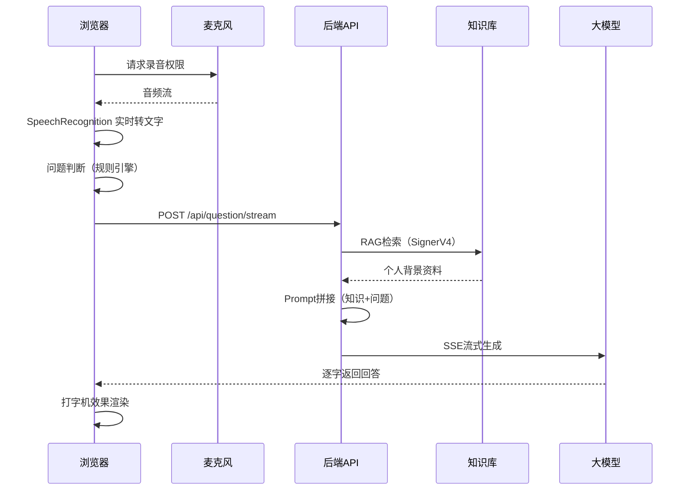

# 🐯 面试虎 — AI智能面试助手

> 实时语音识别 · 知识库增强 · 个性化回答建议

面试虎是一款面向个人求职者的**本地化AI面试辅助工具**。在浏览器中打开后，系统实时录制面试官语音并通过AI生成贴合你个人背景的回答建议。

## ✨ 核心功能

- 🎤 **实时语音识别**：基于浏览器 Web Speech API，面试官提问即时转文字
- 📚 **知识库增强**：接入火山引擎知识库 RAG 检索，结合你的个人简历/项目经历
- 🧠 **大模型生成**：DeepSeek V4 Flash 大模型生成个性化 STAR 法则回答建议
- 📱 **响应式适配**：PC端左右两栏，移动端上下布局
- 🔒 **数据安全**：API Key 仅存储在浏览器本地，纯本地运行

## 🏗️ 技术栈

| 层级 | 技术 |
|------|------|
| 前端 | Vue 3 + Vite + Tailwind CSS + Pinia + TypeScript |
| 后端 | Python FastAPI |
| 大模型 | 火山引擎方舟平台 (DeepSeek V4 Flash) |
| 知识库 | 火山引擎知识库 (SignerV4 + RAG) |
| 语音识别 | Web Speech API (浏览器原生) |
| 音频采集 | MediaRecorder API (浏览器原生) |

## 🚀 快速开始

### 前置条件

1. **火山引擎账号**（已开通方舟大模型 + 知识库服务）
2. **Chrome 80+** 或 **Edge 80+** 浏览器
3. **Python 3.11+** + **Node.js 18+**

### 1. 后端启动

```bash
cd backend
pip install -r requirements.txt

# 配置环境变量（可选，也可在前端页面配置）
cp .env.example .env
# 编辑 .env 填入 ARK_API_KEY 和 KB_ID

python app/main.py
# API 服务启动在 http://localhost:8000
```

### 2. 前端启动

```bash
cd frontend
npm install
npm run dev
# 页面打开 http://localhost:5173
```

### 3. 配置

在首页右上角⚙️设置中填入：
- **大模型 API Key**：火山引擎方舟平台 Bearer Token
- **知识库 ID**：siyuan_jianli 或自定义
- **知识库 API Key**：AK:SK 格式的知识库密钥
- **模型 ID**：推荐 `deepseek-v4-flash-260425`

## 📂 项目结构

```
interview-tiger/
├── frontend/                      # Vue 3 前端
│   └── src/
│       ├── components/            # UI组件
│       │   ├── HomePage.vue       # 首页（开始面试）
│       │   ├── InterviewPage.vue  # 面试主页面
│       │   ├── ConfigModal.vue    # 配置弹窗
│       │   └── DialogueItem.vue   # 对话展示组件
│       ├── composables/           # 组合式API
│       │   ├── useRecorder.ts     # 录音逻辑
│       │   ├── useSpeech.ts       # 语音识别
│       │   └── useApi.ts          # API调用（含SSE流式）
│       ├── stores/
│       │   └── interview.ts       # Pinia面试状态
│       ├── utils/
│       │   └── questionJudge.ts   # 问题判断与去重
│       └── router/index.ts        # 前端路由
├── backend/                       # Python 后端
│   └── app/
│       ├── main.py                # FastAPI入口
│       ├── routes/                # API路由
│       │   ├── health.py          # 健康检查
│       │   ├── config.py          # 配置管理
│       │   ├── search.py          # 知识库检索
│       │   ├── generate.py        # 大模型生成
│       │   └── question.py        # 问题处理（核心）
│       └── services/              # 业务服务
│           ├── knowledge.py       # 知识库检索(SignerV4)
│           ├── llm.py             # 大模型调用(流式/非流式)
│           └── prompt.py          # Prompt拼接
├── .ai-workflow/                  # AI工程化工作流
└── docs/                          # 项目文档
```

## 🎯 核心流程



## 🛡️ 安全与隐私

- 所有 API Key 仅存储在浏览器 `localStorage`
- 后端仅做 API 代理转发，不存储任何用户数据
- 不含任何云端数据库或日志收集
- 开源代码接受社区安全审计

## 📄 License

MIT License
