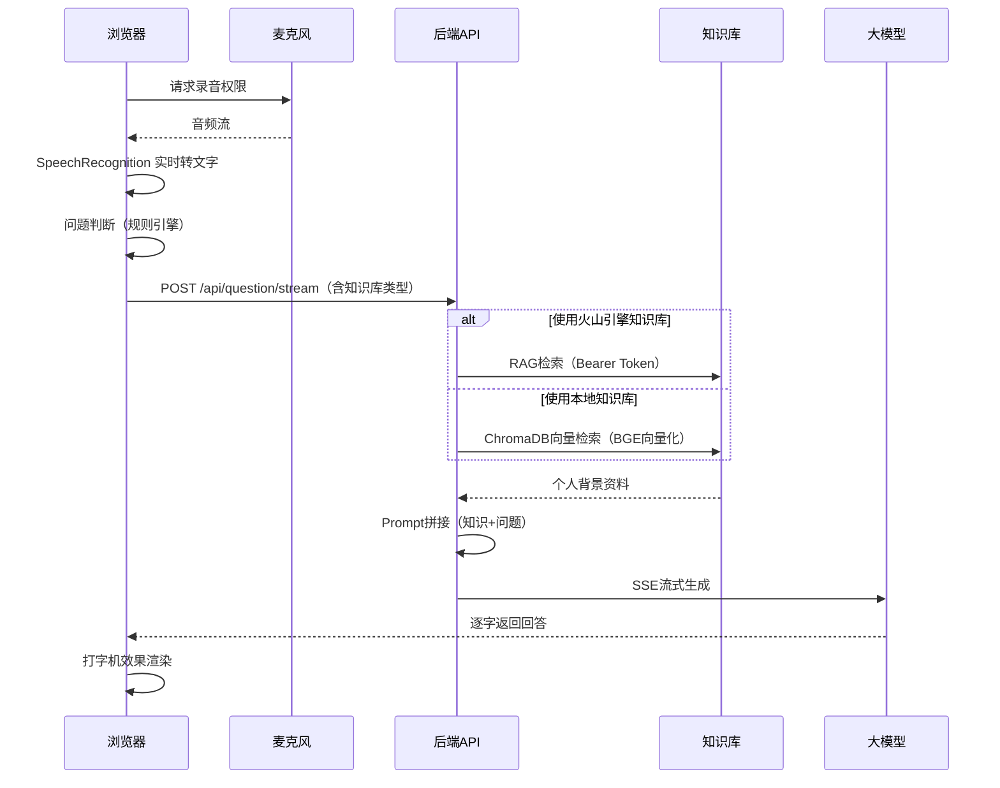

# 🐯 面试虎 — AI智能面试助手

> 实时语音识别 · 双知识库支持 · 个性化回答建议

面试虎是一款面向个人求职者的**本地化AI面试辅助工具**。在浏览器中打开后，系统实时录制面试官语音并通过AI生成贴合你个人背景的回答建议。

## ✨ 核心功能

- 🎤 **实时语音识别**：基于浏览器 Web Speech API，面试官提问即时转文字
- 📚 **双知识库支持**：火山引擎知识库 / 本地知识库（LangChain + ChromaDB），自由切换，降低成本
- 📤 **文档上传**：支持 PDF、Word 等多种格式文档上传至本地知识库
- 🔪 **智能切片**：可配置的文本分块参数（chunk_size、chunk_overlap），优化检索效果
- 🧠 **大模型生成**：DeepSeek V4 Flash 大模型生成个性化 STAR 法则回答建议
- 📱 **响应式适配**：PC端左右两栏，移动端上下布局
- 🔒 **数据安全**：API Key 仅存储在浏览器本地，纯本地运行，支持离线使用

## 🏗️ 技术栈

| 层级 | 技术 |
|------|------|
| 前端 | Vue 3 + Vite + Tailwind CSS + Pinia + TypeScript |
| 后端 | Python FastAPI |
| 大模型 | 火山引擎方舟平台 (DeepSeek V4 Flash) |
| 知识库 | 火山引擎知识库 / LangChain + ChromaDB（本地） |
| 向量化 | BGE-Large-ZH-v1.5（开源中文 Embedding） |
| 语音识别 | Web Speech API (浏览器原生) |
| 音频采集 | MediaRecorder API (浏览器原生) |

## 🚀 快速开始

### 前置条件

1. **火山引擎账号**（仅使用火山引擎知识库时需要，已开通方舟大模型 + 知识库服务）
2. **Chrome 80+** 或 **Edge 80+** 浏览器
3. **Python 3.11+** + **Node.js 18+**
4. **Docker**（推荐使用 Docker Compose 一键部署）

### 方式一：Docker Compose 一键部署（推荐）

```bash
# 进入项目目录
cd interview-tiger

# 构建并启动所有服务（后端 + 前端 + 数据库）
docker-compose up --build -d

# 服务启动后访问：
# - 前端页面：http://localhost:40003
# - 后端 API：http://localhost:8001
```

### 方式二：本地开发模式

#### 1. 后端启动

```bash
cd backend
pip install -r requirements.txt

# 配置环境变量（可选，也可在前端页面配置）
cp .env.example .env
# 编辑 .env 填入 ARK_API_KEY 和 KB_ID（使用火山引擎知识库时）

python app/main.py
# API 服务启动在 http://localhost:8000
```

#### 2. 前端启动

```bash
cd frontend
npm install
npm run dev
# 页面打开 http://localhost:5173
```

### 3. 配置

在首页右上角⚙️设置中配置：

#### 知识库类型选择

| 类型 | 说明 | 适用场景 |
|------|------|----------|
| 🔥 火山引擎 | 云端知识库，需开通服务 | 需要专业级检索效果 |
| 📁 本地知识库 | 本地 ChromaDB 存储，完全免费 | 降低成本、离线使用 |

#### 火山引擎知识库配置

- **大模型 API Key**：火山引擎方舟平台 Bearer Token
- **知识库 ID**：kb-xxx 格式（从知识库控制台获取）
- **知识库 API Key**：VIKING_API_KEY（从知识库控制台 → 用户管理获取）
- **模型 ID**：推荐 `deepseek-v4-flash-260425`

#### 本地知识库配置

- **文档上传**：点击上传按钮，支持 PDF、Word、TXT 等格式
- **切片大小**：默认 500 字符，可根据文档内容调整
- **切片重叠**：默认 50 字符，保持上下文连贯性

## 📂 项目结构

```
interview-tiger/
├── frontend/                      # Vue 3 前端
│   └── src/
│       ├── components/            # UI组件
│       │   ├── HomePage.vue       # 首页（开始面试）
│       │   ├── InterviewPage.vue  # 面试主页面
│       │   ├── ConfigModal.vue    # 配置弹窗（含知识库切换）
│       │   └── DialogueItem.vue   # 对话展示组件
│       ├── composables/           # 组合式API
│       │   ├── useRecorder.ts     # 录音逻辑
│       │   ├── useSpeech.ts       # 语音识别
│       │   └── useApi.ts          # API调用（含SSE流式）
│       ├── stores/
│       │   └── interview.ts       # Pinia面试状态
│       ├── utils/
│       │   └── questionJudge.ts   # 问题判断与去重
│       └── router/index.ts        # 前端路由
├── backend/                       # Python 后端
│   ├── wheels/                    # 本地 wheel 缓存（加速构建）
│   └── app/
│       ├── main.py                # FastAPI入口
│       ├── routes/                # API路由
│       │   ├── health.py          # 健康检查
│       │   ├── config.py          # 配置管理
│       │   ├── search.py          # 知识库检索
│       │   ├── generate.py        # 大模型生成
│       │   ├── question.py        # 问题处理（核心）
│       │   └── local_kb.py        # 本地知识库管理（上传/列表/删除）
│       ├── services/              # 业务服务
│       │   ├── knowledge.py       # KnowledgeProvider 协议 + 火山引擎实现
│       │   ├── local_knowledge.py # 本地知识库实现（LangChain + ChromaDB）
│       │   ├── llm.py             # 大模型调用(流式/非流式)
│       │   └── prompt.py          # Prompt拼接
│       └── utils/
│           └── kb_provider.py     # 知识库提供者工厂函数
├── .ai-workflow/                  # AI工程化工作流
└── docs/                          # 项目文档
```

## 🎯 核心流程



## 💡 知识库对比

| 特性 | 火山引擎知识库 | 本地知识库 |
|------|----------------|------------|
| 💰 成本 | 按量付费 | 完全免费 |
| 🔌 网络 | 需要网络连接 | 支持离线 |
| 📦 存储 | 云端存储 | 本地文件 |
| 🔒 数据安全 | 服务商托管 | 完全可控 |
| 📊 检索效果 | 专业优化 | 依赖配置 |
| 📤 文档格式 | 平台支持 | PDF/Word/TXT/Markdown |
| ⚙️ 切片配置 | 平台设置 | 可自定义 |

## 🛡️ 安全与隐私

- 所有 API Key 仅存储在浏览器 `localStorage`
- 后端仅做 API 代理转发，不存储任何用户数据
- 本地知识库数据存储在 Docker 容器卷中，完全可控
- 不含任何云端数据库或日志收集
- 开源代码接受社区安全审计

## 📄 License

MIT License