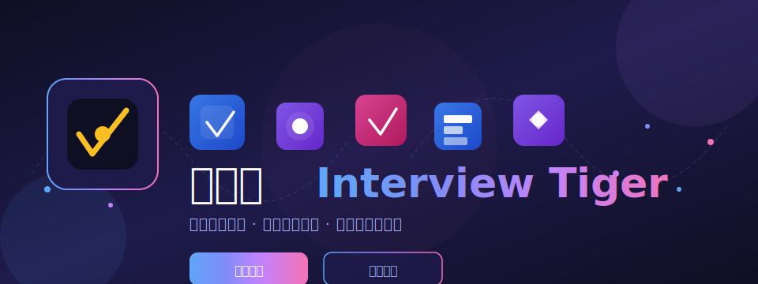
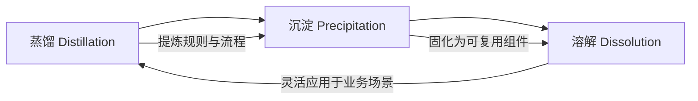
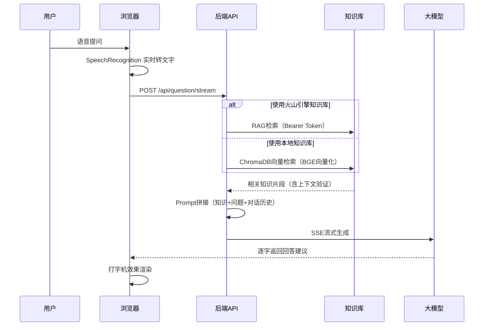

---

## 🎯 项目愿景

在当前 AI 大模型时代，面试的形态正在经历深刻的变化。传统技术岗位的面试方式，过于依赖对技术细节的记忆性考察，这在信息获取成本极低的今天，其有效性正在被重新审视。

我始终认为，面试更应关注的是**面试者的核心能力**——思维能力、组织能力、问题定义能力以及对复杂场景的掌控能力。在大模型能够解决绝大多数专项技术问题的背景下，**能够精准提出问题、定义问题的人，往往比单纯回答问题的人更具价值**。

更进一步，我相信在理论上，人的思维方式、专业技能、甚至个人经验都可以被**蒸馏（Distillation）**为可执行的智能体（Agent），为特定场景提供服务，这并不局限于任何特定的大模型框架。面试者当下的思考能力之所以重要，是因为最终产出的应用、平台或研发成果，其核心价值在于**为业务赋能**，而非单纯的技术堆砌。

这款产品的初衷，是希望帮助求职者更好地展现自己的核心竞争力，而非机械地背诵技术细节。它旨在深度结合个人知识库与实时对话场景，让面试过程更贴近真实工作中的问题解决能力展示——**不是为了彰显 AI 能力，而是把 AI 落实到真正的业务场景**。

---

## 💡 设计理念

### 从"知识记忆"到"能力展现"

传统面试往往聚焦于"你知道什么"，而我们更关注"你能如何运用知识解决问题"。这套系统帮助面试者将个人经历、项目实践、专业知识整合为有机的知识体系，在面试场景中自然地展现出来。

### AI 时代的新能力模型

在现代 AI 开发的背景下，以下能力变得愈发重要：

| 能力维度 | 说明 |
|----------|------|
| **Agent 思维** | 理解如何将复杂任务拆解为可执行的智能体流程 |
| **RAG 深度应用** | 掌握知识检索增强生成的底层原理与实践 |
| **上下文管理** | 理解对话上下文的维护、验证与优化策略 |
| **系统工程能力** | 从需求到部署的完整工程化实践 |

### 面向多岗位的适用性

本系统不仅适用于传统技术岗位，更适配以下新兴岗位：

| 岗位类别 | 典型岗位名称 |
|----------|--------------|
| AI 应用开发 | AI 应用开发工程师、LLM 应用工程师、Agent 开发工程师 |
| RAG 与知识工程 | RAG 工程师、知识图谱工程师、知识库架构师 |
| AI 产品与运营 | AI 产品经理、智能体产品经理、数字人运营 |
| 智能体架构 | 智能体架构师、AI Agent 系统设计师 |
| 业务与管理 | 业务分析岗、AI 解决方案顾问、技术型产品经理 |

---

## 🔬 方法论体系

本项目的开发过程，遵循一套完整的知识工程方法论：**蒸馏 → 沉淀 → 溶解**。



### 🔄 蒸馏（Distillation）

将复杂的业务逻辑、领域知识、个人经验提炼为可形式化的规则和流程。在本项目中：

- 将面试场景中的问答逻辑蒸馏为结构化的 Prompt 模板
- 将个人知识体系蒸馏为可检索的向量数据库
- 将实时语音交互流程蒸馏为标准化的状态机

### 📦 沉淀（Precipitation）

将蒸馏后的知识固化为可复用的组件和技能。在本项目中：

- 将知识库检索逻辑沉淀为 `KnowledgeProvider` 协议接口
- 将本地知识库实现沉淀为独立的 Skill 模块
- 将文档处理流程沉淀为可配置的切片策略

### 💧 溶解（Dissolution）

将沉淀的知识在具体业务场景中灵活应用和融合。在本项目中：

- 在面试对话场景中，将知识库检索与大模型生成灵活融合
- 根据用户选择的知识库类型，动态切换检索策略
- 将实时语音识别与知识增强生成有机结合

这套方法论适用于绝大部分 AI 驱动的项目开发，核心在于**将复杂问题分解为可管理的组件，再在具体场景中灵活组合**。

---

## 🔧 技术深度

### RAG 底层能力

本项目深入实践了 RAG（Retrieval-Augmented Generation）的核心技术：

| 技术点 | 实现方式 | 效果 |
|--------|----------|------|
| **语义切片策略** | Recursive Character Text Splitter，可配置 chunk_size=500, chunk_overlap=50 | 平衡上下文完整性与检索精度 |
| **上下文验证** | 检索结果返回前进行语义相关性校验 | 确保引入的知识与问题高度相关 |
| **双知识库架构** | 火山引擎云端知识库 / 本地 ChromaDB 向量数据库 | 无缝切换，降低成本 |

### Skill 工程体系

本项目基于完整的 AI 工程化体系开发，体现了以下工程实践：

- **技能封装**：将特定业务逻辑封装为可复用的 Skill，实现知识的沉淀与传承
- **多 Agent 协作**：支持多智能体之间的协作与任务分发
- **流程编排**：通过标准化的工作流定义，实现复杂业务流程的自动化执行

### AI 数字人 / AI 员工概念实践

系统架构设计预留了向 AI 数字人方向演进的能力：

- **实时语音交互**：基于 Web Speech API 的实时语音识别与合成能力
- **个性化知识注入**：支持将个人专业知识、经验沉淀为知识库，供 AI 代理使用
- **场景化能力扩展**：可根据不同面试场景，动态调整 AI 代理的行为模式

---

## 📊 系统架构

### 核心技术栈

| 层级 | 技术选型 | 说明 |
|------|----------|------|
| 前端 | Vue 3 + Vite + Tailwind CSS | 响应式 UI，打字机效果渲染 |
| 后端 | Python FastAPI | 高性能 API 服务，SSE 流式输出 |
| 大模型 | 火山引擎方舟平台 (DeepSeek V4 Flash) | 流式生成个性化回答 |
| 知识库 | 火山引擎知识库 / LangChain + ChromaDB | 双知识库支持，自由切换 |
| 向量化 | BGE-Large-ZH-v1.5 | 开源中文 Embedding 模型 |
| 语音识别 | Web Speech API | 浏览器原生实时语音转文字 |

### 核心流程



### 项目结构

```
interview-tiger/
├── frontend/                      # Vue 3 前端
│   └── src/
│       ├── components/            # UI组件（配置弹窗含知识库切换）
│       ├── composables/           # 组合式API（录音、语音、API调用）
│       ├── stores/                # Pinia状态管理
│       └── router/                # 前端路由
├── backend/                       # Python 后端
│   └── app/
│       ├── routes/                # API路由（含本地知识库管理）
│       ├── services/              # 业务服务（KnowledgeProvider协议）
│       └── utils/                 # 工具函数（知识库提供者工厂）
├── .ai-workflow/                  # AI工程化工作流配置
├── docs/                          # 项目文档
│   └── hero.svg                   # Hero 横幅图
├── DEPLOY.md                      # Docker部署指南
└── docker-compose.yml             # Docker Compose 配置
```

---

## ✨ 核心功能

| 功能 | 图标 | 说明 |
|------|------|------|
| 🎤 **实时语音识别** | 🎙️ | 基于浏览器原生能力，面试官提问即时转文字 |
| 📚 **双知识库支持** | 💾 | 火山引擎云端知识库 / 本地 ChromaDB，自由切换 |
| 📤 **文档上传** | 📁 | 支持 PDF、Word、TXT 等多种格式文档上传 |
| 🔪 **智能切片** | ✂️ | 可配置的文本分块参数，优化检索效果 |
| 🧠 **大模型生成** | 🤖 | 基于 STAR 法则生成个性化回答建议 |
| 📱 **响应式适配** | 📱 | PC 端左右两栏，移动端上下布局 |
| 🔒 **数据安全** | 🔐 | API Key 仅存储在浏览器本地，纯本地运行 |

---

## 🚀 部署与运行

详细的 Docker Compose 部署步骤请参考：[DEPLOY.md](file:///Users/siyuan/Documents/www/ai-project/interview-tiger/DEPLOY.md)

```bash
# 快速启动（需要 Docker Compose）
docker-compose up --build -d
```

---

## 🔍 知识库对比

| 特性 | 火山引擎知识库 | 本地知识库 |
|------|----------------|------------|
| 💰 成本 | 按量付费 | **完全免费** |
| 🔌 网络 | 需要网络连接 | **支持离线** |
| 📦 存储 | 云端存储 | 本地文件 |
| 🔒 数据安全 | 服务商托管 | **完全可控** |
| 📊 检索效果 | 专业优化 | 依赖配置 |
| 📤 文档格式 | 平台支持 | PDF/Word/TXT/Markdown |
| ⚙️ 切片配置 | 平台设置 | **可自定义** |

---

## 🛡️ 安全与隐私

- 所有 API Key 仅存储在浏览器 `localStorage`
- 后端仅做 API 代理转发，不存储任何用户数据
- 本地知识库数据存储在 Docker 容器卷中，完全可控
- 不含任何云端数据库或日志收集
- 开源代码接受社区安全审计

---

## 📄 License

MIT License